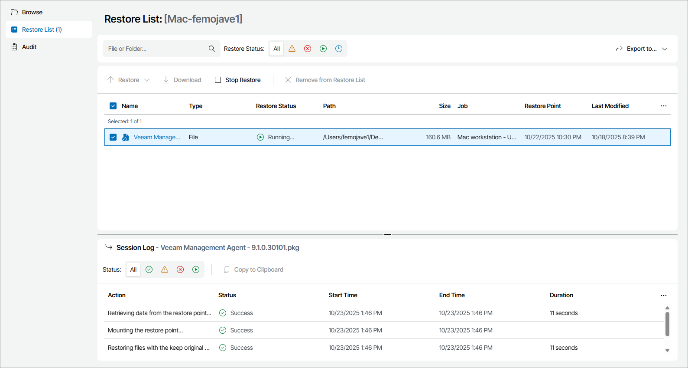

# Step 3. Perform Restore

Select how you want to restore selected files and folders:

1. In the file-level restore portal, click Restore List.
2. In the objects list, select the necessary files and folders.
3. At the top of the list, choose restore action:

* To overwrite the original objects on the remote computer with the objects restored from the backup, click Restore > Overwrite.

* To save the objects restored from the backup next to the original objects on the remote computer, click Restore > Keep.

Veeam Service Provider Console will add the RESTORED- prefix to the restored file or folder name and save it in the same location where the original file resides.

* To save the restored objects on your computer, click Download.

In the Download Files window, specify credentials of an account with sudo rights on the computer hosting Veeam backup agent and click Verify.

Veeam Service Provider Console will save the ZIP archive with restored files to the default download location on your computer.

Veeam Service Provider Console will start the selected restore session. After you start restore, you can view restore session details in the Session Log section.

1. If you want to restore other objects using different restore action, repeat steps 2–3 for all objects you want to restore.

If you do not want to restore an object, click Remove from Restore List to remove selected object from the list.

To export restore list details, click Export to and choose a format of the exported data:

* CSV — choose this option to structure exported data as a CSV file.
* XML — choose this option to structure exported data as an XML file.

The file with exported data will be saved to the default download location on your computer.

