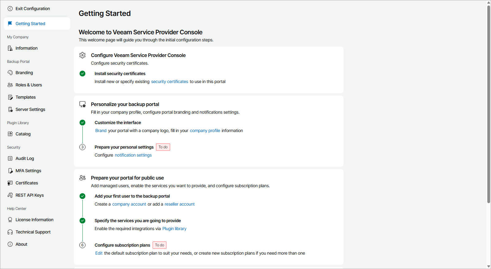

# Getting Started

The Getting Started page provides a sequence of steps you can follow to quickly set up and customize your Veeam Service Provider Console portal. On this page, completed steps are marked with a check mark, and incomplete steps are marked as To do. You can click a link in each step description to navigate to the relevant page of Veeam Service Provider Console.

To access the page:

1. Log in to Veeam Service Provider Console as a Portal Administrator.

For details, see [Accessing Veeam Service Provider Console](access_vac.md).

1. At the top right corner of the Veeam Service Provider Console window, click Configuration.
2. In the configuration menu on the left, click Getting Started.

|  |
| --- |
| Note: |
| To perform configuration tasks, the user must have Portal Administrator privileges. For details on users and privileges, see [Managing Portal Users](manage_users.md). |

Getting Started

To set up your Veeam Service Provider Console portal:

1. [Configure security certificates](install_certificate.md).

Install new, or specify existing security certificates to use in the portal.

1. Customize the portal:

1. [Fill company profile](fill_company_profile.md).

Add information, such as contact details, about your company.

1. [Customize branding](customize_branding.md).

Customize portal, invoice and report appearance in accordance with your company branding.

1. [Create portal users](manage_users.md).

Create users that can access the Veeam Service Provider Console portal, and to which you can assign billing, reporting and monitoring tasks.

1. [Configure notification settings](configure_email_settings.md).

Configure notification frequency and the SMTP server, or integration with a third party mail service provider that Veeam Service Provider Console will use to send email notifications, such as alarm and billing notifications.

1. Enable Veeam Service Provider Console integrations:

1. [Configure Veeam Service Provider Console plugins](plugins.md).

Configure the necessary plugins to manage Veeam products and combine Veeam Service Provider Console functionality with third party solutions.

1. [Configure integration with Veeam Cloud Connect](integration_cc.md).

Configure Veeam Cloud Connect integration to create and manage cloud tenants, and allow companies to store backups and replicas on cloud repositories.

1. [Configure integration with VCSP Pulse](integration_pulse.md).

Configure VCSP Pulse integration to create, manage and assign license keys internally and to managed companies.

1. Add companies and systems to manage:

1. [Register company accounts](create_companies.md).

Create accounts for client companies for which you will provide managed backup services.

1. [Create company locations](create_locations.md).

Create locations for companies that run multiple offices or business units to differentiate backup services and resources consumed by each location.

1. (Optional) [Register reseller accounts](create_reseller.md).

Create accounts for resellers to which you can assign client company management.

1. [Deploy Veeam Service Provider Console management agents](manage_vac_agents.md).

Deploy Veeam Service Provider Console management agents on computers that host Veeam products.

1. [Deploy Veeam backup agents and configure backup jobs](manage_backup_agents.md).

Deploy Veeam backup agents on computers in client and hosted infrastructures, and configure backup job settings.

1. [Connect Veeam Backup & Replication servers or install Veeam Backup & Replication on managed computers](manage_vbr.md).

Connect Veeam Backup & Replication servers that you plan to manage in Veeam Service Provider Console, or install Veeam Backup & Replication on computers in client and hosted infrastructures.

1. [Create subscription plans](create_subscriptions.md).

Configure subscription plans that will be used to calculate the cost of managed backup services you provide to companies.

1. Configure backup jobs or policies for managed Veeam products:

* [Configure Veeam Backup & Replication jobs for client companies](manage_backup_jobs.md).
* [Configure Veeam Backup for Microsoft 365 backup and backup copy jobs](manage_vbo_servers.md).
* [Configure Veeam Backup for Public Clouds policies](vb_cloud_jobs.md).

1. [Configure and schedule invoices](manage_invoices.md).

Configure the type and schedule of invoices, and the schedule of billing notifications.

1. [Configure backup reports](configure_backup_reports.md).

Configure and run backup reports to check the efficiency of data protection, and make sure that you meet established RPO and SLA requirements.

1. Configure alarm settings:

1. [Configure Veeam Service Provider Console alarms](configure_alarms.md).

Check alarm settings, alarm assignment, and configure alarm email notifications.

1. [Synchronize alarms with Veeam ONE](manage_one.md).

Enable alarms data collection to manage the alarms triggered in Veeam ONE in Veeam Service Provider Console.

