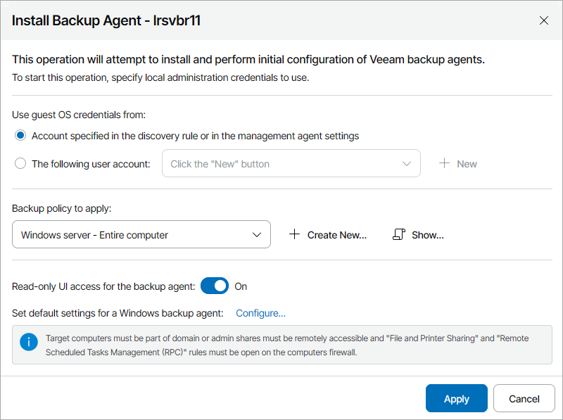

# Installing Veeam Backup Agents Manually

You can deploy Veeam backup agents on client or hosted computers manually. This method does not require you to run discovery rules in client or hosted infrastructure. You can use one of the following installation methods.

|  |
| --- |
| Note: |
| * You can install Veeam Agent for Microsoft Windows version 13 or later only on computers running 64-bit version of the Microsoft Windows OS. For computers running 32-bit version of the Microsoft Windows OS, the latest available version of Veeam Agent for Microsoft Windows is 6.1. * You cannot install Veeam Agent for Linux on a computer where Linux Veeam Backup & Replication is deployed. * Veeam Agent for Mac can be installed automatically during Veeam Service Provider Console management agent deployment. For details, see [Deploying Mac Management Agents](deploy_management_agents_mac.md). |

Prerequisites

Before you install Veeam backup agents:

* Install Veeam Service Provider Console management agents on client or hosted computers.

You can deploy management agents manually or using 3rd party automation tools. For details, see [Deploying Management Agents Manually](deploy_management_agents.md) and [How to Deploy Windows Management Agents with GPO](deploy_management_agents_gpo.md).

* If you plan to apply a backup policy as part of the installation procedure, create a new backup policy or check and if necessary customize one of the predefined policies.

For details, see [Configuring Backup Policies](configure_backup_policies.md).

Installing Veeam Backup Agents from Veeam Service Provider Console

You can initiate installation of Veeam Agent for Linux and Veeam Agent for Microsoft Windows in Veeam Service Provider Console. After you initiate installation, Veeam Service Provider Console management agents on client and hosted computers will download the Veeam backup agents setup file from the Veeam Installation Server over the Internet, install Veeam backup agents and assign a backup policy.

Required Privileges

To perform this task, a user must have one of the following roles assigned: Portal Administrator, Site Administrator, Portal Operator.

|  |
| --- |
| Note: |
| Before you install Veeam backup agents on remote computers, make sure that:   * Remote computers are powered on. * Remote computers on which you plan to install Veeam backup agent have access to the Internet.  * [For Veeam Agent for Microsoft Windows] Remote computers are configured to allow installation: the File and Printer Sharing (SMB-In) firewall rule must allow inbound traffic. * [For Veeam Agent for Linux] You have the root account or any user account with super user privileges on all remote computers.   [For Veeam Agent for Microsoft Windows] If for some reason, you cannot download the Veeam backup agent setup file from the Veeam Installation Server, you can obtain the supported version of the setup file, and place it by the C:\ProgramData\Veeam\Veeam Availability Console\AgentPackage\VeeamAgentWindows.exe path on a remote computer. When you initiate installation in Veeam Service Provider Console, this setup file will be used to install Veeam backup agent on a remote computer. To automate upload of setup files, you can use 3rd party tools, like GPO. To learn how to upload the Veeam Agent for Microsoft Windows setup file using GPO, see [How to Upload Veeam Agent for Microsoft Windows Setup File to Client Computers with GPO](appendix_upload_setup_file_gpo.md). |

Initiating Installation in Veeam Service Provider Console

To initiate Veeam backup agent installation:

1. Log in to Veeam Service Provider Console.

For details, see [Accessing Veeam Service Provider Console](access_vac.md).

1. In the menu on the left, click Discovery.
2. Open the Discovered Computers tab and navigate to Computers.
3. Select check boxes next to the necessary computers.
4. Click Install Product and select Install Backup Agent.

Alternatively, you can right-click the necessary computer and select Install Product > Install Backup Agent.

The Install Backup Agent window will pop up.

1. In the Use guest OS credentials from section, select an account that will be used to upload setup files to client and hosted computers and start installation.

The account must have local Administrator permissions on computers where you want to install Veeam backup agents.

* Select Account specified in the discovery rule or in the management agent settings if you want to use for installation the same account that you specified for discovery of client and hosted computers, either in the master agent configuration or in the discovery rule settings.
* Select The following user account if you want to specify an account different from the one that you used for discovery. You can select an account from the list or click New to specify credentials for a new account.

1. In the Backup policy to apply list, choose a backup policy that must be applied as part of the installation process.

If you allocated all cloud resources specified in the policy to the company, the chosen backup policy will be used to configure backup job settings after installing Veeam backup agents. You can select No policy if you do not want to configure backup job settings as part of installation.

To view the selected policy details, click the Show link. To configure a new backup policy, click Create New and configure a new backup policy. For details, see [Configuring Backup Policies](configure_backup_policies.md).

Note that you cannot assign a backup policy targeted to a Veeam Cloud Connect repository to a hosted Veeam backup agent.

1. By default, the read-only access mode is enabled for all Veeam backup agents. To disable the read-only access mode for Veeam backup agents, set the Read-only UI access for the backup agent toggle to Off.

For details on the read-only access mode for Veeam backup agents, see [Enabling Read-Only Access Mode](enable_read_only_mode.md).

1. [For Veeam Agent for Microsoft Windows] To push global settings for Veeam backup agents, click Configure and specify default global settings for Veeam Agent for Microsoft Windows. For details on the global settings for Veeam Agent for Microsoft Windows, see [Configuring Global Settings for Veeam Agent for Microsoft Windows](configure_backup_agent_settings.md).
2. Click Apply.
3. Wait for the installation process to complete.

The installation process may take up to several minutes.

Checking Installation Results

To make sure that installation of Veeam backup agents has completed successfully, complete the following steps:

1. Log in to Veeam Service Provider Console.

For details, see [Accessing Veeam Service Provider Console](access_vac.md).

1. In the menu on the left, click Discovery.
2. Open the Discovered Computers tab and navigate to Computers.
3. Find the necessary computers in the list.
4. Check the value in the Deployment Status and Deployment Progress columns.

If installation was successful, the Deployment Status status must be Success, and the Deployment Progress must be 100%.

1. Click a link in the Deployment Status column to display session details of the installation procedure.

In some cases, after installation you may need to perform additional operations. For example, if the setup detects a pending computer reboot, the list of installation session details, will display a warning notifying that reboot is required. To complete the installation, you can initiate computer reboot in Veeam Service Provider Console. For details, see [Rebooting Remote Computers](reboot_remote_computers.md).

Installing Veeam Backup Agents Outside Veeam Service Provider Console

You can install Veeam backup agents outside Veeam Service Provider Console:

1. Install Veeam backup agents on client and hosted computers.

You can use the installation wizard or install the software in the unattended mode. For details on how to install Veeam backup agents outside Veeam Service Provider Console, see the following sections of the Veeam backup agents User Guides:

* Section [Installing Veeam Agent for Microsoft Windows in Unattended Mode](https://helpcenter.veeam.com/docs/agentforwindows/userguide/installation_unattended.html) of the Veeam Agent for Microsoft Windows User Guide.
* Section [Installing Veeam Agent for Linux](https://helpcenter.veeam.com/docs/agentforlinux/userguide/installation_process.html) of the Veeam Agent for Linux User Guide.
* Section [Installation and Configuration](https://helpcenter.veeam.com/docs/agentformac/userguide/installation_and_configuration.html) of the Veeam Agent for Mac User Guide.

1. Activate Veeam backup agents in Veeam Service Provider Console.

For details, see [Activating Veeam Backup Agents](activate_backup_agents.md).

