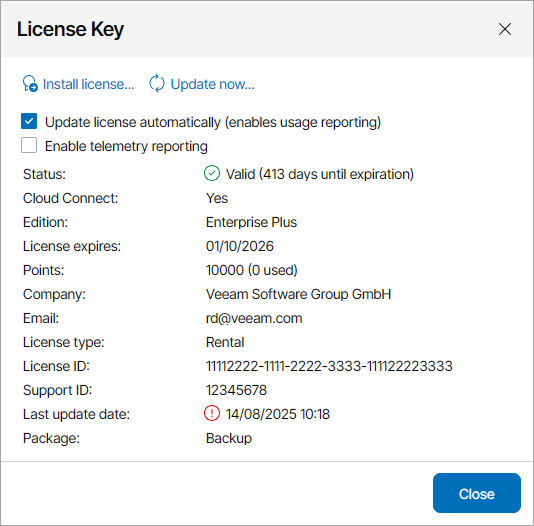

# Installing Veeam Service Provider Console License

When you install Veeam Service Provider Console, you must specify a path to a Veeam license key before you can begin installation. Without a license, you will not be able to start installation.

After you install Veeam Service Provider Console, you can change the license that you provided during installation:

1. Log in to Veeam Service Provider Console.

For details, see [Accessing Veeam Service Provider Console](access_vac.md).

1. At the top right corner of the Veeam Service Provider Console window, click Configuration.
2. In the menu on the left, click License Information.
3. On the Overview tab, click the License Status link.
4. In the License Key window, click Install license and browse to the license file.

After you choose the license file, Veeam Service Provider Console will display the Install license file window to show the result of the license installation.

1. In the Install license file window, click OK.

