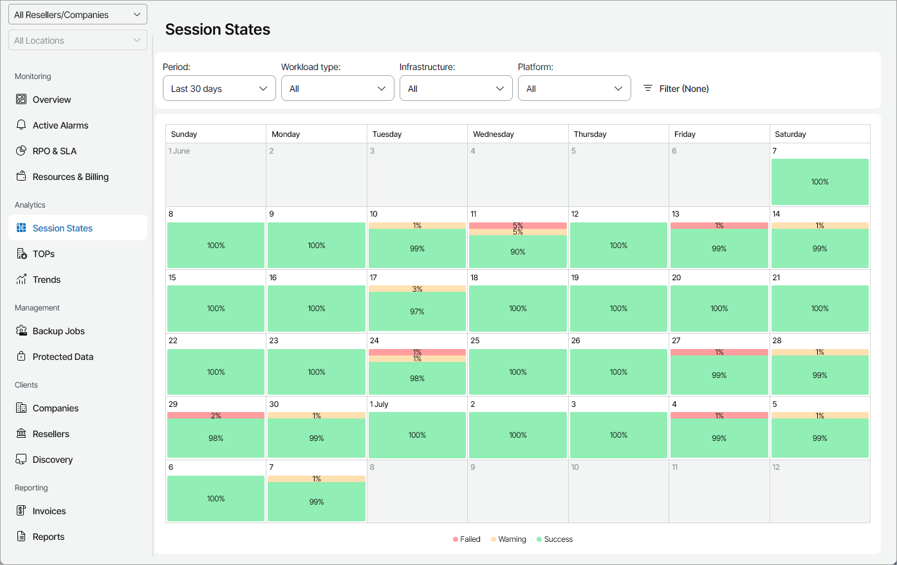
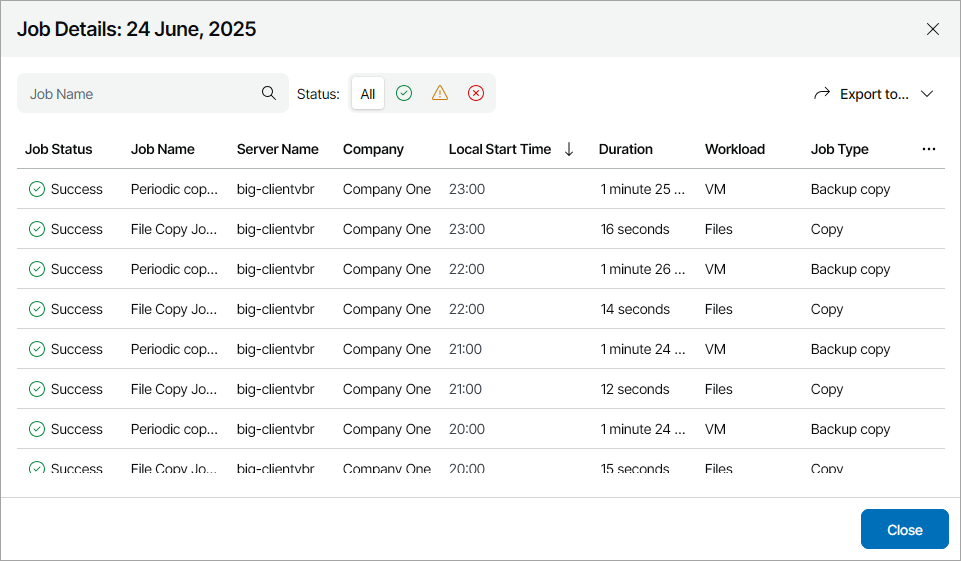
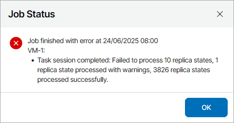

# Session States

The Session States dashboard shows ratio of successful jobs and jobs that finished with warnings and errors on each day of a specific period.

Required Privileges

To perform this task, a user must have one of the following roles assigned: Portal Administrator, Site Administrator, Portal Operator, Read-only User.

Accessing Session States Dashboard

To access the dashboard:

1. Log in to Veeam Service Provider Console.

For details, see [Accessing Veeam Service Provider Console](access_vac.md).

1. In the menu on the left, click Session States.
2. To show data for a specific Veeam Cloud Connect site, reseller, company and location, use the sites, reseller/company and location filters at the top left corner of the Veeam Service Provider Console window.

By default, the dashboard represents data for all job types for the last 30 days. You can change that by applying the following filters:

* Period — defines which time period is represented on the dashboard (Last 30 days, Current month, Previous month).

* Workload type — limits the list of represented jobs by workload type (Computer, VM, Cloud VM, Cloud database, Cloud file share, Cloud network, File share, Object storage, Files, Users).
* Infrastructure — limits the list of represented jobs by infrastructure type (Cloud, Local).
* Platform — limits the list of represented jobs by platform (Amazon Web Services, Microsoft Azure, Google Cloud, Microsoft 365, Cloud Director, vSphere, Hyper-V, AHV, Physical, oVirt KVM, Proxmox VE, SC HyperCore).
* Job types — limits the list of represented jobs by type (Backup, Replication, Replica snapshot, Backup copy, Backup to tape, File to tape, Copy, SureBackup, Snapshot, Archive).

To see detailed information on all job sessions on specific day, click the cell associated with that day. The Job Details window will open.

To narrow down the list of job sessions, you can apply the following filters:

* Job Name — search job sessions by job name.
* Status — search job sessions by status (Success, Warning, Failed).

To export job details, click Export to and select a format of the exported data:

* CSV — structures exported data as a CSV file.
* XML — structures exported data as an XML file.

The file with exported data will be saved to the default download location on your computer.

Each job session in the list is described with a set of properties.

* Job Status — status of the latest job session (Success, Warning, Failed).
* Job Name — name of a data protection job.
* Server Name — name of a server on which a job is configured.

* Location — name of a location to which a job belongs.

* Company — name of a company to which a job belongs.

* Local Start Time — time when the job session started.
* Local End Time — time when the job session ended.

* Duration — time taken to complete the job session.
* Workload — type of the workload protected by the job (Computer, Virtual machine, Cloud virtual machine, Cloud database, Cloud file share, File share, Object storage, Files, Users).

* Job Type — type of the job (Backup, Replication, Backup copy, Backup to tape, File to tape, Copy, SureBackup, Snapshot, Archive).

To get information on jobs that finished with errors and warnings, you can click the link in the job status. The Job Status window containing issue details will open.

