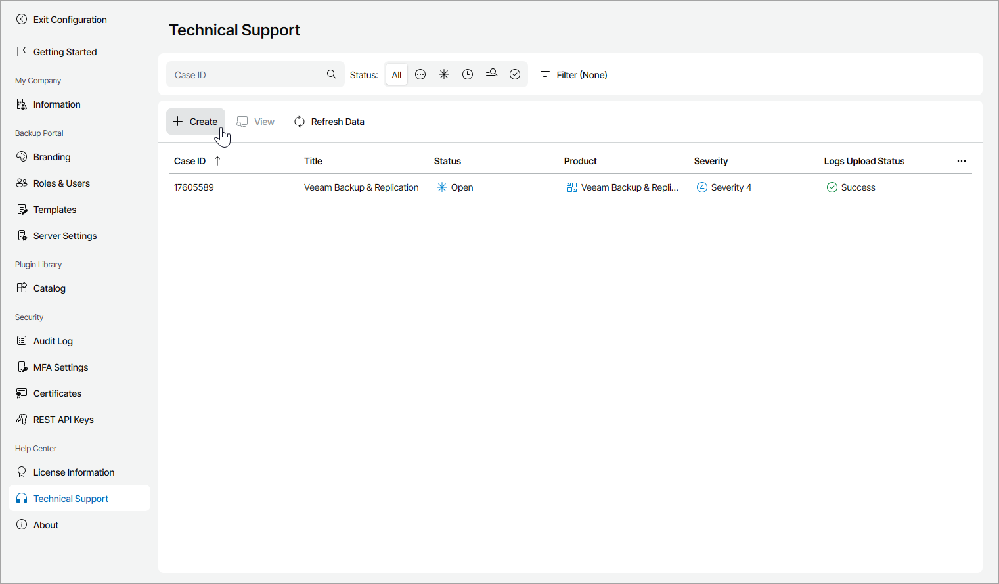

# Step 1. Launch New Support Case Wizard

To launch the New Support Case wizard:

1. Log in to Veeam Service Provider Console.

For details, see [Accessing Veeam Service Provider Console](access_vac.md).

1. At the top right corner of the Veeam Service Provider Console window, click Configuration.
2. In the configuration menu on the left, click Technical Support.
3. At the top of the support cases list, click Create.

