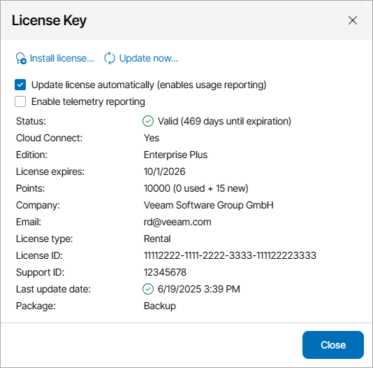

# Veeam Service Provider Console License Key Details

The License Key window provides information about the license that is currently installed in Veeam Service Provider Console.

The following details are available for the current license:

* Status — license status (Valid, Invalid, Expired, Not Installed, Warning, Error).
* Cloud Connect — indicates if the license is intended for Veeam Cloud & Service Providers (VCSPs).
* Edition — license edition (Standard, Enterprise, Enterprise Plus).
* License expires — date when the license will expire.
* [For Rental licenses] Points — total number of points for Veeam backup agents included in the license, and number of used points. For details, see [Licensing for Managed Veeam Backup Agents](licensed_objects.md#agents).
* [For Subscription licenses] Instances — total number of instances for Veeam backup agents included in the license, and number of used instances. For details, see [Licensing for Managed Veeam Backup Agents](licensed_objects.md#agents).
* Company — name of the user or company to which the license was issued.
* Email — email address of the contact person in a company.
* License type — license type (Rental, Subscription, Evaluation, NFR).
* License ID — ID of the license file.
* Support ID — support ID required for contacting Veeam Customer Technical Support.
* Last update date — date of the latest license update attempt, and the license update result. For details, see [Updating License](update_license.md).
* Package — license package (Backup, Essentials, Suite, Foundation, Advanced, Premium).

