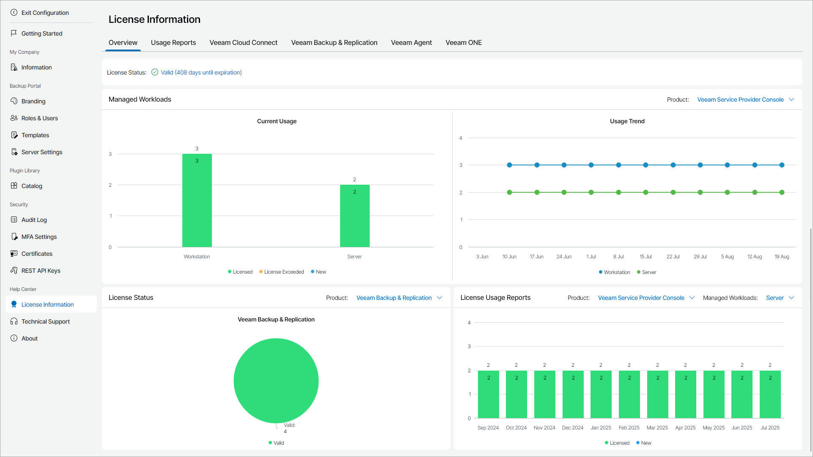

# Overview

The Overview tab provides cumulative information about license usage for Veeam Service Provider Console, Veeam Cloud Connect, Veeam Backup & Replication, Veeam ONE and Veeam Backup for Microsoft 365.

The Overview tab includes the following widgets:

* Managed Workloads widget shows the current number of managed workloads and workloads usage trend for the previous quarter.

To show the necessary product, use the list at the top of the widget:

* Veeam Service Provider Console — show the number of managed Veeam backup agents. The view shows the number of workstation agents (computers that run Veeam backup agents in the Workstation mode) and server agents (computers that run Veeam backup agents in the Server mode).

For each Veeam backup agent type, the view details the number of licensed agents, new agents and agents with exceeded license. Click a chart bar to drill down to the list of Veeam backup agents with a specific license status. For details on Veeam backup agent license statuses, see [Veeam Backup Agent License Statuses](exceeding_license_limit.md#status).

* Veeam Cloud Connect — show the number of backups and replicas residing in Veeam Cloud Connect. The widget shows the number of workstation backups (backups of physical computers or VMs that run Veeam backup agents in the Workstation mode), server backups (backups of physical computers or VMs that run Veeam backup agents in the Server mode), backups of VMs created with Veeam Backup & Replication, and cloud VM replicas created with Veeam Backup & Replication.
* Veeam Backup & Replication — show the number of workloads protected by Veeam Backup & Replication. The view shows the number of workstation agents (computers that run Veeam backup agents in the Workstation mode), server agents (computers that run Veeam backup agents in the Server mode), VMs, file shares, cloud VMs and enterprise applications. Note that the view does not show workloads protected by hosted Veeam Backup & Replication servers.
* Veeam ONE — show the number of workloads monitored by Veeam ONE servers. The view shows the number of workstation agents (computers that run Veeam backup agents in the Workstation mode), server agents (computers that run Veeam backup agents in the Server mode), VMs, file shares and cloud VMs.
* Veeam Backup for Microsoft 365 — show the number of protected Veeam Backup for Microsoft 365 users.

* License Status widget shows the number of Veeam Cloud Connect, Veeam Backup & Replication, Veeam ONE and Veeam Backup for Microsoft 365 servers managed in Veeam Service Provider Console.

Click a chart bar to drill down to the list of servers with a specific license status.

* License Usage Reports widget shows the number of licensed objects reflected in submitted license usage reports. If the number of managed objects in a license usage report was adjusted, the widget will show the adjusted number. For details on license usage reports, see [Submitting License Usage Report](submit_license_usage_report.md).

To show the necessary product and object type, use the list at the top of the widget. The list contains only those object types that were reflected in the license usage reports.

* For Veeam Service Provider Console:

* Workstation — show the number of computers that run Veeam backup agents in the Workstation mode and that are managed by Veeam Service Provider Console.
* Server — show the number of computers that run Veeam backup agents in the Server mode and that are managed by both Veeam Service Provider Console.

* For Veeam Cloud Connect:

* Cloud VM — show the number of Amazon Web Services, Microsoft Azure and Google Cloud VMs protected by Veeam Cloud Connect.
* Cloud Backup (Workstation) — show the number of backups for computers that run Veeam backup agents in the Workstation mode and that are stored on cloud repositories.
* Cloud Backup (Server) — show the number of backups for computers that run Veeam backup agents in the Server mode and that are stored on cloud repositories.
* Cloud Backup (VM) — show the number of VM backups that are created with Veeam Backup & Replication and that are stored on cloud repositories.
* Cloud Replica (VM) — show the number of VM replicas that are created with Veeam Backup & Replication and that are registered on cloud hosts.
* Cloud Databases — show the number of Amazon Web Services, Microsoft Azure and Google Cloud databases protected by Veeam Backup for Public Clouds appliances.
* Cloud File Shares — show the number of Amazon Web Services, Microsoft Azure and Google Cloud file shares protected by Veeam Backup for Public Clouds appliances.

* For Veeam Backup & Replication:

* Workstation — show the number of computers that run Veeam backup agents in the Workstation mode and that are managed by Veeam Backup & Replication.
* Server — show the number of computers that run Veeam backup agents in the Server mode and that are managed by Veeam Backup & Replication.
* VM — show the number of Microsoft Hyper-V, VMware vSphere, Nutanix AHV and Red Hat Virtualization VMs protected by Veeam Backup & Replication.
* File Share — show the number of data blocks (500 GB each) of file shares protected by Veeam Backup & Replication.
* Cloud VM — show the number of Amazon Web Services, Microsoft Azure and Google Cloud VMs protected by Veeam Backup & Replication.
* Cloud Databases — show the number of Amazon Web Services, Microsoft Azure and Google Cloud databases protected by Veeam Backup for Public Clouds appliances managed by Veeam Backup & Replication.
* Cloud File Shares — show the number of Amazon Web Services, Microsoft Azure and Google Cloud file shares protected by Veeam Backup for Public Clouds appliances managed by Veeam Backup & Replication.
* Enterprise Application — show the number of enterprise applications (SAP HANA, Oracle RMAN, SAP on Oracle) protected by Veeam Backup & Replication.

* For Veeam ONE:

* Virtual Machine — show the number of Microsoft Hyper-V, VMware vSphere, Nutanix AHV and Red Hat Virtualization VMs monitored by Veeam ONE.
* Cloud Virtual Machine — show the number of Amazon Web Services, Microsoft Azure and Google Cloud VMs monitored by Veeam ONE.
* Workstation Agent — show the number of computers that run Veeam backup agents in the Workstation mode and that are monitored by Veeam ONE.
* Server Agent — show the number of computers that run Veeam backup agents in the Server mode and that are monitored by Veeam ONE.
* File Share — show the number of data blocks (500 GB each) of file shares monitored by Veeam ONE.
* Cloud File Share — show the number of Amazon EC2 and Microsoft Azure file shares monitored by Veeam ONE.
* Microsoft 365 User — show the number of packs (10 users each) of Microsoft 365 users monitored by Veeam ONE.
* Cloud Database — show the number of of Amazon Web Services, Microsoft Azure and Google Cloud databases and Amazon Web Services database clusters monitored by Veeam ONE.
* Enterprise Application — show the number of enterprise application plugins monitored by Veeam ONE.

* For Veeam Backup for Microsoft 365:

* User — show the number of Microsoft 365 users protected by Veeam Backup for Microsoft 365.

* For Veeam Backup Enterprise Manager:

* Workstation — show the number of computers that run Veeam backup agents in the Workstation mode and that are managed by Veeam Backup Enterprise Manager.
* Server — show the number of computers that run Veeam backup agents in the Server mode and that are managed by Veeam Backup Enterprise Manager.
* VM — show the number of Microsoft Hyper-V, VMware vSphere, Nutanix AHV and Red Hat Virtualization VMs protected by Veeam Backup Enterprise Manager.
* File Share — show the number of data blocks (500 GB each) of file shares protected by Veeam Backup Enterprise Manager.
* Cloud VM — show the number of Amazon Web Services, Microsoft Azure and Google Cloud VMs protected by Veeam Backup Enterprise Manager.
* Cloud Databases — show the number of Amazon Web Services, Microsoft Azure and Google Cloud databases protected by Veeam Backup for Public Clouds appliances managed by Veeam Backup Enterprise Manager.
* Cloud File Shares — show the number of Amazon Web Services, Microsoft Azure and Google Cloud file shares protected by Veeam Backup for Public Clouds appliances managed by Veeam Backup Enterprise Manager.

* For Veeam Data Platform:

* Workstation — show the number of computers that run Veeam backup agents in the Workstation mode and that are managed by Veeam Backup & Replication.
* Server — show the number of computers that run Veeam backup agents in the Server mode and that are managed by Veeam Backup & Replication.
* VM — show the number of Microsoft Hyper-V, VMware vSphere, Nutanix AHV and Red Hat Virtualization VMs protected by Veeam Backup & Replication.
* File Share — show the number of data blocks (500 GB each) of file shares protected by Veeam Backup & Replication.
* Cloud VM — show the number of Amazon Web Services, Microsoft Azure and Google Cloud VMs protected by Veeam Backup & Replication.
* Cloud Databases — show the number of Amazon Web Services, Microsoft Azure and Google Cloud databases protected by Veeam Backup for Public Clouds appliances managed by Veeam Backup & Replication.
* Cloud File Shares — show the number of Amazon Web Services, Microsoft Azure and Google Cloud file shares protected by Veeam Backup for Public Clouds appliances managed by Veeam Backup & Replication.
* Enterprise Application — show the number of enterprise applications (SAP HANA, Oracle RMAN, SAP on Oracle) protected by Veeam Backup & Replication.

