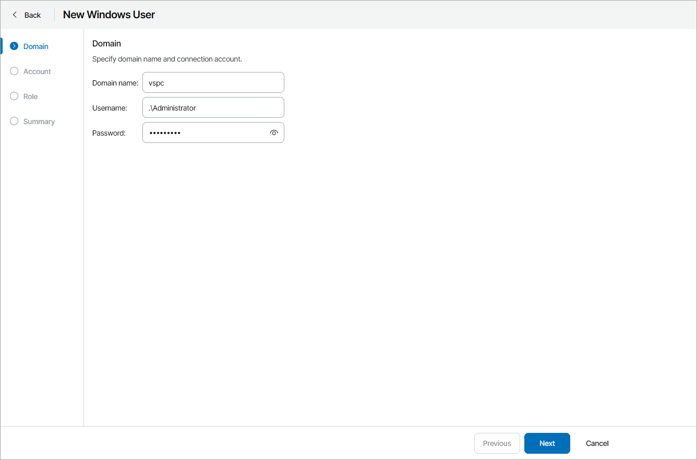
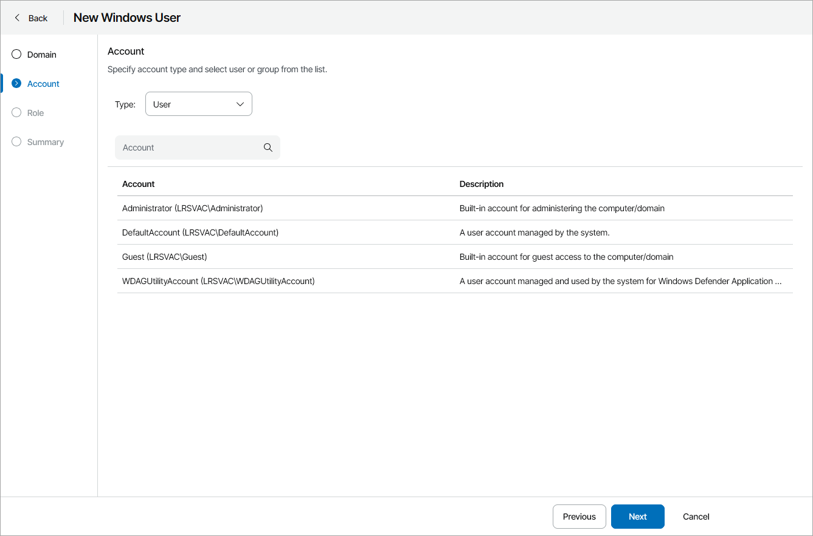

# Managing Portal Administrators

You can assign the role of a Portal Administrator to users and user groups, enable and disable Portal Administrators.

Required Privileges

To perform this task, a user must have the following role assigned: Portal Administrator.

Assigning Portal Administrator Role

To grant Portal Administrator privileges to a user or group:

1. Log in to Veeam Service Provider Console.

For details, see [Accessing Veeam Service Provider Console](access_vac.md).

1. At the top right corner of the Veeam Service Provider Console window, click Configuration.
2. In the configuration menu on the left, click Roles & Users.
3. Open the My Company tab and navigate to Windows Users.
4. At the top of the page, click New.

Alternatively, you can right-click the user list and choose New.

Veeam Service Provider Console will launch the New Windows User wizard.

1. At the Domain step of the wizard, type the domain name and specify credentials to connect to the domain.

By default, Veeam Service Provider Console searches users and groups on the machine hosting Veeam Service Provider Console. If you installed Veeam Service Provider Console using the distributed deployment scenario, this will be a machine on which the Veeam Service Provider Console Server component runs.

1. At the Account step of the wizard, select a user account:

1. From the Type drop-down list, select the account type: User or Group.
2. To find a user or a group by name, use the Account search field.

|  |
| --- |
| Note: |
| To be able to log in to Veeam Service Provider Console web UI, selected users or groups must be specified in the Allow log on locally security policy setting on the machine where Veeam Service Provider Console Server component is installed. |

1. At the Role step of the wizard, select the Portal Administrator role.

1. At the Summary step of the wizard, review user details and click Finish.

Other Ways to Assign Portal Administrator Role

To assign the role of a Portal Administrator to a user, add this user to the local Administrators group on the machine hosting Veeam Service Provider Console. If you installed Veeam Service Provider Console using the distributed deployment scenario, this must be a machine on which the Veeam Service Provider Console Server component runs. For details, see [Microsoft Documentation](https://technet.microsoft.com/en-us/library/cc772524.aspx).

|  |
| --- |
| Note: |
| To be able to log in to Veeam Service Provider Console web UI, users or groups must be specified in the Allow log on locally security policy setting on the machine where Veeam Service Provider Console Server component is installed. |

Disabling Portal Administrators

To control access to Veeam Service Provider Console for Portal Administrators, you can enable and disable users or groups of users with Portal Administrator privileges. It is recommended to disable users to instantly revoke access to the portal for these users.

To disable a user or a user group with Portal Administrator privileges:

1. Log in to Veeam Service Provider Console.

For details, see [Accessing Veeam Service Provider Console](access_vac.md).

1. At the top right corner of the Veeam Service Provider Console window, click Configuration.
2. In the configuration menu on the left, click Roles & Users.
3. Open the My Company tab and navigate to Windows Users.
4. At the top of the page, select the Portal Administrator role.
5. Select the necessary user or user group in the list.

To narrow down the list of users, you can apply the following filters:

* Name — limit the list of users by name.
* User type — limit the list of users by type (Users, Groups).
* MFA status — limit the list of users by multi-factor authentication status (Enforced, Not enforced).

1. Click Disable.

Alternatively, you can right-click the necessary user and choose Disable.

Enabling Portal Administrators

To enable a user group with Portal Administrator privileges:

1. Log in to Veeam Service Provider Console.

For details, see [Accessing Veeam Service Provider Console](access_vac.md).

1. At the top right corner of the Veeam Service Provider Console window, click Configuration.
2. In the configuration menu on the left, click Roles & Users.
3. Open the My Company tab and navigate to Windows Users.
4. At the top of the page, select the Portal Administrator role.
5. Select the necessary user or user group in the list.

To narrow down the list of users, you can apply the following filters:

* Name — limit the list of users by name.
* User type — limit the list of users by type (Users, Groups).
* MFA status — limit the list of users by multi-factor authentication status (Enforced, Not enforced).

1. Click Enable.

Alternatively, you can right-click the necessary user and choose Enable.

