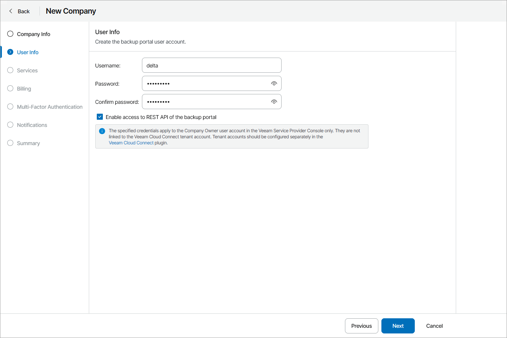

# Managing Company Owners

Each company in Veeam Service Provider Console has one Company Owner user. A Company Owner acts on behalf of a company that consumes provided services.

Credentials of a Company Owner are required to gain access to the Veeam Service Provider Console Client Portal.

You can think of the Company Owner as of a super user at a company level. In the Client Portal, a Company Owner has access to all monitoring and billing details for all company locations, and can perform all types of configuration and management tasks. For details on Veeam Service Provider Console functionality available to a Company Owner in the Client Portal, see [Guide for End Users](https://helpcenter.veeam.com/docs/vac/provider_user/about.html?ver=9.1).

Creating Company Owner

You create a Company Owner when you register a new company account in Veeam Service Provider Console:

1. Log in to Veeam Service Provider Console.

For details, see [Accessing Veeam Service Provider Console](access_vac.md).

1. In the menu on the left, click Companies.
2. Choose to create a new company and navigate to the User Info step of the wizard.
3. Specify credentials for the user who will act as a Company Owner.
4. Save changes.

For details on creating companies in Veeam Service Provider Console, see [Creating Companies](create_companies.md).

Modifying Company Owner Password

You can modify a password for an owner of an already existing company:

1. Log in to Veeam Service Provider Console.

For details, see [Accessing Veeam Service Provider Console](access_vac.md).

1. In the menu on the left, click Companies.
2. Choose to edit a company and navigate to the User Info step of the wizard.
3. Change the password for the user who acts as a Company Owner.
4. Save changes.

For details on modifying a company, see [Modifying Company Settings](modify_tenants.md).

Modifying Company Owner Info

You can modify general Company Owner details:

1. Log in to Veeam Service Provider Console.

For details, see [Accessing Veeam Service Provider Console](access_vac.md).

1. At the top right corner of the Veeam Service Provider Console window, click Configuration.
2. In the configuration menu on the left, click Roles & Users.
3. Open the Managed Companies tab and navigate to Local Users.
4. To display Company Owners, in the Role filter select Company Owner.
5. Select the necessary user and click Edit.
6. Modify user settings as described in [Creating Company Administrators](create_company_admins.md).

You can modify all settings except the user name.

Note that changing Company Owner email address will not affect company email address. If you want to modify company email address, you must do it manually. For details, see [Modifying Company Settings](modify_tenants.md).

1. Save changes.

Disabling and Deleting Company Owner

Credentials of a Company Owner are specified in a company account. When you disable or delete a company account, the Company Owner user is disabled or deleted along with it.

For details, see [Disabling and Enabling Companies](enable_disabe_tenants.md) and [Removing Companies](remove_tenants.md).

