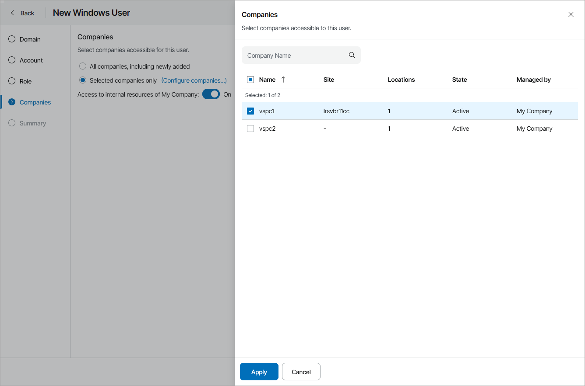

# Managing Portal Operators

You can assign the role of a Portal Operator to other users, enable and disable Portal Operators.

Required Privileges

To perform this task, a user must have one of the following roles assigned: Portal Administrator.

Assigning Portal Operator Role

To grant Portal Operator privileges to a user or group:

1. Log in to Veeam Service Provider Console.

For details, see [Accessing Veeam Service Provider Console](access_vac.md).

1. At the top right corner of the Veeam Service Provider Console window, click Configuration.
2. In the configuration menu on the left, click Roles & Users.
3. Open the My Company tab and navigate to Windows Users.
4. At the top of the page, click New.

Alternatively, you can right-click the user list and choose New.

Veeam Service Provider Console will launch the New Windows User wizard.

1. At the Domain step of the wizard, type the domain name and specify credentials to connect to the domain.

By default, Veeam Service Provider Console searches users and groups on the machine hosting Veeam Service Provider Console. If you installed Veeam Service Provider Console using the distributed deployment scenario, this will be a machine on which the Veeam Service Provider Console Server component runs.

1. At the Account step of the wizard, select a user account:

1. From the Type drop-down list, select the account type: User or Group.
2. To find a user or a group by name, use the Account search field.

|  |
| --- |
| Note: |
| To be able to log in to Veeam Service Provider Console web UI, selected users or groups must be specified in the Allow log on locally security policy setting on the machine where Veeam Service Provider Console Server component is installed. |

1. At the Role step of the wizard, select the Portal Operator role.
2. At the Companies step of the wizard, select companies that a user or group will manage.

If you want to add a Portal Operator who will manage all companies, select the All companies, including newly added option. With this option selected, Veeam Service Provider Console will also include newly added companies to a Portal Operator management scope.

If you want to add a Portal Operator who will have access to the service provider company, set the Access to internal resources of My Company toggle to On.

If you logged in to Veeam Service Provider Console as a Site Administrator, you can assign to Portal Operators only companies registered on your Veeam Cloud Connect site.

1. At the Summary step of the wizard, review user details and click Finish.

Disabling Portal Operators

To control access to Veeam Service Provider Console for Portal Operators, you can enable and disable groups and users with Portal Operator privileges. It is recommended to disable users to instantly revoke access to the portal for these users.

To disable a user or a user group with Portal Operator privileges:

1. Log in to Veeam Service Provider Console.

For details, see [Accessing Veeam Service Provider Console](access_vac.md).

1. At the top right corner of the Veeam Service Provider Console window, click Configuration.
2. In the configuration menu on the left, click Roles & Users.
3. Open the My Company tab and navigate to Windows Users.
4. At the top of the page, select the Portal Operator role.
5. Select the necessary user or user group in the list.

To narrow down the list of users, you can apply the following filters:

* Name — limit the list of users by name.
* User type — limit the list of users by type (Users, Groups).

* MFA status — limit the list of users by multi-factor authentication status (Enforced, Not enforced).

1. Click Disable.

Alternatively, you can right-click the necessary user and choose Disable.

Enabling Portal Operators

To enable a user or a user group with Portal Operator privileges:

1. Log in to Veeam Service Provider Console.

For details, see [Accessing Veeam Service Provider Console](access_vac.md).

1. At the top right corner of the Veeam Service Provider Console window, click Configuration.
2. In the configuration menu on the left, click Roles & Users.
3. Open the My Company tab and navigate to Windows Users.
4. At the top of the page, select the Portal Operator role.
5. Select the necessary user or user group in the list.

To narrow down the list of users, you can apply the following filters:

* Name — limit the list of users by name.
* User type — limit the list of users by type (Users, Groups).

* MFA status — limit the list of users by multi-factor authentication status (Enforced, Not enforced).

1. Click Enable.

Alternatively, you can right-click the necessary user and choose Enable.

