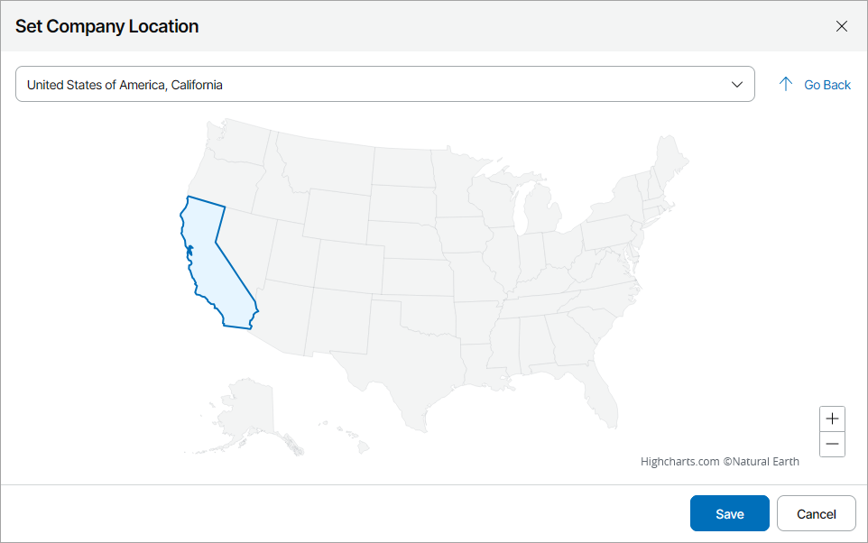

# Managing Reseller Region

If you have several resellers distributed across one country, you can set geographical regions for these resellers to simplify alarms management and health state monitoring. After you set a geographical region for a reseller, you will be able to monitor the reseller health state in the Companies State by Regions widget and drill down to alarms triggered for all companies in a specific country. For details, see [Overview](overview.md).

Alternatively, you can set a region while creating or modifying a reseller account. For details, see [Step 2. Specify Reseller Details](specify_reseller_details.md).

|  |
| --- |
| Note: |
| Veeam Service Provider Console obtains data on geographical regions from a 3rd party resource. |

Required Privileges

To perform this task, a user the following role assigned: Portal Administrator.

Managing Reseller Region

To set or modify a geographical region for a reseller:

1. Log in to Veeam Service Provider Console.

For details, see [Accessing Veeam Service Provider Console](access_vac.md).

1. In the menu on the left, click Resellers.
2. Select the necessary reseller in the list and click a link in the Country column.

If the column is hidden, click the ellipsis on the right of the list header. In the list of properties that must be displayed, select Country.

Note that a link in the Country column will be inactive if a reseller configuration task is running or if the previous configuration task has failed.

1. In the Set Company Location window, select a new geographical region for a reseller.

To select a specific region, use the drop-down list at the top of the map or click the necessary region on the map. To zoom out of the selected region, click Go Back.

1. Click Save.

Removing Reseller Region

To remove a geographical region for a reseller, you must edit the reseller account settings. For details, see [Modifying Reseller Settings](modify_resellers.md).

