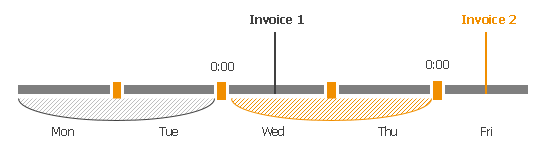

# Measuring Amount of Consumed Services

An approach used to measure the amount of provided services depends on the type of service.

Services Measured by Actual Numbers

Some services are measured by the actual number of managed objects, size of managed objects, or amount of consumed space as of the date when an invoice is generated.

These services include:

* Number of managed VMs, cloud VMs, file shares and databases, Microsoft 365 users, workstation agents and server agents, extra charges for guest OSes of managed Veeam backup agents.
* Number of VMs, workstation agents and server agents stored in backups on cloud repositories.
* Number of VMs replicated to cloud.
* Amount of space consumed by backups on cloud and Veeam Backup for Microsoft 365 repositories, file share and object storage backups, amount of space consumed by VM replicas on cloud storage, amount of allocated space on cloud repositories, and amount of space in the recycle bin consumed by deleted cloud backups.

Services Measured for Billing Period

The following services are measured for a billing period:

* Managed services
* Monitoring services
* Data transfer out traffic
* Compute resources
* Cloud network configuration backup

A billing period is the length of time between two successive invoices. It starts at 0:00 of the day when a previous invoice was generated, and ends at 23:59 of the day prior to the day when the current invoice is generated.

For example, on Wednesday you generated Invoice 1, and on Friday you generated Invoice 2. Invoice 2 will take into account data transfer out traffic and compute resources starting from Wednesday 0:00, and ending on Thursday 23:59. That is, an Invoice 2 will show the cost of services for all full days since a previous saved invoice (Invoice 1).

Measuring License Usage

Consumed license instances are measured according to Veeam Service Provider Console license usage reports. Consider the following scenarios:

1. If you configured Veeam Service Provider Console to generate invoices after the license usage report is generated or once a month at a specific day, a generated invoice will include data from the latest approved license usage report.

For example, if the invoice was generated on February, 10, it will include license usage from the report approved before February, 6. If the invoice was generated on February, 1, before the license usage report was approved, it will include license usage from the previous usage report generated on January, 1.

1. If you generate several invoices in one month, each invoice will include data from the same latest approved license usage report.

For example, the first invoice is generated on February, 10 and the second invoice is generated on February, 25. Both invoices will include license usage from the report approved before February, 6.

1. If you generate one invoice in several months, the generated invoice will include data from all license usage reports that were not included in the previous invoice.

