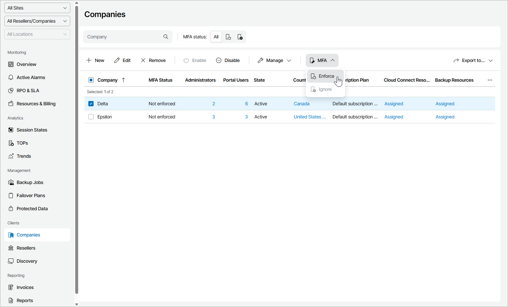

# Enabling and Disabling MFA for Companies

You can enable MFA for all users of one or more companies.

|  |
| --- |
| Important! |
| If you enable MFA for an account that is used for integration with third party applications, that integration will stop working. To avoid that, first configure an API key, as described in the [Configuring API Keys](api_keys.md) section. |

Required Privileges

To perform this task, a user must have the following role assigned: Portal Administrator, Site Administrator, Portal Operator.

Enabling and Disabling MFA for All Company Users

To enable or disable MFA for all users of one or more companies:

1. Log in to Veeam Service Provider Console.

For details, see [Accessing Veeam Service Provider Console](access_vac.md).

1. In the menu on the left, click Companies.
2. Select the necessary companies in the list.
3. At the top of the list, click MFA.

Alternatively, you can right-click the necessary company and choose MFA.

1. From the drop-down list select Enforce to enable MFA or Ignore to allow company users disable MFA.

1. In the displayed window, click Yes.

On the next authorization session, each user will be prompted to configure MFA settings on the Multi-Factor Authentication step of the Edit User wizard as described in the [Filling User Profile](fill_user_profile.md#mfa_config) section.

|  |
| --- |
| Note: |
| If the Enforce MFA for all managed clients and resellers policy is enabled or MFA is enabled for the reseller that manages the selected companies, you cannot disable MFA. For details, see [MFA Policies](mfa_policies.md). |

