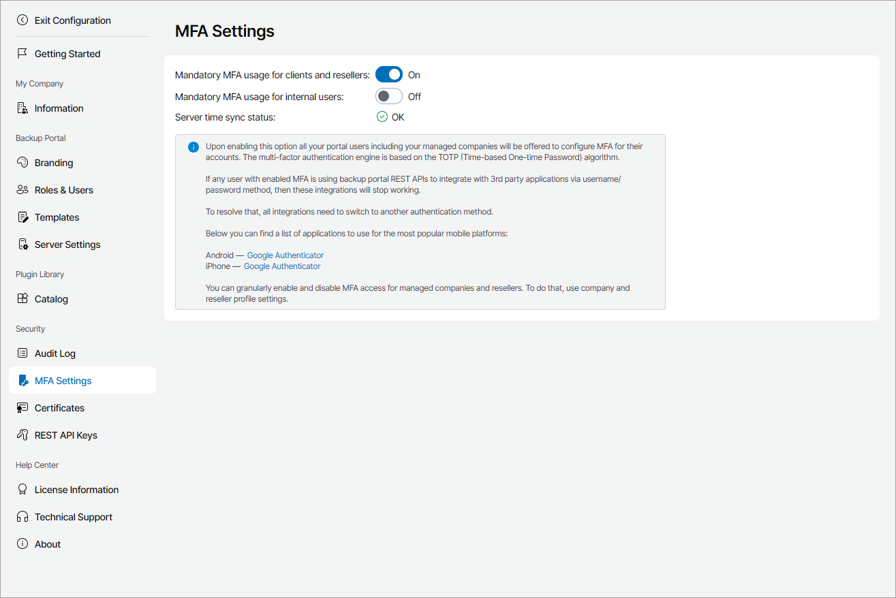

# MFA Policies

To enforce additional security to all users that have access to Veeam Service Provider Console without enabling MFA for each of them one by one, you can apply MFA policies. MFA policies allow you to prompt all users of your organization as well as managed resellers and companies to enable MFA.

Required Privileges

To perform this task, a user must have the following role assigned: Portal Administrator.

Applying Policies

To apply policies:

1. Log in to Veeam Service Provider Console.

For details, see [Accessing Veeam Service Provider Console](access_vac.md).

1. At the top right corner of the Veeam Service Provider Console window, click Configuration.
2. In the configuration menu on the left, click MFA Settings.
3. Set one or both toggles of the following options to On.

* Mandatory MFA usage for clients and resellers — enables notification about required MFA for all users of the managed companies and resellers.
* Mandatory MFA usage for internal users — enables notification about required MFA for all users of your organization.

The Server time sync status indicates whether current time in the Veeam Service Provider Console server is synchronized with the NTP server. If it does not have the OK value, the policies can not be applied.

On the next authorization session, each user in the scope of an applied policy will be prompted to configure MFA by going through the Multi-Factor Authentication step of the Edit User wizard as described in the [Filling User Profile](fill_user_profile.md#mfa_config) section.

Ignoring Policies

To ignore applied policies:

1. Log in to Veeam Service Provider Console.

For details, see [Accessing Veeam Service Provider Console](access_vac.md).

1. At the top right corner of the Veeam Service Provider Console window, click Configuration.
2. In the configuration menu on the left, click MFA Settings.
3. Set one or both toggles of the following options to Off.

* Mandatory MFA usage for clients and resellers — set the toggle to Off to ignore MFA for all users of the managed companies and resellers.
* Mandatory MFA usage for internal users — set the toggle to Off to ignore MFA for all users of your organization.

After you ignore MFA, each user in the scope of an ignored policy will be able to disable MFA manually by going through the Multi-Factor Authentication step of the Edit User wizard as described in the [Filling User Profile](fill_user_profile.md#mfa_config) section.

