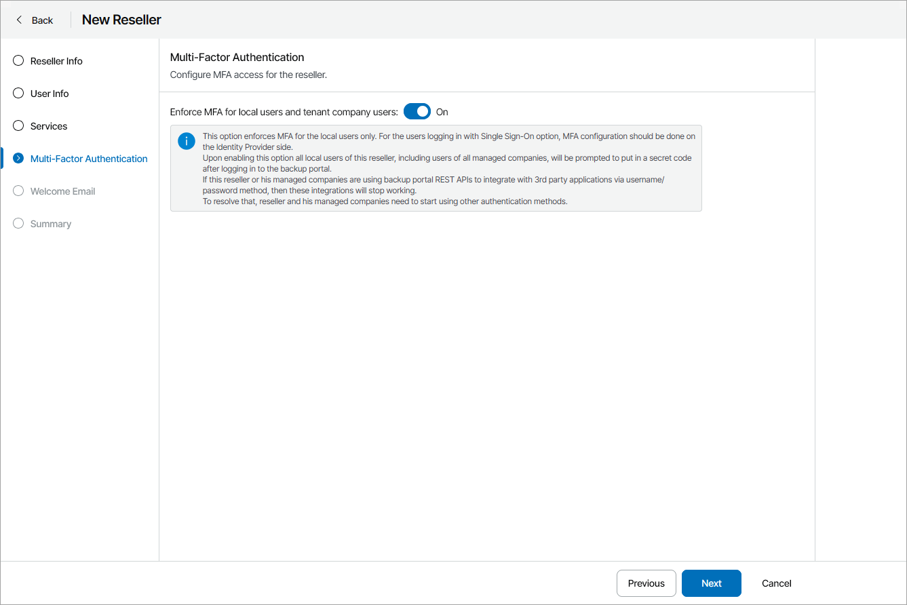

# Step 5. Configure Multi-Factor Authentication

At the Multi-Factor Authentication step of the wizard, you can assign a second authentication factor to all reseller users and users of all assigned companies. For details on MFA, see [Configuring Multi-Factor Authentication](mfa.md).

To enable MFA, set the Enforce MFA for local users and tenant company users toggle to On. On the next authorization session, each user will be prompted to configure MFA.

