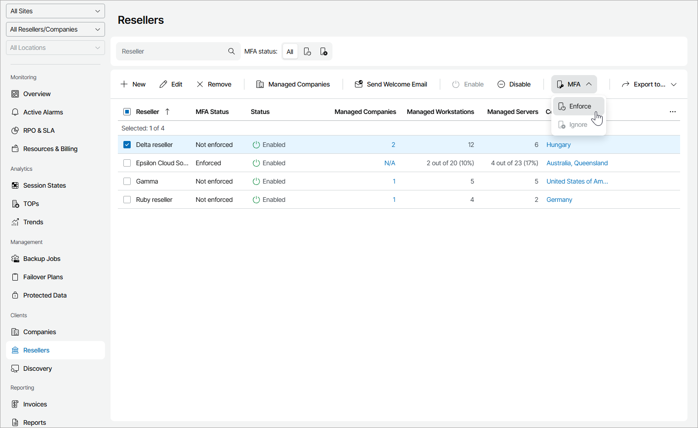

# Enabling and Disabling MFA for Resellers

You can enable MFA for all users of one or more resellers and users of all assigned companies.

|  |
| --- |
| Important! |
| If you configure MFA for an account that is used for integration with third party applications, that integration will stop working. To avoid that, first configure API key, as described in the [Configuring API Keys](api_keys.md) section. |

Required Privileges

To perform this task, a user must have the following role assigned: Portal Administrator.

Enabling and Disabling MFA

To enable or disable MFA for one or more resellers:

1. Log in to Veeam Service Provider Console.

For details, see [Accessing Veeam Service Provider Console](access_vac.md).

1. In the menu on the left, click Resellers.
2. Select the necessary reseller in the list.
3. At the top of the list, click MFA.

Alternatively, you can right-click the necessary reseller and choose MFA.

1. From the drop-down list select Enforce to enable MFA or Ignore to allow resellers to disable MFA for their account.

1. In the displayed window, click Yes.

On the next authorization session, each user will be prompted to configure MFA settings on the Multi-Factor Authentication step of the Edit User wizard as described in the [Filling User Profile](fill_user_profile.md#mfa_config) section.

|  |
| --- |
| Note: |
| If the Enforce MFA for all managed clients and resellers policy is enabled, you cannot disable MFA for individual resellers. For details, see [MFA Policies](mfa_policies.md). |

