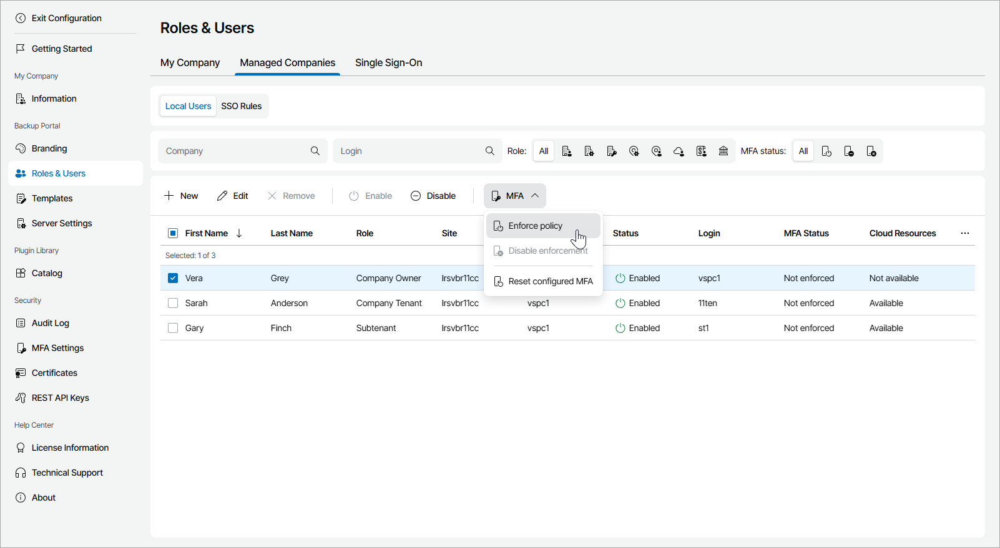

# Enabling, Disabling and Resetting MFA for Company Users

You can configure MFA for specific company users.

|  |
| --- |
| Important! |
| If you configure MFA for an account that is used for integration with third party applications, that integration will stop working. To avoid that, first configure API key, as described in the [Configuring API Keys](api_keys.md) section. |

To enable, disable or reset MFA for specific users of a company:

1. Log in to Veeam Service Provider Console.

For details, see [Accessing Veeam Service Provider Console](access_vac.md).

1. At the top right corner of the Veeam Service Provider Console window, click Configuration.
2. In the configuration menu on the left, click Roles & Users.
3. Open the Managed Companies tab and navigate to Local Users.
4. To narrow down the list of users, you can apply the following filters:

* Company — search the list of users by company to which the user belongs.
* Login — search the list of users by user login.
* Role — limit the list of users by role (Company Owner, Company Administrator, Company Tenant, Location Administrator, Location User, Subtenant, Company Invoice Auditor, Service Provider Global Administrator).

* MFA status — indicates whether multi-factor authentication is enforced for user (Enforced, Not enforced, Not configured).

1. Select users in the list.
2. At the top of the list, click MFA.

Alternatively, you can right-click the necessary user and choose MFA.

1. From the drop-down list select Enforce policy to enable MFA, Disable enforcement to allow users to disable MFA or Reset configured MFA to reset MFA settings.

1. In the confirmation window, click Yes.
2. Click OK to close the Users window.

On the next authorization session, each user will be prompted to configure MFA settings on the Multi-Factor Authentication step of the Edit User wizard as described in the [Modifying User Profile](https://helpcenter.veeam.com/docs/vac/provider_user/modify_user_profile.html?ver=9.2) section of the Guide for End Users.

|  |
| --- |
| Note: |
| If the Enforce MFA for all managed clients and resellers policy is enabled or MFA is enabled for the reseller that manages the selected companies, you cannot disable MFA. For details, see [MFA Policies](mfa_policies.md). If MFA is enabled for the company by your service provider, you cannot disable MFA. |

