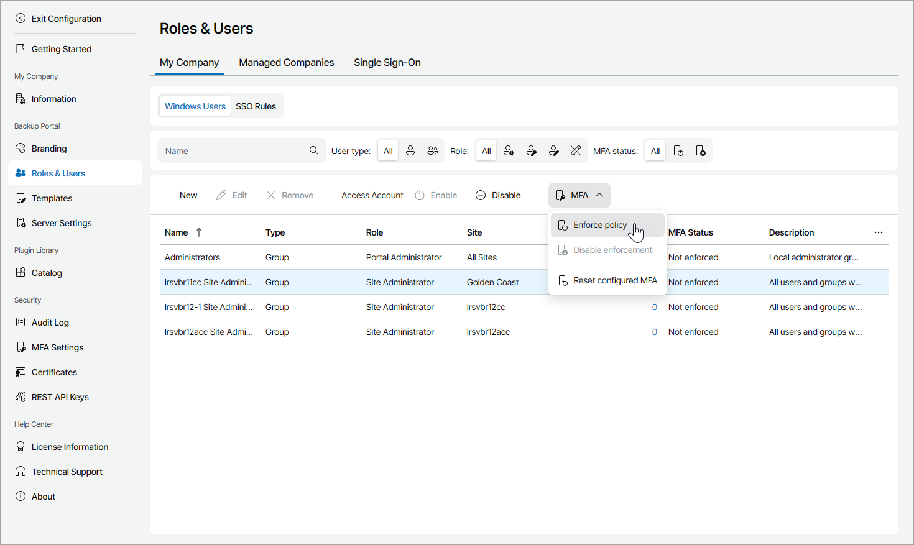
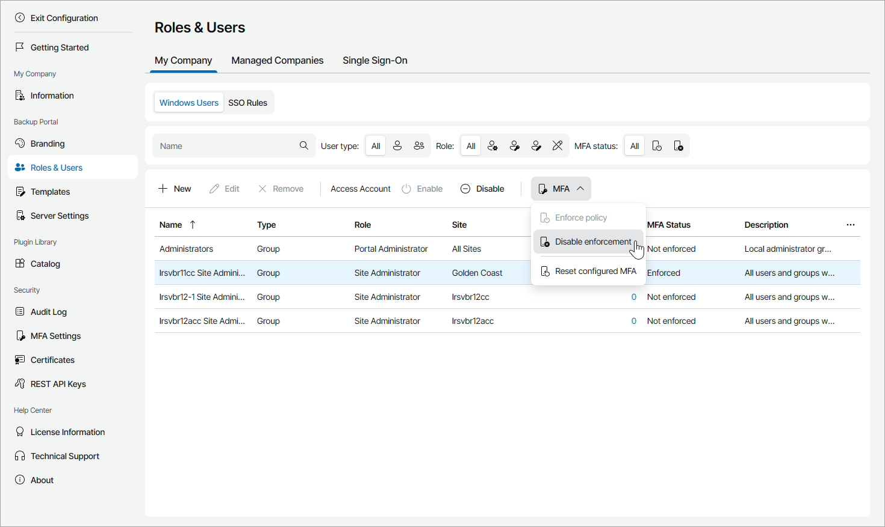
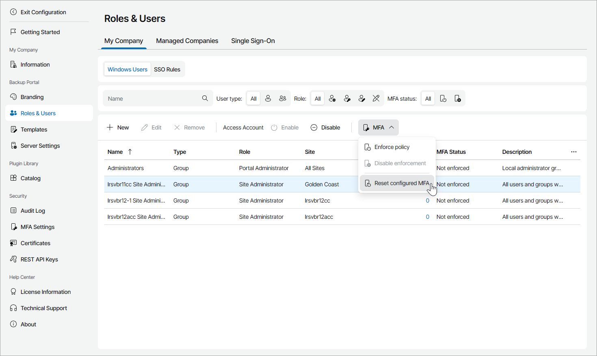

# Enabling, Disabling and Resetting MFA for Administrator Portal Users

You can configure MFA for Administrator Portal users and groups.

Required Privileges

To perform this task, a user must have the following role assigned: Portal Administrator.

Enabling MFA

To enable MFA for portal users and groups:

1. Log in to Veeam Service Provider Console.

For details, see [Accessing Veeam Service Provider Console](access_vac.md).

1. At the top right corner of the Veeam Service Provider Console window, click Configuration.
2. In the configuration menu on the left, click Roles & Users.
3. Open the My Company tab and navigate to Windows Users.
4. Select the necessary user or user group in the list.
5. At the top of the user list, click MFA and select Enforce policy.

Alternatively, you can right-click the necessary user or user group, choose MFA and select Enforce policy.

On the next authorization session, each user must configure MFA on the Multi-Factor Authentication step of the Edit User wizard as described in the [Filling User Profile](fill_user_profile.md#mfa_config) section.

Disabling MFA

To allow portal users and groups disable MFA:

1. Log in to Veeam Service Provider Console.

For details, see [Accessing Veeam Service Provider Console](access_vac.md).

1. At the top right corner of the Veeam Service Provider Console window, click Configuration.
2. In the configuration menu on the left, click Roles & Users.
3. Open the My Company tab and navigate to Windows Users.
4. Select one or more users or groups in the list.
5. At the top of the user list, click MFA and select Disable enforcement.

Alternatively, you can right-click the necessary user or user group, choose MFA and select Disable enforcement.

On the next authorization session, each user can disable MFA on the Multi-Factor Authentication step of the Edit User wizard as described in the [Filling User Profile](fill_user_profile.md#mfa_config) section.

|  |
| --- |
| Note: |
| If a user exists only as a part of a group, to enable or disable MFA for that user separately, use Veeam Service Provider Console REST API as described in section [Enabling and Disabling MFA using REST API](mfa_rest.md). |

Resetting MFA

To reset MFA for portal users:

1. Log in to Veeam Service Provider Console.

For details, see [Accessing Veeam Service Provider Console](access_vac.md).

1. At the top right corner of the Veeam Service Provider Console window, click Configuration.
2. In the configuration menu on the left, click Roles & Users and navigate to My Company.
3. Open the Windows Users tab.
4. Select one or more users or groups in the list.
5. At the top of the user list, click MFA and select Reset configured MFA.

Alternatively, you can right-click the necessary user or user group, choose MFA and select Reset configured MFA.

