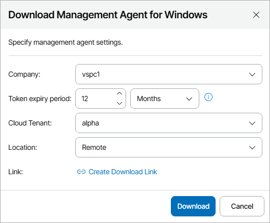
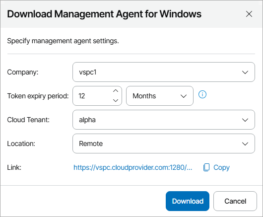

# Obtaining Management Agent Setup File

To deploy Veeam Service Provider Console management agent on machines hosting Veeam products, you must obtain the management agent setup file. To download the management agent setup file, you can use one of the following options:

* [Download the setup file in Veeam Service Provider Console](#download).

* [Create the setup file download link](#link).
* [Download the setup file using link in the cloud tenant welcome email](#email).

Required Privileges

To perform this task, a user must have one of the following roles assigned: Portal Administrator, Site Administrator, Portal Operator.

Downloading Management Agent Setup File in Veeam Service Provider Console

You can download the management agent setup file in Veeam Service Provider Console:

1. Log in to Veeam Service Provider Console.

For details, see [Accessing Veeam Service Provider Console](access_vac.md).

1. In the menu on the left, click Discovery.
2. Open the Discovered Computers tab and navigate to Computers.
3. At the top of the computers list, click Download Management Agent and select OS type: Windows, Linux or macOS.

Alternatively, you can right-click the necessary computer and choose Download Management Agent.

1. In the Download Management Agent for Windows/Linux/Mac window, specify management agent settings:

* In the Company, Cloud Tenant and Location lists, select an active company, cloud tenant account and company location to which you want to assign the management agent. Selected company, cloud tenant and location names will be added to the agent setup file name and the management agent will be preconfigured to connect to Veeam Service Provider Console with the selected company settings.

[For hosted infrastructure] To download a management agent for Veeam products hosted in your infrastructure, select your company name in the list.

To download setup file for an agent that will not be assigned to any company, select Not Set. You can deploy a Not Set agent only in client infrastructures. Note that this agent will not be able to connect to Veeam Service Provider Console automatically, and you will have to configure the agent manually. After you configure the agent, Veeam Service Provider Console will assign the Unverified connection status to this agent. You will have to verify the agent manually by setting the company to the agent. For details, see [Setting Company to Management Agents](set_company.md). Note that if you delete an unverified agent connection, the agent will be removed from Veeam Service Provider Console. To connect this agent, you will have to reinstall it manually.

* In the Token expiry period field, specify the time period for which you want to verify the management agent. Management agents installed after the specified period expires will not be able to connect to Veeam Service Provider Console automatically. You will have to verify the agent manually by setting company to the agent. Note that if you delete an unverified agent connection, the agent will be removed from Veeam Service Provider Console. To connect this agent, you will have to reinstall it manually. Management agents that are already connected to Veeam Service Provider Console will not be affected.

If you downloaded a setup file for a management agent assigned to the company but did not install the management agent before token expiration, the setup file will become invalid. An agent installed from this setup file will have the Unverified connection status and you will have to verify the agent manually by setting company to the agent. For details, see [Setting Company to Management Agents](set_company.md).

It is recommended to specify an expiry period of 6 months or less.

Note that you cannot specify expiry period for agents that are not assigned to any company.

1. Click Download.

The setup file will be saved to the default download location on your computer.

Creating Management Agent Setup File Link in Veeam Service Provider Console

If you do not want to manually deploy management agent setup files on managed computers, you can create a download link for a preconfigured management agent. For example, if you want company users to download agents with custom configuration, you can include the download link in the customized welcome email.

To copy the management agent setup file link from Veeam Service Provider Console:

1. Log in to Veeam Service Provider Console.

For details, see [Accessing Veeam Service Provider Console](access_vac.md).

1. In the menu on the left, click Discovery.
2. Open the Discovered Computers tab and navigate to Computers.
3. At the top of the computers list, click Download Management Agent and select OS type: Windows, Linux or macOS.

Alternatively, you can right-click the necessary computer and choose Download Management Agent.

1. In the Download Management Agent for Windows/Linux/Mac window, specify management agent settings:

* In the Company, Cloud Tenant and Location lists, select an active company, cloud tenant account and company location to which you want to assign the management agent. Selected company, cloud tenant and location names will be added to the agent setup file name and the management agent will be preconfigured to connect to Veeam Service Provider Console with the selected company settings.

[For hosted infrastructure] To download a management agent for Veeam products hosted in your infrastructure, select your company name in the list.

If you want to download a setup file for an agent that will not be assigned to any company, in the list of companies, select Not Set. You can deploy a Not Set agent only in client infrastructures. Note that this agent will not be able to connect to Veeam Service Provider Console automatically, and you will have to configure the agent manually. After you configure the agent, Veeam Service Provider Console will assign the Unverified connection status to this agent. You will have to verify the agent manually by setting company to the agent. For details, see [Setting Company to Management Agents](set_company.md). Note that if you delete an unverified agent connection, the agent will be removed from Veeam Service Provider Console. To connect this agent, you will have to reinstall it manually.

* In the Token expiry period field, specify the time period for which you want to verify the management agent. Management agents installed after the specified period expires will not be able to connect to Veeam Service Provider Console automatically. You will have to verify the agent manually by setting company to the agent. Note that if you delete an unverified agent connection, the agent will be removed from Veeam Service Provider Console. To connect this agent, you will have to reinstall it manually. Management agents that are already connected to Veeam Service Provider Console will not be affected.

If you downloaded a setup file for a management agent assigned to the company but did not install the management agent before token expiration, the setup file will become invalid. An agent installed from this setup file will have the Unverified connection status, and you will have to verify the agent manually by setting company to the agent. For details, see [Setting Company to Management Agents](set_company.md).

It is recommended to specify an expiry period of 6 months or less.

Note that you cannot specify expiry period for agents that are not assigned to any company.

1. Click Create Download Link.

Veeam Service Provider Console will generate a download link for the management agent.

If you have changed the management agent settings after creating a download link, click New Link to generate a new download link.

1. Click Copy to copy the download link.

After creating a download link, you can send the link to Company Owner, include it in the customized welcome email or use the link to download management agent setup file directly from remote computers.

Downloading Management Agent Setup File Using Link in Cloud Tenant Welcome Email

Company users can download the preconfigured management agent setup file using a link in the welcome email message sent to the Company Owner after you assign a cloud tenant to the company. For details, see [Sending Welcome Email Message](send_tenant_welcome_email.md).

Note that management agent setup files provided in the default welcome email have an expiry period of 2 days.

