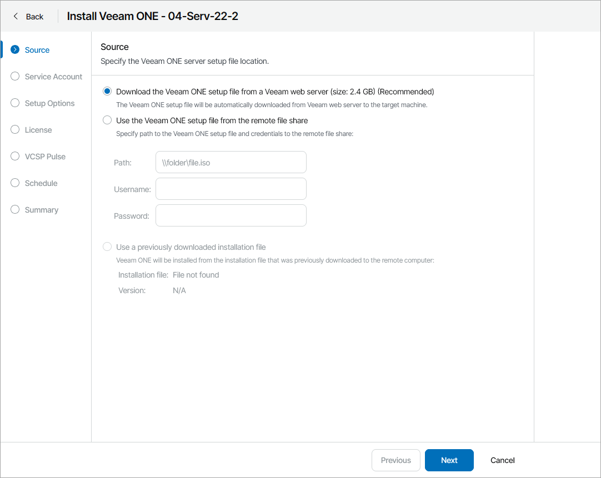
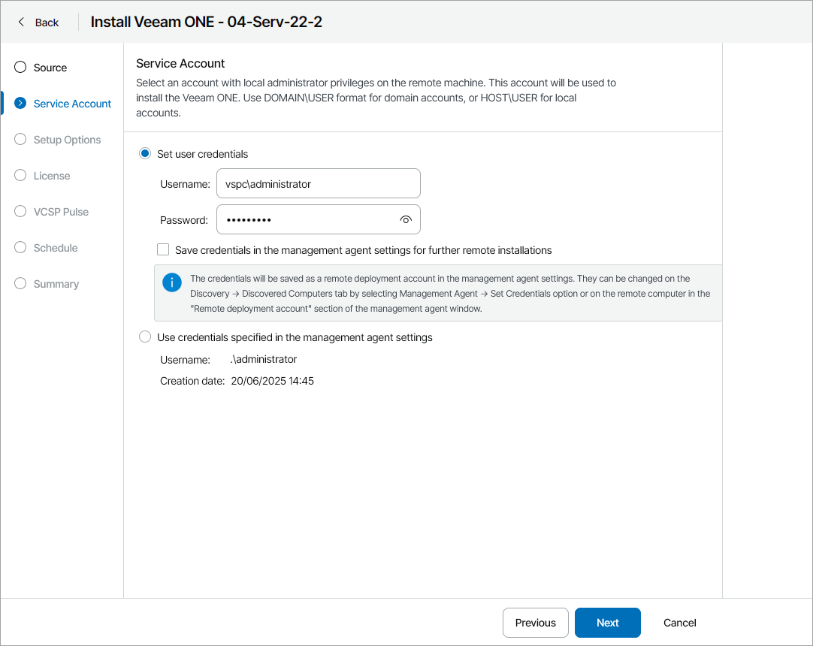
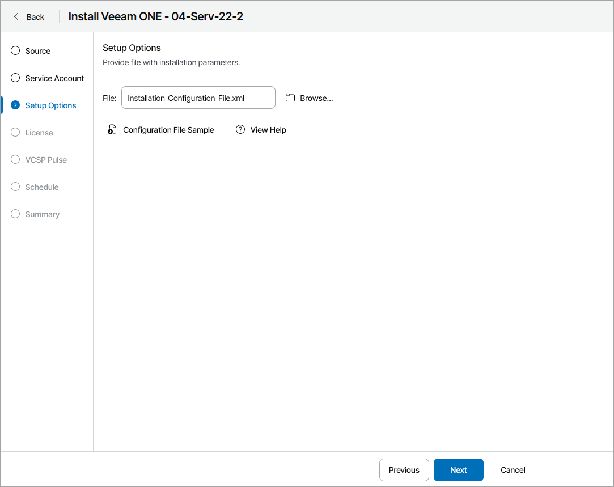
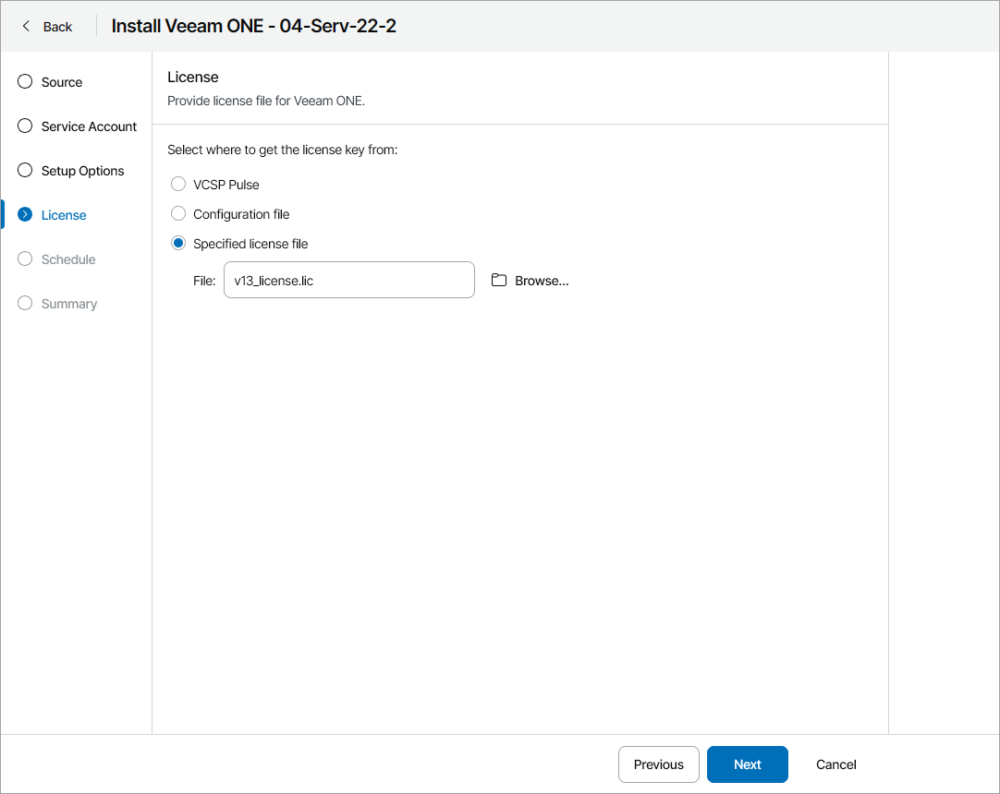
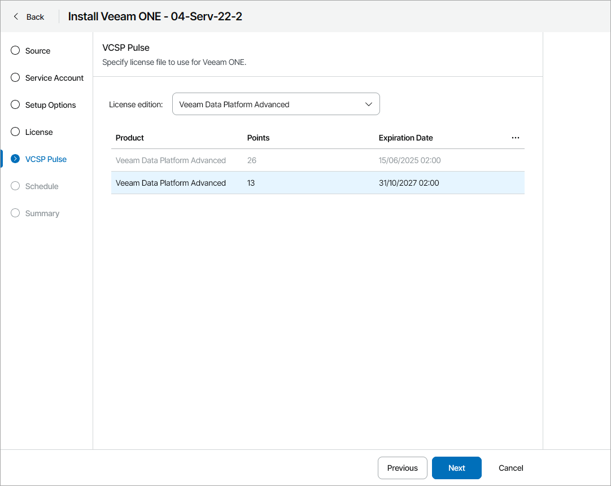
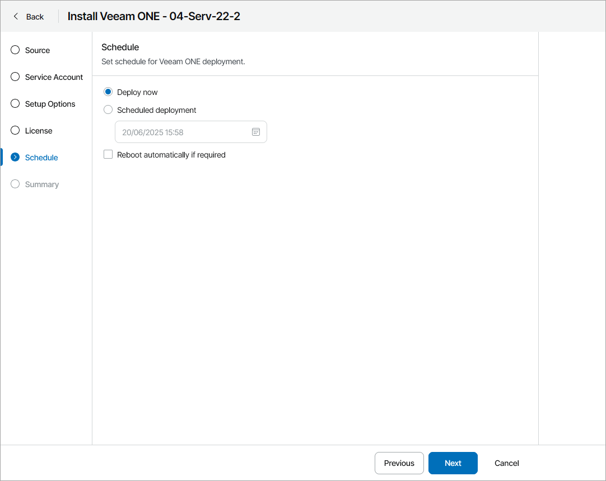
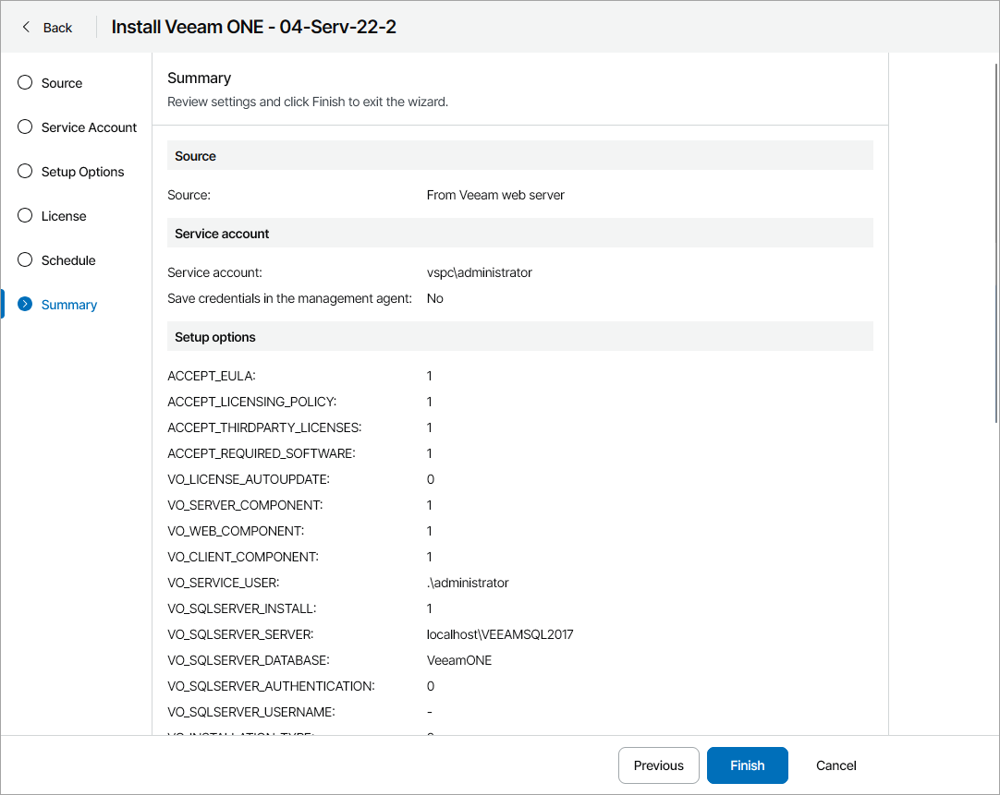

# Installing Veeam ONE Servers

You can install Veeam ONE in unattended mode on discovered computers in client or hosted infrastructure. For details on installation in unattended mode, see section [Installing Veeam ONE in Unattended Mode](https://helpcenter.veeam.com/docs/one/userguide/silent_mode.html?ver=13) of the Veeam ONE User Guide.

How Installation of Veeam ONE is Performed

Installation of Veeam ONE runs as follows:

1. A backup administrator instructs Veeam Service Provider Console to install Veeam ONE on a discovered computer and configures installation settings.
2. Veeam Service Provider Console management agent on the discovered computer provides Veeam ONE license from the selected source and triggers installation of Veeam ONE in unattended mode. After the installation is complete, Veeam Service Provider Console management agent connects Veeam ONE to Veeam Service Provider Console.

Required Privileges

To perform this task, a user must have one of the following roles assigned: Portal Administrator, Site Administrator, Portal Operator.

Prerequisites

For details on system requirements for Veeam ONE servers, see section [System Requirements](https://helpcenter.veeam.com/docs/one/userguide/system_requirements.html?ver=13) of the Veeam ONE User Guide.

In addition to requirements listed in the Veeam ONE User Guide, consider the following:

* Make sure that a Veeam Service Provider Console management agent is deployed on the machine on which you plan to install Veeam ONE. For details, see [Deploying Veeam Service Provider Console Management Agents](install_management_agents.md).
* To install Veeam ONE on a client computer, you must upgrade Veeam Cloud Connect server on which the cloud tenant is registered to version 12.
* Make sure you have additional free space on the system disk on the machine on which you plan to install Veeam ONE. Veeam Service Provider Console will need extra space to download and unpack the Veeam ONE setup file. You can check the setup file size on the first step of the wizard.

* Make sure you have local administrator credentials for the machine on which you plan to install Veeam ONE.

|  |
| --- |
| Note: |
| In Veeam Service Provider Console, you can install Veeam ONE version 13 or later in the all-in one deployment scenario only. For details, see section [All-in-One Deployment](https://helpcenter.veeam.com/docs/one/userguide/typical_deployment.html?ver=13) of the Veeam ONE User Guide.  When you initiate Veeam ONE installation, Veeam Service Provider Console will send to Veeam Installation Server data about Veeam Service Provider Console version. This data will be sent even if you have disabled automatic checks for Veeam products updates. |

Installing Veeam ONE

To initiate Veeam ONE installation:

1. Log in to Veeam Service Provider Console.

For details, see [Accessing Veeam Service Provider Console](access_vac.md).

1. In the menu on the left, click Discovery.
2. Open the Discovered Computers tab and navigate to Computers.
3. Select the necessary computer in the list.
4. At the top of the list, click Install Product > Install Veeam ONE > Install.

Alternatively, you can right-click the necessary computer and click Install Product > Install Veeam ONE > Install.

Veeam Service Provider Console will open the Install Veeam ONE wizard.

1. At the Source step of the wizard, specify the location of the Veeam ONE distribution:

* To use a latest distribution from Veeam Installation Server (over the Internet), select the Download the Veeam ONE setup file from a Veeam web server option.
* To use a distribution stored on a remote file share, select the Use the Veeam ONE setup file from the remote file share option and specify the remote file share location and the credentials of the account that Veeam Service Provider Console will use to connect to the file share.
* If you have previously downloaded an installation file to the remote computer in Veeam Service Provider Console, select the Use a previously downloaded installation file option. Veeam Service Provider Console will locate the downloaded installation file automatically.

For details on how to download the installation file in Veeam Service Provider Console, see [Downloading Setup File](#download_iso).

1. At the Service Account step of the wizard, specify service account credentials:

* Select the Set user credentials option to set the user name and password.

The account must have local administrator permissions on the remote computer.

To store the user name and password as remote deployment account credentials in the management agent, select the Save credentials in the management agent settings for further remote installations check box. This will allow you to use these credentials to upgrade the Veeam ONE server in Veeam Service Provider Console.

If you have previously saved credentials in the management agent, you must confirm overwriting the saved credentials.

You can also set or update service account credentials in Veeam Service Provider Console. For details, see [Modifying Management Agent Credentials](modify_agent_credentials.md).

* Select the Use credentials specified in the management agent settings option to use the credentials saved in the management agent settings.

1. At the Setup Options step of the wizard, specify path to an XML file with installation parameters.

To create a configuration file, click Configuration File Sample to download the file template and fill in the necessary configuration parameters. For details on configuration parameters, see [Configuration Parameters](#config).

1. At the License step of the wizard, do one of the following:

* To install license key configured in VCSP Pulse, select VCSP Pulse.

This option is available only if you have configured integration with VCSP Pulse. For details, see [Integration with VCSP Pulse](integration_pulse.md).

If this option is selected, the VCSP Pulse step will become available in the wizard.

* To install license provided in configuration file, select Configuration file.

* To upload license file from your computer, select Specified license file, click Browse and specify a path to the license file.

1. [If you have selected VCSP Pulse at step 9] At the VCSP Pulse step of the wizard, select the necessary license key in the list.

It is not recommended to install one VCSP Pulse license in multiple products. If you have selected a license key that is already installed in another product, Veeam Service Provider Console will ask you to copy the license key. If you do not want to copy the license key, you can download the license file from VCSP Pulse and install it manually. Note that in license usage report Veeam Service Provider Console will add up points usage for all servers with the same license ID.

1. At the Schedule step of the wizard, specify when you want to install Veeam ONE:

* To install Veeam ONE immediately, select Deploy now.
* To postpone installation, select Scheduled deployment and specify the date and time when Veeam ONE will be installed.

You will be able to reschedule or cancel the installation using the link in the Scheduled Deployment column on the Discovered Computers tab.

If you want to reboot remote computers automatically during Veeam ONE installation, select the Reboot automatically if required check box. If you do not select the check box, you may need to reboot the Veeam ONE server manually to complete installation. For details, see [Rebooting Remote Computers](reboot_remote_computers.md).

1. At the Summary step of the wizard, review installation settings and click Finish.

Downloading Setup File

To download the Veeam ONE installation file to a remote computer:

1. Log in to Veeam Service Provider Console.

For details, see [Accessing Veeam Service Provider Console](access_vac.md).

1. In the menu on the left, click Discovery.
2. Open the Discovered Computers tab and navigate to Computers.
3. Select the necessary computers in the list.
4. At the top of the list, click Install Product > Install Veeam ONE > Download Installation File.

Alternatively, you can right-click the necessary computer, click Install Product > Install Veeam ONE > Download Installation File.

Veeam Service Provider Console will open the Download Installation File window.

1. In the Directory field, check, and if necessary, change the directory where Veeam Service Provider Console will download the installation file.
2. Click Download.
3. To ensure that the Veeam ONE installation file was downloaded successfully:

* Check the value in the Installation File Download Status column.

If the installation was successful, the Installation File Download Status must be Success.

* Click the link in the Installation File Download Status column to display session details of the installation file download.

If you want to cancel the download of the Veeam ONE installation file, click Cancel Download. If the download was canceled and the Installation File Download Status is Failed, click Clear Logs to reset the status.

Checking Installation Results

To make sure that the installation of Veeam ONE has completed successfully, complete the following steps:

1. Log in to Veeam Service Provider Console.

For details, see [Accessing Veeam Service Provider Console](access_vac.md).

1. In the menu on the left, click Discovery.
2. Open the Discovered Computers tab and navigate to Computers.
3. Find the necessary computers in the list.
4. Check the value in the Deployment Status and Deployment Progress columns.

If installation was successful, the Deployment Status must be Success, and the Deployment Progress must be 100%.

1. Click a link in the Deployment Status column to display session details of the installation procedure.

If you want to cancel Veeam ONE installation, click Cancel Deployment. If the installation was canceled and the Deployment Status is Failed, click Clear Logs to reset the status.

In some cases, after installation you may need to perform additional operations. For example, if the setup detects a pending computer reboot, the list of installation session details will display a warning notifying that reboot is required. To complete the installation, you can initiate computer reboot in Veeam Service Provider Console. For details, see [Rebooting Remote Computers](reboot_remote_computers.md).

Configuration Parameters

The configuration file contains the following parameters:

* ACCEPT\_EULA — specify "1" to accept Veeam license agreement.
* ACCEPT\_LICENSING\_POLICY — specify "1" to accept Veeam licensing policy.
* ACCEPT\_THIRDPARTY\_LICENSES — specify "1" to accept the license agreement for 3rd party components that Veeam incorporates.
* ACCEPT\_REQUIRED\_SOFTWARE — specify "1" to accept all required software license agreements.
* VO\_LICENSE\_FILE — path to the license file on the machine where you want to install Veeam ONE. If you want to install VCSP Pulse license or provide the license file manually, leave this parameter empty.
* VO\_LICENSE\_AUTOUPDATE — specify "1" to enable automatic license update and usage reporting. Specify "0" if you want to update the license manually. For licenses without ID information, specify "0".
* VO\_SERVER\_COMPONENT — specify "1" to install Veeam ONE Server.
* VO\_WEB\_COMPONENT — specify "1" to install Veeam ONE Web Services.
* VO\_CLIENT\_COMPONENT — specify "1" to install Veeam ONE Client.
* VO\_SERVICE\_USER — user account under which the Veeam ONE Service will run.
* VO\_SERVICE\_PASSWORD — password for the account under which the Veeam ONE Service will run.
* VO\_SQLSERVER\_INSTALL — specify "0" to use an existing SQL server instance. Specify "1" to install a new SQL server instance.
* VO\_SQLSERVER\_SERVER — SQL server and instance where the configuration database will be deployed. Note that if you want to install a new SQL instance, you can only connect to a local host.
* VO\_SQLSERVER\_DATABASE — configuration database name.
* VO\_SQLSERVER\_AUTHENTICATION — specifies authentication mode to connect to the SQL Server where the Veeam ONE configuration database is deployed. Specify "1" to use the SQL Server authentication mode or specify "0" to use the Microsoft Windows authentication mode.
* VO\_SQLSERVER\_USERNAME — LoginID to connect to the SQL Server in the SQL Server authentication mode.
* VO\_SQLSERVER\_PASSWORD — password to connect to the SQL Server in the SQL Server authentication mode.
* VO\_POSTGRESQL\_INSTALL — specify "0" to use an existing PostgreSQL server instance. Specify "1" to install a new PostgreSQL server instance.
* VO\_POSTGRESQL\_SERVER — PostgreSQL server and instance where the caching database will be deployed.
* VO\_POSTGRESQL\_PORT — port used to access the PostgreSQL server and instance on which the caching database will be deployed. If you do not specify this parameter, default port '5432' is used.
* VO\_POSTGRESQL\_DATABASE — configuration database name.
* VO\_POSTGRESQL\_AUTHENTICATION — specifies authentication mode to connect to the PostgreSQL Server where the Veeam ONE configuration database is deployed. Specify "1" to use the PostgreSQL Server authentication mode or specify "0" to use the Microsoft Windows authentication mode.
* VO\_POSTGRESQL\_USERNAME — LoginID to connect to the PostgreSQL Server in the PostgreSQL Server authentication mode.
* VO\_POSTGRESQL\_PASSWORD — password to connect to the PostgreSQL Server in the PostgreSQL Server authentication mode.
* VO\_INSTALLATION\_TYPE — specify "0" to use Veeam backup data and virtual infrastructure performance monitoring. Specify "1" to use Veeam backup data and large-scale virtual infrastructure performance monitoring. Specify "2" to use Veeam backup data only. If you do not specify this parameter, Veeam backup data only mode will be used.
* VO\_MONITORING\_SERVICE\_PORT — port used to interact with Veeam ONE Monitoring service. If you do not specify this parameter, default port '2714' is used.
* VO\_REPORTING\_SERVICE\_PORT — port used to interact with Veeam ONE Reporting service. If you do not specify this parameter, default port '2742' is used.
* VO\_CACHING\_SERVICE\_PORT — port used to interact with Veeam ONE Caching service. If you do not specify this parameter, default port '2743' is used.
* VO\_INTERNAL\_WEB\_API\_PORT — port used by Veeam ONE Monitoring service and Web Services component to interact with Veeam ONE Reporting service. If you do not specify this parameter, default port '2741' is used.
* VO\_WEBSITE\_PORT — port used to access the Veeam ONE Web Client through the web. If you do not specify this parameter, default port '1239' is used.
* VO\_AGENT\_SERVICE\_PORT — port that Veeam ONE Agent will use to collect data from connected Veeam ONE servers. If you do not specify this parameter, default port '2805' is used.
* VO\_CERTIFICATE\_THUMBPRINT — certificate thumbprint that will be used to secure traffic between the web browser, Veeam ONE Web Services and Veeam ONE Reporting service.
* INSTALLDIR — path to the directory where Veeam ONE will be installed.
* VO\_PERFCACHE — folder where Veeam ONE stores real-time performance data, as this data is collected.
* DONT\_ADD\_USER\_TO\_ADMINS — specify "1" to only add the service user to the administrator group. Specify "0" to add the setup user and the service user to the administrator group.

Note that you must specify "1" in ACCEPT\_EULA, ACCEPT\_LICENSING\_POLICY, ACCEPT\_THIRDPARTY\_LICENSES and ACCEPT\_REQUIRED\_SOFTWARE parameters to proceed with the installation.

