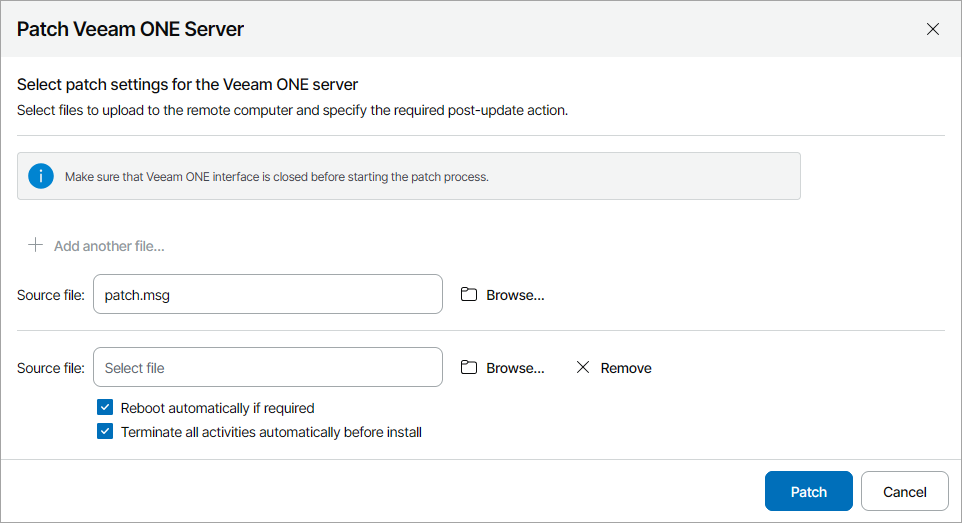

# Applying Patches to Veeam ONE Servers

From time to time, you may obtain from Veeam Software patches aimed to fix known issues in the Veeam ONE software. A patch is a hotfix or bugfix that does not change product major or minor version. Applying patches on individual Veeam ONE servers in the client infrastructure may take a lot of time and effort. To streamline this process, you can apply patches to a group of Veeam ONE servers managed in Veeam Service Provider Console.

The procedure of applying patches to Veeam ONE servers is performed with the help of a management agent. The management agent obtains patch files provided by the Administrator Portal user, uploads these files to hosted and client computers within the patching scope, and initiates the patching process on these computers.

|  |
| --- |
| Note: |
| For security reasons, only files obtained from Veeam Customer Technical Support or downloaded from Veeam website can be used for patching. |

Required Privileges

To perform this task, a user must have one of the following roles assigned: Portal Administrator, Site Administrator, Portal Operator.

Before You Begin

Before you start the procedure of applying patches, close all Veeam ONE Client instances of the Veeam ONE servers that you want to patch.

Applying Patches to Veeam ONE Servers

To patch a Veeam ONE server:

1. Log in to Veeam Service Provider Console.

For details, see [Accessing Veeam Service Provider Console](access_vac.md).

1. In the menu on the left, click Discovery.
2. Open the ONE Servers tab.
3. Select one or more Veeam ONE servers in the list.

Note that you can patch only Veeam ONE servers with the same version. Otherwise, only the Veeam ONE servers that are compatible with the patch version will be patched.

1. At the top of the list, click Manage Updates and choose Patch Server.

Alternatively, you can right-click the necessary server, choose Manage Updates and select Patch Server.

Veeam Service Provider Console will open the Patch Veeam ONE Server window.

1. Click Browse and select a patch file that must be executed on the Veeam ONE servers.

To execute multiple patch files, click Add another file and repeat step 6 for every file you want to upload.

1. If you want to reboot remote computers automatically during patch installation, select the Reboot automatically if required check box.

If you do not select the check box, you may need to reboot the Veeam ONE server manually to complete patch installation. For details, see [Rebooting Remote Computers](https://helpcenter.veeam.com/docs/vac/provider_admin/reboot_remote_computers.html).

1. If you want Veeam ONE to automatically stop all monitoring activities, select the Terminate all activities automatically before install check box.

After the patching process is finished, monitoring activities will resume automatically.

1. Click Patch.

Veeam Service Provider Console will upload patch files to the Veeam ONE server and the execute selected actions. Do not close your browser tab until the patching process is finished. After patch installation, Veeam ONE remote components will be updated automatically. To check the patching progress and download patching session logs, click the link in the Update Status column.

To complete patch installation, you may need to reboot the Veeam ONE server. For details, see [Rebooting Remote Computers](https://helpcenter.veeam.com/docs/vac/provider_admin/reboot_remote_computers.html).

