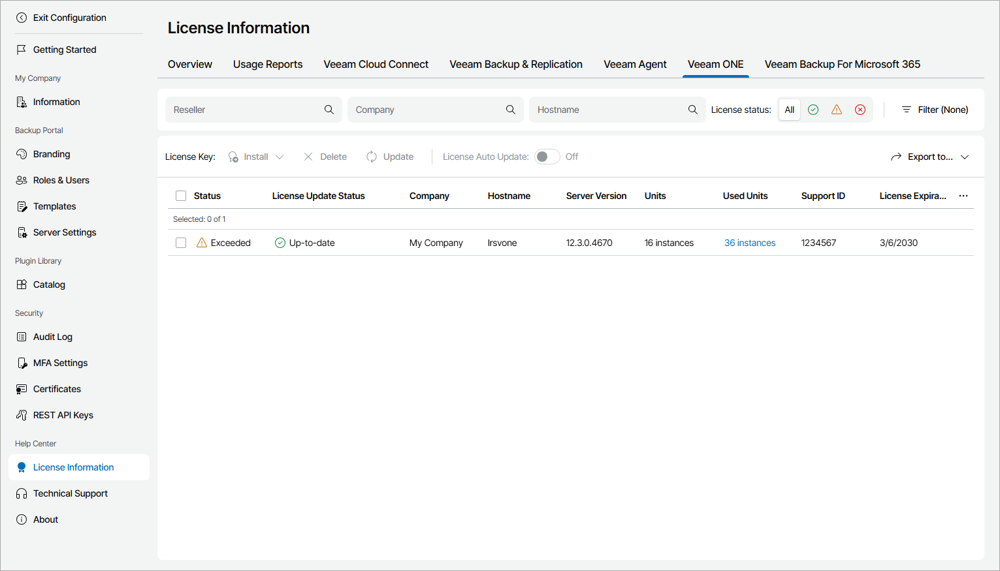

# Veeam ONE

The Veeam ONE view provides a list of Veeam ONE servers managed in Veeam Service Provider Console, and information about their license status.

To narrow down the list of Veeam ONE servers, you can use the following filters:

* Reseller — search Veeam ONE servers by name of a reseller who manages the server.
* Company — search Veeam ONE servers by company name.
* Hostname — search Veeam ONE servers by host name.
* License status — limit the list of Veeam ONE servers by license status (Valid, Warning, Error).

* Type — limit the list of Veeam ONE servers by type of license installed on the server (Community, Rental, Subscription, Perpetual).

Each Veeam ONE server in the list is described with a set of properties. By default, some properties in the list are hidden. To display additional properties, click the ellipsis on the right of the list header and choose properties that must be displayed.

* Status — status of license installed on the Veeam ONE server (Valid, Warning, Error).

* License Update Status — status of the latest license update.

* Reseller — name of a reseller who manages the company to which a Veeam ONE server belongs.

* Company — client company to which a Veeam ONE server belongs.

* Site — name of the Veeam Cloud Connect site on which the company is registered.

* Location — location to which a Veeam ONE server belongs.
* Hostname — name of a Veeam ONE server for which license details are provided.
* Server Version — version of Veeam ONE installed on a server.

* License Type — license type (Community, Rental, Subscription, Perpetual).

* Package — license package.

* Units — number of instances or points included in a license file.

* Used Units — number of instances or points consumed by managed objects out of the total number of instances available in the license.

Click a link in the Used Units column to view detailed information on licensed workloads, used instances or points and new workloads count.

* Support ID — support ID required for contacting Veeam Customer Technical Support.

* Support Expiration — date when support contract will expire.
* License Expiration — date when a license will expire.

* License ID — ID of the license file.

* License Auto Update — indicates if license auto update is enabled.

Exporting Veeam ONE License Details

You can export Veeam ONE license details to a CSV or XML file:

1. Apply the necessary filters to display in the list Veeam ONE servers you want to export.
2. Click Export to and choose a format of the exported data:

* CSV — choose this option to structure exported data as a CSV file.
* XML — choose this option to structure exported data as an XML file.

The file with exported data will be saved to the default download location on your computer.

