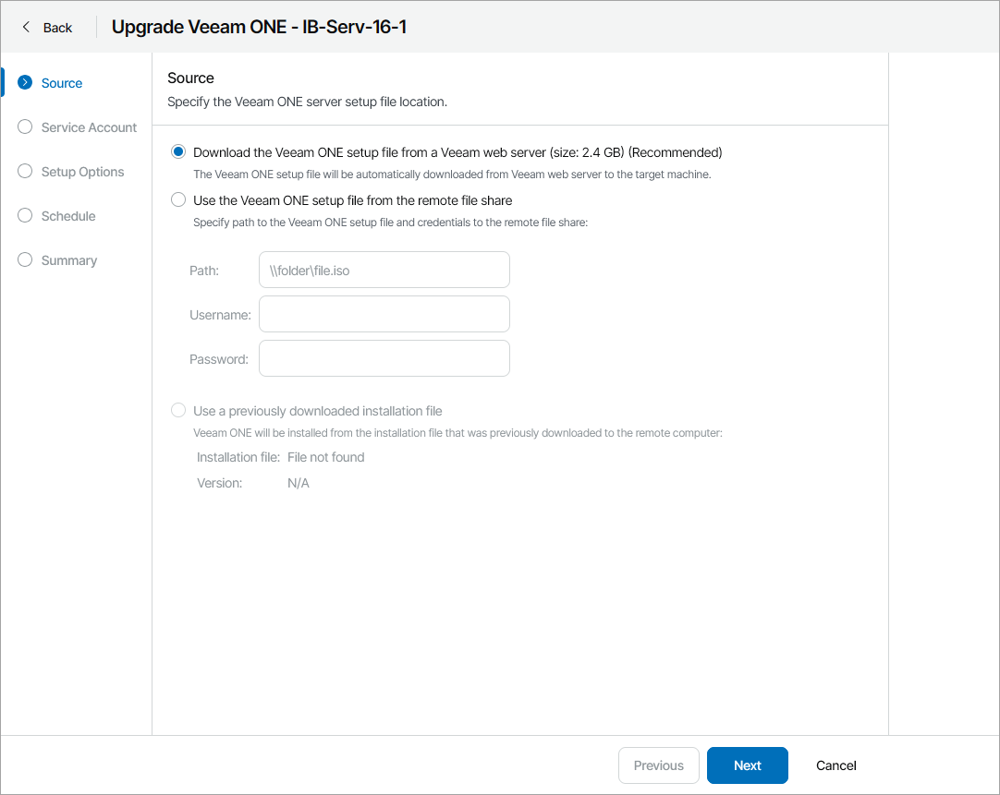
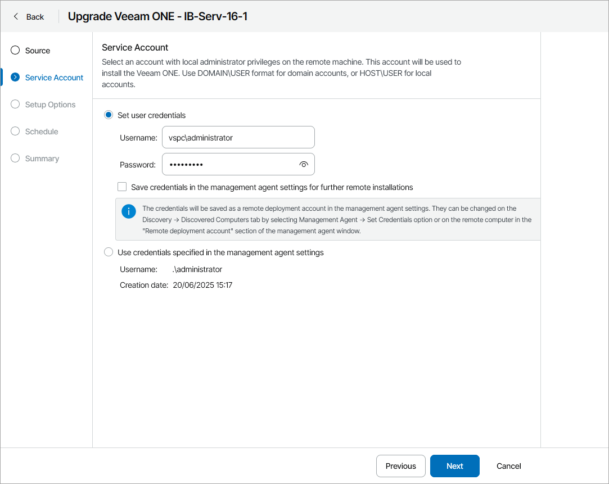
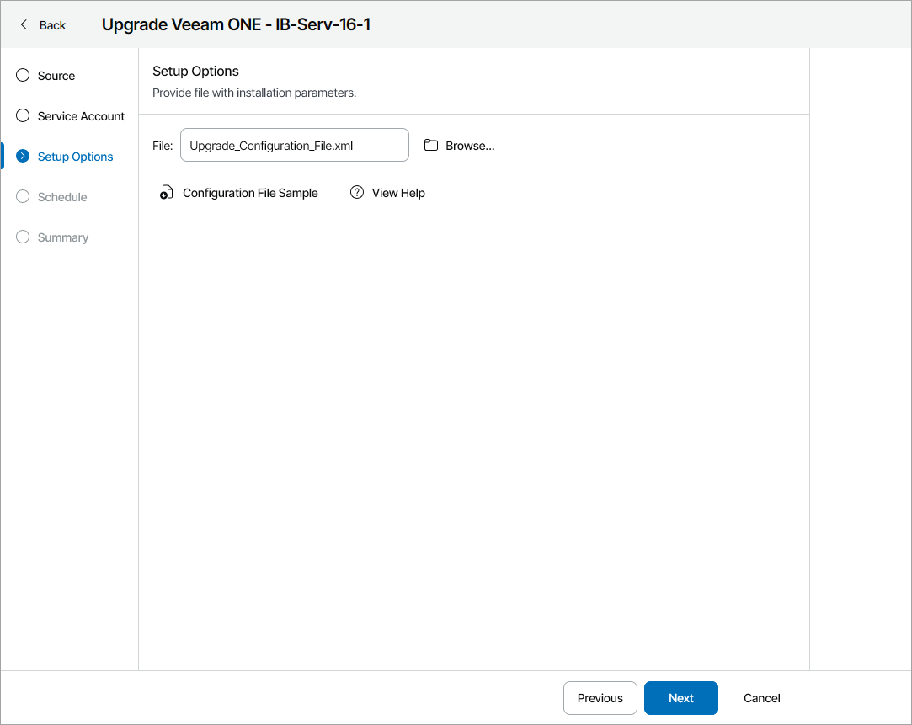
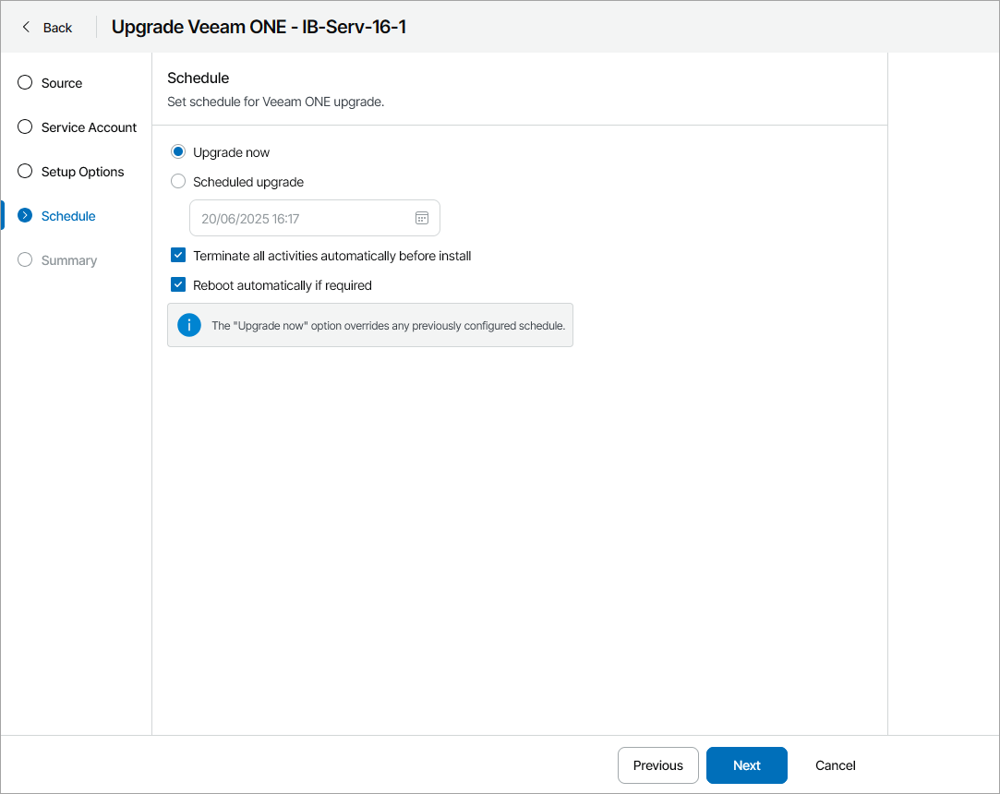
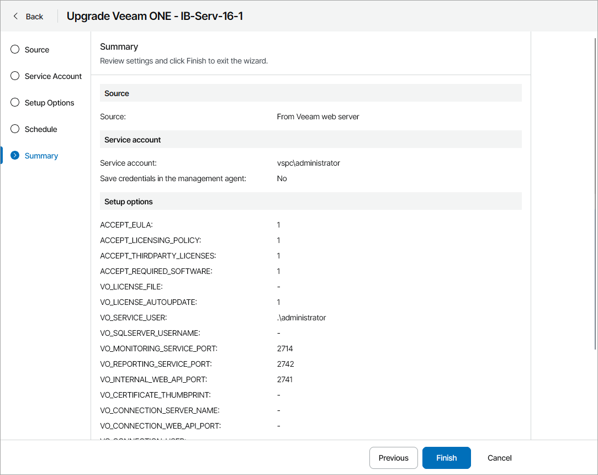

# Upgrading Veeam ONE Servers

In Veeam Service Provider Console, you can initiate the upgrade of Veeam ONE on client or hosted computers without accessing the managed Veeam ONE servers.

For details on upgrading servers in unattended mode, see section [Installing Veeam ONE in Unattended Mode](https://helpcenter.veeam.com/docs/one/userguide/silent_mode.html?ver=13) of the Veeam ONE User Guide.

How Upgrade of Veeam ONE is Performed

The upgrade procedure works as follows:

1. Veeam Service Provider Console periodically connects to the Veeam Installation Server (over the Internet), and checks whether a new Veeam ONE version is available.
2. If a new software version is available for managed Veeam ONE servers, Veeam Service Provider Console displays message next to these servers saying that an upgrade is available.
3. A backup administrator instructs Veeam Service Provider Console to upgrade Veeam ONE on a remote computer and configures upgrade settings.
4. The Veeam Service Provider Console management agent obtains the Veeam ONE setup file from the Veeam Installation Server (over the Internet) or from the remote file share and uploads this file to the remote computer.

Alternatively, you can download the setup file in Veeam Service Provider Console to the remote computer in advance to decrease Veeam ONE server downtime.

1. The management agent on the remote computer triggers the upgrade with the configured settings.

Required Privileges

To perform this task, a user must have one of the following roles assigned: Portal Administrator, Site Administrator, Portal Operator.

Prerequisites

For details on system requirements for Veeam ONE servers, see the [System Requirements](https://helpcenter.veeam.com/docs/one/userguide/system_requirements.html?ver=13) section of the Veeam ONE User Guide.

In addition to requirements listed in the Veeam ONE User Guide, consider the following:

* To upgrade Veeam ONE on a client computer, you must upgrade Veeam Cloud Connect server on which the cloud tenant is registered to version 13.
* Make sure you have additional free space on the system disk on the machine on which you plan to upgrade Veeam ONE. Veeam Service Provider Console will need extra space to download and unpack the Veeam ONE setup file. You can check the setup file size on the first step of the wizard.

* Make sure you have local administrator credentials for the machine on which you plan to upgrade Veeam ONE.

|  |
| --- |
| Note: |
| Upgrade is available from Veeam ONE version 12 or later to Veeam ONE version 13 or later for Veeam ONE instances installed in the all-in-one deployment scenario only. For details, see section [All-in-One Deployment](https://helpcenter.veeam.com/docs/one/userguide/typical_deployment.html?ver=13) of the Veeam ONE User Guide. |

Before You Begin

Before you start the upgrade procedure, close all Veeam ONE Client instances of the Veeam ONE server that you want to upgrade.

Upgrading Veeam ONE

To upgrade a Veeam ONE server:

1. Log in to Veeam Service Provider Console.

For details, see [Accessing Veeam Service Provider Console](access_vac.md).

1. In the menu on the left, click Discovery.
2. Open the ONE Servers tab.
3. Select the necessary computers in the list.
4. At the top of the list, click Manage Updates and choose Upgrade Server.

Alternatively, you can right-click the necessary server, select Manage Updates and choose Upgrade Server.

Veeam Service Provider Console will open the Upgrade Veeam ONE wizard.

1. At the Source step of the wizard, specify the location of the Veeam ONE distribution:

* To use a latest distribution from Veeam License Update server, select the Download the Veeam ONE setup file from a Veeam web server option.
* To use a distribution stored on a remote file share, select the Use the Veeam ONE setup file from the remote file share option and specify remote file share location and credentials of an account that Veeam Service Provider Console will use to connect to the file share.

* If you have previously downloaded an installation file to the remote computer, select the Use a previously downloaded installation file option. Veeam Service Provider Console will locate the downloaded installation file automatically.

For details on how to download the installation file in Veeam Service Provider Console, see [Downloading Setup File](#download_iso).

1. At the Service Account step of the wizard, specify service account credentials. The account must have local administrator permissions on the remote computer.

* Select the Set user credentials option to set the user name and password.

The account must have local administrator permissions on the remote computer.

To store the user name and password as remote deployment account credentials in the management agent, select the Save credentials in the management agent settings for further remote installations check box. This will allow you to use these credentials for future upgrades in Veeam Service Provider Console.

If you previously saved credentials in the management agent, you must confirm overwriting the saved credentials.

You can also set or update service account credentials in Veeam Service Provider Console. For details, see [Modifying Management Agent Credentials](modify_agent_credentials.md).

* Select the Use credentials specified in the management agent settings option to use the credentials configured in the management agent settings.

1. At the Setup Options step of the wizard, click Browse and specify path to an XML configuration file.

To create a configuration file, click Configuration File Sample to download the file template and fill in the necessary installation parameters. For details on configuration parameters, see [Configuration Parameters](#config).

1. At the Schedule step of the wizard, specify deployment schedule:

* To upgrade Veeam ONE immediately, select Upgrade now.

If you select this option, any previously scheduled update will be canceled automatically.

* To postpone upgrade, select Scheduled upgrade and specify date and time when Veeam ONE will be upgraded.

You will be able to reschedule or cancel the upgrade using the link in the Scheduled Updates column on the ONE Servers tab.

* If you want Veeam ONE to automatically stop active all monitoring activities, select the Terminate all activities automatically before install check box. After the upgrade is finished, monitoring activities will resume automatically.
* If you want to reboot remote computers automatically during Veeam ONE upgrade, select the Reboot automatically if required check box. If you do not select the check box, you may need to reboot the Veeam ONE server manually to complete installation. For details, see [Rebooting Remote Computers](reboot_remote_computers.md).

1. At the Summary step of the wizard, review upgrade settings and click Finish.

Downloading Setup File

To download the Veeam ONE upgrade file to a remote computer:

1. Log in to Veeam Service Provider Console.

For details, see [Accessing Veeam Service Provider Console](access_vac.md).

1. In the menu on the left, click Discovery.
2. Open the ONE Servers tab.
3. Select the necessary computers in the list.
4. At the top of the list, click Manage Updates.

Alternatively, you can right-click the necessary computer, click Manage Updates.

1. From the drop-down menu, select Download Upgrade File.

Veeam Service Provider Console will open the Download Upgrade File window.

1. In the Directory field, check, and if necessary, change the directory where Veeam Service Provider Console will download the upgrade file.
2. Click Download.
3. To ensure that the Veeam ONE installation file was downloaded successfully:

* Check the value in the Upgrade File Download Status column.

If the installation was successful, the Upgrade File Download Status must be Success.

* Click the link in the Upgrade File Download Status column to display session details of the upgrade file download.

If you want to cancel the download of the Veeam ONE upgrade file, click Cancel Download. If the download was canceled and the Upgrade File Download Status is Failed, click Clear Logs to reset the status.

Checking Upgrade Results

To make sure that Veeam ONE upgrade has completed successfully, complete the following steps:

1. Log in to Veeam Service Provider Console.

For details, see [Accessing Veeam Service Provider Console](access_vac.md).

1. In the menu on the left, click Discovery.
2. Open the ONE Servers tab.
3. Find the necessary computers in the list.
4. Check the value in the Update Status column.

If installation was successful, the Update Status must be Success.

1. Click the link in the Update Status column to display session details of the installation procedure.

If you want to cancel Veeam ONE upgrade, click Cancel Update. If the upgrade was canceled and the Update Status is Failed, click Clear Logs to reset the status.

Configuration Parameters

The configuration file contains the following parameters:

* ACCEPT\_EULA — specify "1" to accept Veeam license agreement.

* ACCEPT\_LICENSING\_POLICY — specify "1" to accept Veeam licensing policy.

* ACCEPT\_THIRDPARTY\_LICENSES — specify "1" to accept the license agreement for 3rd party components that Veeam incorporates.
* ACCEPT\_REQUIRED\_SOFTWARE — specify "1" to accept all required software license agreements.
* VO\_LICENSE\_FILE — path to the license file. If you do not want to change license on the upgraded server, leave this parameter unchanged.
* VO\_LICENSE\_AUTOUPDATE — specify 1 to enable automatic license update and usage reporting or specify 0 to update the license manually. For NFR licenses, specify 1. For licenses without license ID information it must be set to 0.
* VO\_SERVICE\_USER — user account under which the Veeam ONE Service will run. If you do not specify this parameter, the service will run under the LocalSystem account.
* VO\_SERVICE\_PASSWORD — password for the account under which the Veeam ONE Service will run.
* VO\_SQLSERVER\_USERNAME — LoginID to connect to the SQL Server in the SQL Server authentication mode.
* VO\_SQLSERVER\_PASSWORD — password to connect to the SQL Server in the SQL Server authentication mode.
* VO\_MONITORING\_SERVICE\_PORT — port used to interact with Veeam ONE Monitoring service. If you do not specify this parameter, default port '2714' is used.
* VO\_REPORTING\_SERVICE\_PORT — port used to interact with Veeam ONE Reporting service. If you do not specify this parameter, default port '2742' is used.
* VO\_INTERNAL\_WEB\_API\_PORT — port used by Veeam ONE Monitoring service and Web Services component to interact with Veeam ONE Reporting service. If you do not specify this parameter, default port '2741' is used.
* VO\_CERTIFICATE\_THUMBPRINT — certificate thumbprint that will be used to secure traffic between the web browser, Veeam ONE Web Services and Veeam ONE Reporting service.
* VO\_CONNECTION\_SERVER\_NAME — FQDN of a machine on which you have installed the Veeam ONE Server component.
* VO\_CONNECTION\_WEB\_API\_PORT — port that the Web Services component will use to communicate with the Veeam ONE Web API component.
* VO\_CONNECTION\_USER — account under which Veeam ONE Web Services will connect to Veeam ONE Server and configure it during installation.
* VO\_CONNECTION\_PASSWORD — password for the account under which Veeam ONE Web Services will connect to Veeam ONE Server and configure it during installation.

Note that you must specify "1" in ACCEPT\_EULA, ACCEPT\_LICENSING\_POLICY, ACCEPT\_THIRDPARTY\_LICENSES and ACCEPT\_REQUIRED\_SOFTWARE parameters to proceed with the upgrade.

