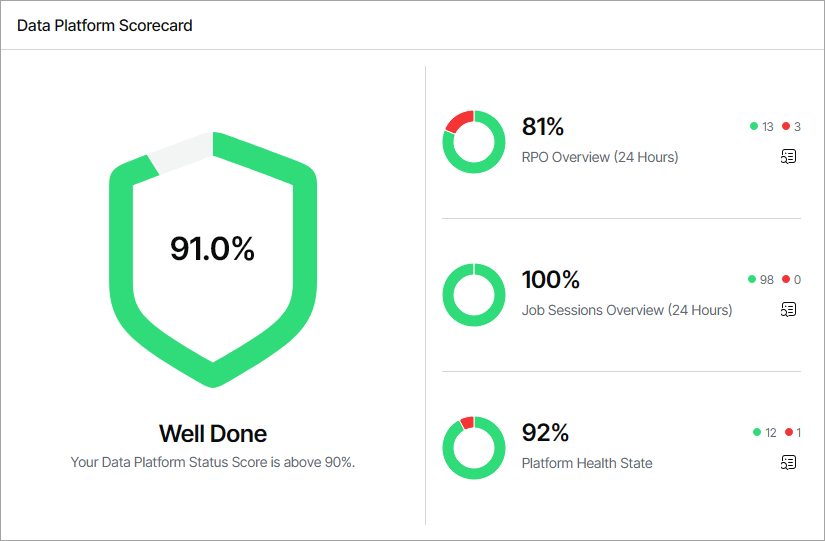
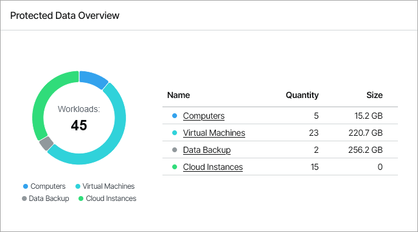
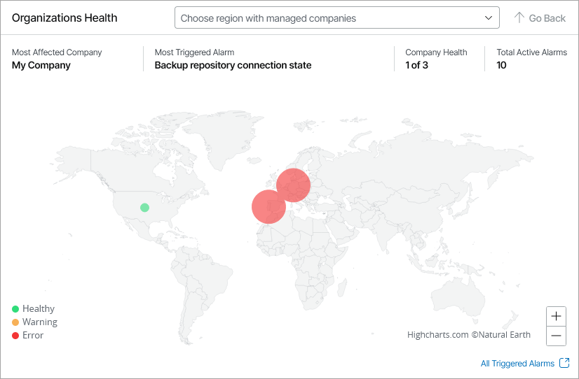
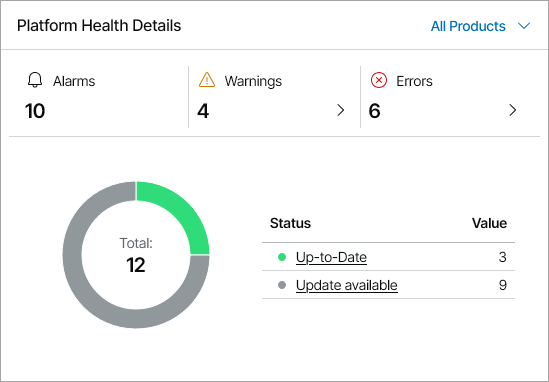
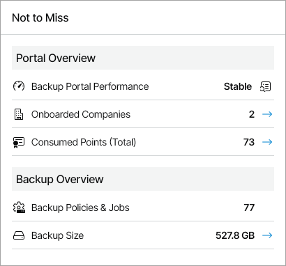

# Overview

The Overview dashboard consolidates information on the health state of connected Veeam products, managed resellers and client companies, active alarms, and Veeam Service Provider Console usage statistics. This dashboard presents the big picture and serves as the starting point from which you can drill down to dashboards and views that provide further details.

Required Privileges

To perform this task, a user must have the following role assigned: Portal Administrator.

Accessing Overview Dashboard

To access the dashboard:

1. Log in to Veeam Service Provider Console.

For details, see [Accessing Veeam Service Provider Console](access_vac.md).

1. In the menu on the left, click Overview.
2. To show data for a specific Veeam Cloud Connect site, reseller, company and location, use the filters at the top left corner of the Veeam Service Provider Console window.

Widgets Included

Data Platform Scorecard

This widget calculates the data platform status score based on the status of protected workloads, finished jobs, and triggered alarms in the last 24 hours.

The widget includes the following sections:

* RPO Overview section shows the number and ratio of protected local and cloud workloads within RPO.

Click the relevant report icon to open the RPO & SLA dashboard. For details on this dashboard, see [RPO & SLA](protected_data_summary.md).

Note that the RPO Overview section does not include data from the Veeam Cloud Connect widget on the RPO & SLA dashboard.

* Job Sessions Overview section shows the number and ratio of successful jobs and jobs that finished with errors.

Click the relevant report icon to open the Session States dashboard. For details on this dashboard, see [Session States](job_overview.md).

* Platform Health State section shows the number and ratio of managed healthy Veeam products, and products with unresolved error alarms.

Click the relevant report icon to open the Active Alarms dashboard. For details on working with alarms, see [Working with Triggered Alarms](view_triggered_alarms.md).

Protected Data Overview

This widget shows the number and ratio of workloads protected by the managed Veeam products. To drill down to the list of protected workloads, click the links in the Name column.

Organizations Health

This widget shows unresolved alarms for your company, and across managed resellers and companies by assigned region, as well as the company with the highest number of triggered alarms, the name of the most triggered alarm, and the total number of unresolved warning and error alarms.

To select a specific country, use the drop-down list at the top of the map or click the country on the map. To zoom out of the selected country, click Go Back.

To view active alarms triggered for the selected country, click a region. Veeam Service Provider Console will open the Active Alarms dashboard. For details on working with alarms, see [Working with Triggered Alarms](view_triggered_alarms.md).

Platform Health Details

This widget shows the update status and the number of triggered alarms for managed Veeam products. To view details for a specific product, use the list at the top right corner of the widget.

In the Alarms section, click the arrows next to the number of warning or error alarms to view objects with unresolved warning and error alarms. In the pop-up windows, click a link in the Number of Objects column to drill down to the Active Alarms dashboard. Veeam Service Provider Console will apply the necessary filters to limit the list of alarms by status and product. For details on working with alarms, see [Working with Triggered Alarms](view_triggered_alarms.md).

The chart shows the number of managed products by the number of up-to date products and products with available updates. To view the list of products, click the Up-to-date or Update available link in the Status column. To drill down to the page with information on the selected product, click a link in the Number of Objects column in the pop-up window.

Not to Miss

This widget shows an overview of Veeam Service Provider Console performance and usage trends.

The widget includes the following statistics:

* Backup Portal Performance section shows Veeam Service Provider Console performance stability. The status is based on whether the Backup portal infrastructure performance alarm is active.

To drill down to the Active Alarms dashboard, click the relevant report icon. For details on working with alarms, see [Working with Triggered Alarms](view_triggered_alarms.md).

* Onboarded Companies section shows the number of companies managed in Veeam Service Provider Console. The arrow indicates whether the trend has increased, decreased or remained the same in the last 30 days.
* Consumed Points (Total) section shows the number of licensing points consumed by managed Veeam products. The arrow indicates whether the trend has increased, decreased or remained the same in the last 30 days.

* Backup Policies & Jobs section shows the current number of configured Veeam Backup & Replication jobs, Microsoft 365 jobs, backup agents jobs and cloud backup policies.
* Backup Size section shows the total amount of storage space consumed by protected workloads on local and cloud repositories. The arrow indicates whether the trend has increased, decreased or remained the same in the last 30 days.

