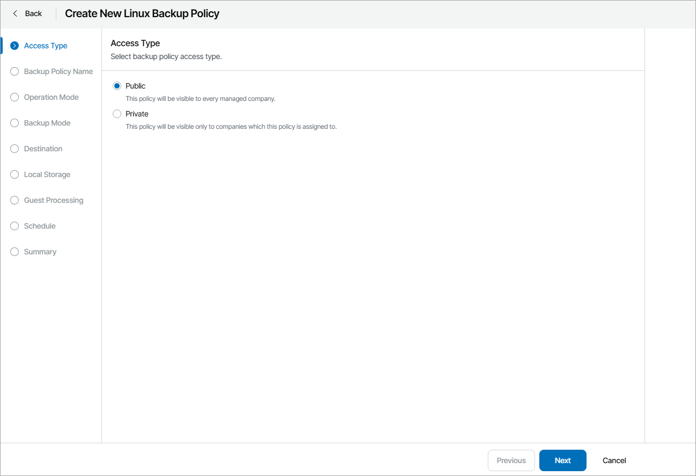

# Step 2. Select Backup Policy Access Type

At the Access Type step of the wizard, select the access type:

* Public — choose this option to create a public policy.

A public policy will be available to all companies in the Client Portal and all resellers in the Reseller Portal.

* Private — choose this option to create a private policy.

A private policy will be visible and available only to the companies to which it is assigned.

