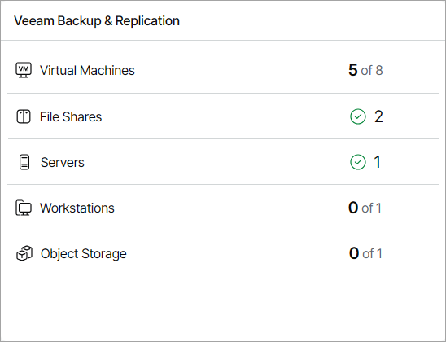
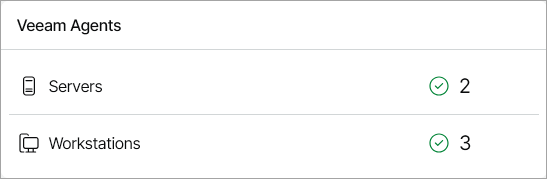
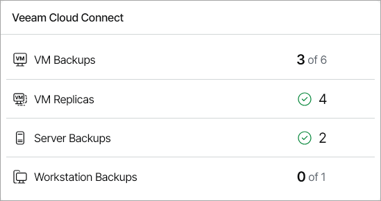
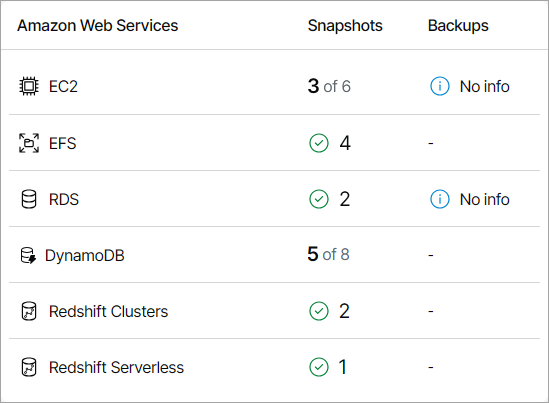
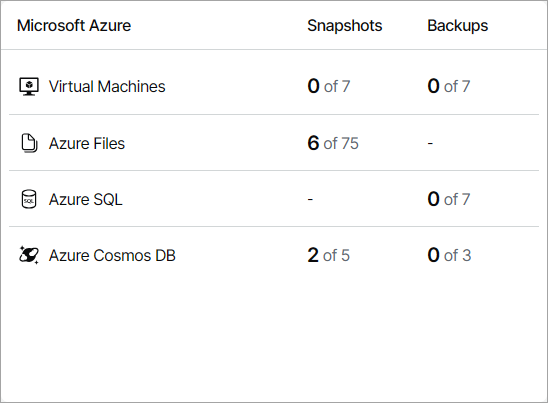
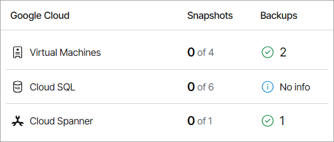
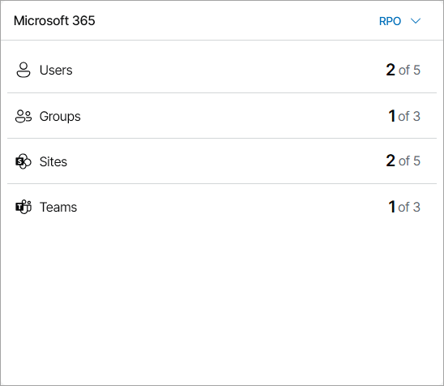

# RPO & SLA

The RPO & SLA dashboard consolidates information on protected local and cloud workloads.

Required Privileges

To perform this task, a user must have one of the following roles assigned: Portal Administrator, Site Administrator, Portal Operator, Read-only User.

Accessing RPO & SLA Dashboard

To access the dashboard:

1. Log in to Veeam Service Provider Console.

For details, see [Accessing Veeam Service Provider Console](access_vac.md).

1. In the menu on the left, click RPO & SLA.
2. To show data for a specific Veeam Cloud Connect site, reseller, company and location, use the sites, reseller/company and location filters at the top left corner of the Veeam Service Provider Console window.

By default, the dashboard shows the data summary for the last 30 days, and for workloads with an RPO of 1 day or an SLA of 90% (for Microsoft 365 workloads). You can use the Time period drop-down list to view data from the previous or current month. To change RPO and SLA settings, specify the necessary values in the Parameters section.

The dashboard includes the following widgets:

* Veeam Backup & Replication widget shows the number of VMs, file shares, computers and object storage protected with Veeam Backup & Replication jobs.

* Veeam Agents widget shows the number of computers running in Server or Workstation mode protected by Veeam backup agents.

* Veeam Cloud Connect widget shows the number of VMs and computers protected with cloud backup jobs.

* Amazon Web Services widget shows the number of Amazon Web Services instances, file shares and databases protected with Veeam Backup for AWS.

* Microsoft Azure widget shows the number of Microsoft Azure VMs, file shares and databases protected with Veeam Backup for Microsoft Azure.

* Google Cloud widget shows the number of Google Cloud VMs and databases protected with Veeam Backup for Google Cloud.

* Microsoft 365 widget shows the number of Microsoft 365 users, user groups, sites and teams protected by Veeam Backup for Microsoft 365 jobs.

By default, the widget shows protection data by RPO. To display protection data by SLA, use the list next to the widget name.

