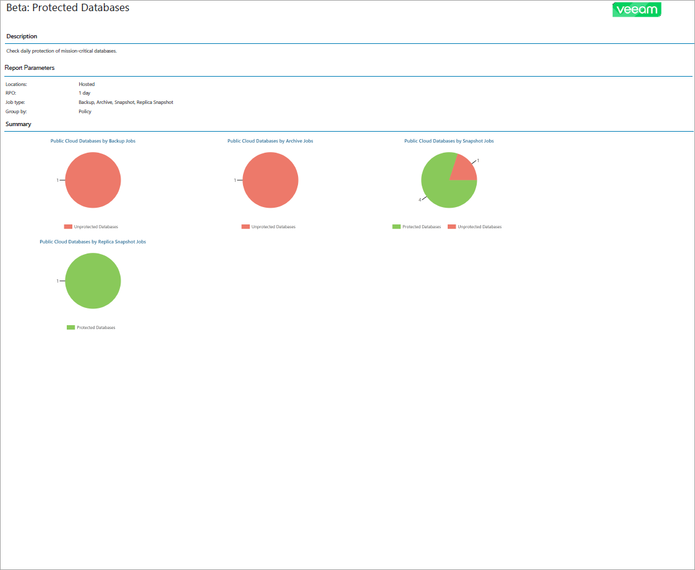

# Protected Databases Backup Report

The Protected Databases report analyzes the efficiency of cloud database protection with Veeam Backup for Public Clouds.

* The Report Parameters section provides information about RPO and job type of databases in the report scope and the way database data is grouped in the report. For individual report, this section provides information about company locations in the report scope. For summary report, this section provides information about the number of companies in the report scope and inclusion of company details in the report.

* The report charts display information about the number of databases protected with backup jobs, archive backup jobs, snapshots and replica snapshots.

* [For summary report] The Overview section provides information about the number of protected databases for each company in the report scope.

* The Details section provides information about all protected and unprotected databases including instance name, region and resource ID, database type, backup server name, restore point region, number of available restore points and date and time of the latest restore point and job run.

For summary report, the Details section is included only if you have selected the Include detailed information to the report check box during report configuration.

* The Unprotected Databases subsection displays a list of databases that have outdated or missing restore points. Information on unprotected databases in each company location is grouped by policy, backup server or platform type, as configured in the report parameters.
* The Protected Databases subsection displays a list of databases that have at least one restore point that meets RPO requirements specified in the report configuration. Information on protected databases in each company location is grouped by policy, backup server or platform type, as configured in the report parameters.

