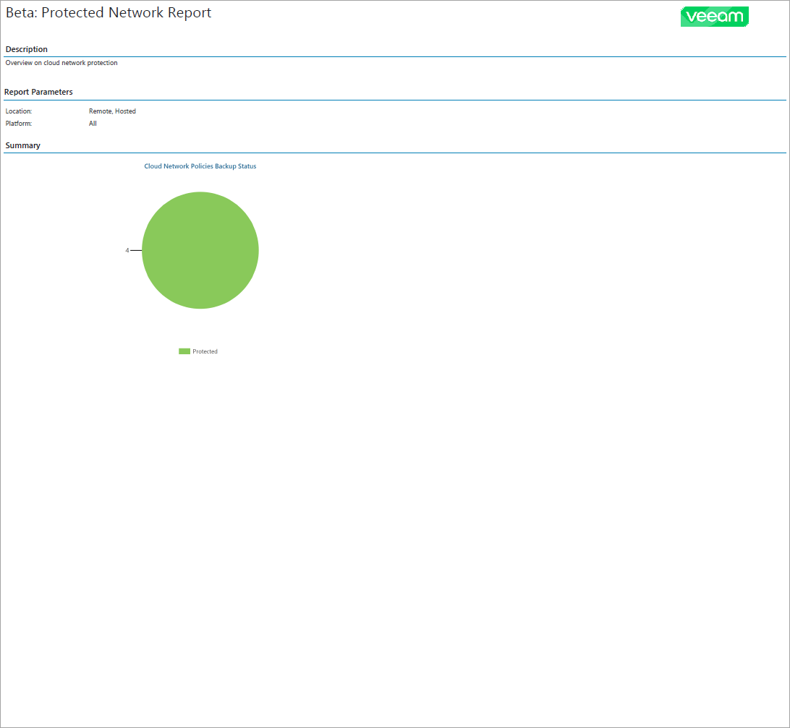

# Protected Cloud Networks Backup Report

The Protected Cloud Networks report analyzes the efficiency of virtual network configuration protection with Veeam Backup for Public Clouds.

* The Report Parameters section provides information about platform type of cloud networks in the report scope. For individual report, this section provides information about company locations in the report scope. For summary report, this section provides information about the number of companies in the report scope and inclusion of company details in the report.

* The report chart displays information about the number of network configurations protected with backup policies.

* [For summary report] The Overview section provides information about the number of protected network configurations for each company in the report scope.

* The Details section provides information about all protected and unprotected network configurations including instance name, account name, region or subscription, appliance name, number of available restore points and date and time of the latest policy run.

For summary report, the Details section is included only if you have selected the Include detailed information to the report check box during report configuration.

* The Unprotected Instances subsection displays a list of network configurations that have outdated or missing restore points. Information on unprotected network configurations in each company location is grouped by backup policy.
* The Protected Instances subsection displays a list of network configurations that have at least one restore point created during the last 30 days. Information on protected databases in each company location is grouped by backup policy.

