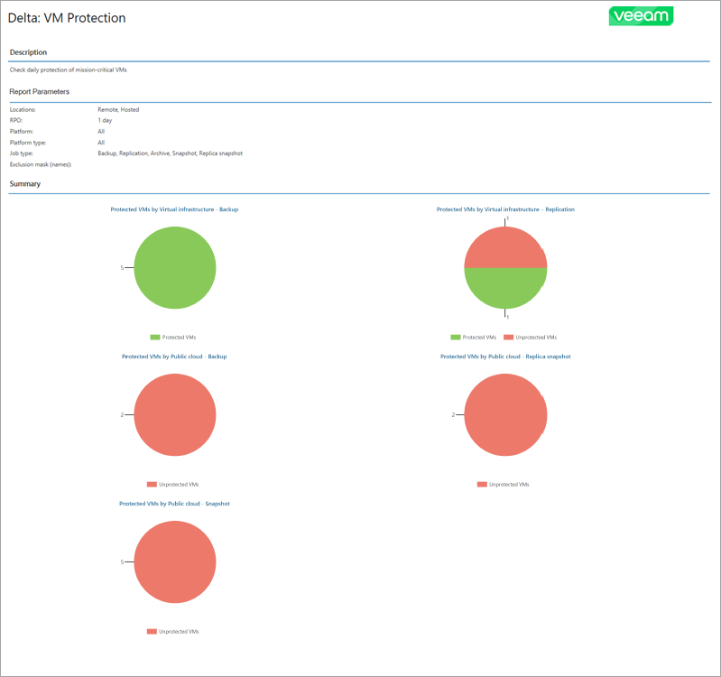
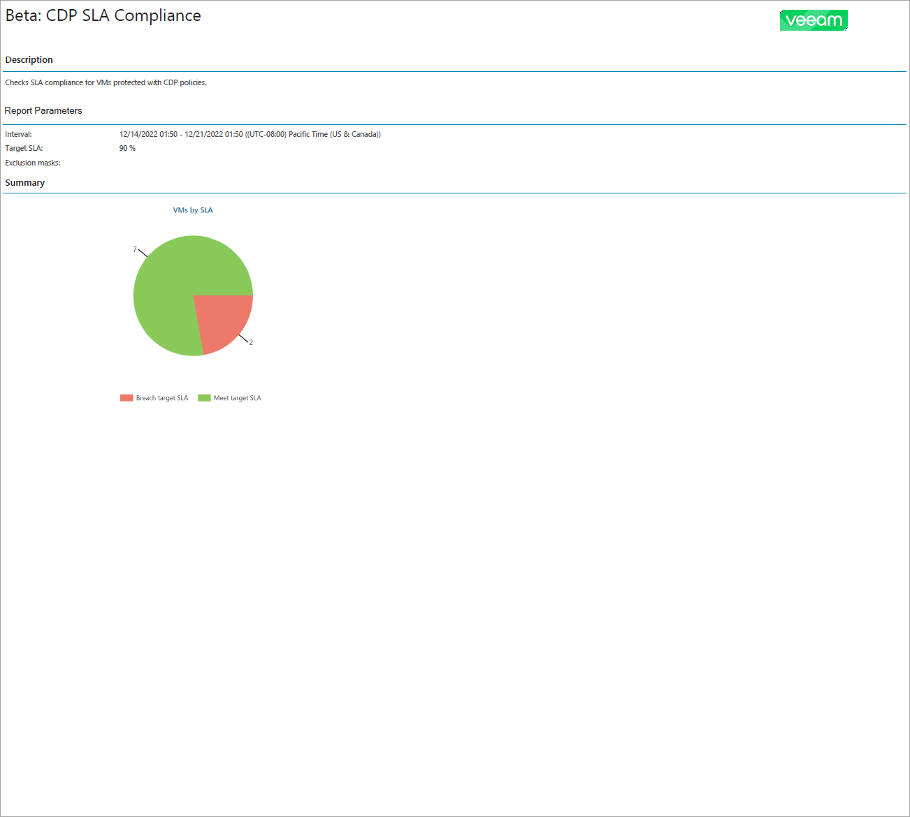

# Protected VMs Backup Report

The Protected VMs report analyzes the efficiency of VM data protection with Veeam Backup & Replication and Veeam Backup for Public Clouds.

RPO-Based Protected VMs Report

The report provides information on VM data protection with RPO.

* The Report Parameters section provides information about RPO, job type and platform type of VMs in the report scope and mask for the VMs excluded from the report scope. For individual report, this section provides information about company locations in the report scope. For summary report, this section provides information about the number of companies in the report scope and inclusion of company details in the report.

* The report charts display information about the number of VMs protected with backup jobs, replication jobs, archive backup jobs, snapshots and replica snapshots.
* [For summary report] The Overview section provides information about the number of protected and unprotected VMs for each company in the report scope.
* The Details section provides information about all protected and unprotected VMs including VM name and resource ID, platform type, backup server name, backup job name and destination, backup type, number of available restore points and date and time of the latest restore point and job run.

For summary report, the Details section is included only if you have selected the Include detailed information to the report check box during report configuration.

* The Unprotected VMs subsection displays a list of VMs that have outdated or missing backup or replica restore points. Information on unprotected VMs in each company location is grouped by the age of the latest restore points.
* The Protected VMs subsection displays a list of VMs that have at least one backup or replica restore point that meets RPO requirements specified in the report configuration. Information on protected VMs in each company location is grouped by last backup state.

SLA-Based Protected VMs Report

The report provides information on VM data protection with CDP policies.

* The Report Parameters section provides information about time period and SLA target and mask for the VMs excluded from the report scope. For summary report, this section provides information about the number of companies in the report scope.

* The report chart displays the total number of VMs compliant with the configured SLA target.
* [For summary report] The Overview section provides information about the number of VMs that meet and breach target SLA for each company in the report scope.
* The Details sections provides information about all VMs that meet and breach target SLA, including VM name, organization name, CDP policy name, locations of original VM and VM replica, RPO in seconds, average SLA, number of available restore points and date and time of the latest restore point.

For summary report, the Details section is included only if you have selected the Include detailed information to the report check box during report configuration.

* The VMs That Breach Target SLA subsection displays a list of VMs with SLA lower than SLA requirements specified in the report configuration.
* The VMs That Meet Target SLA subsection displays a list of VMs with SLA that meets or exceeds SLA requirements specified in the report configuration.

