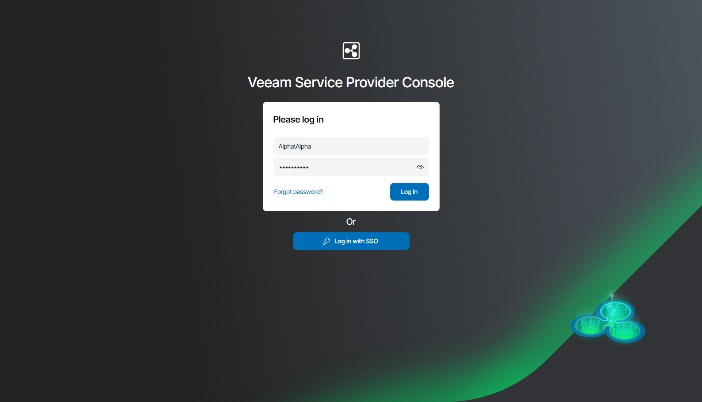
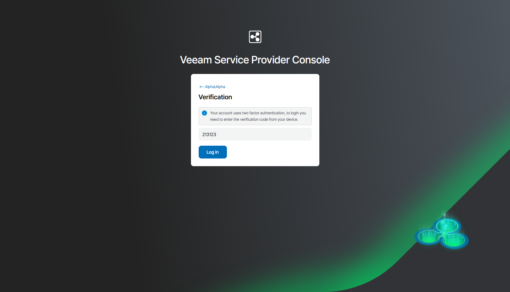

# Accessing Veeam Service Provider Console

To access Veeam Service Provider Console:

1. In a web browser, navigate to the Veeam Service Provider Console URL. Note that Veeam Service Provider Console is available over HTTPS.

The Veeam Service Provider Console URL looks like the following one:

https://vspc.cloudprovider.com:1280

If you have an SSO account, navigate to your personal login URL that you have specified during identity provider configuration.

1. In the Enter Company\User and Enter password fields, specify credentials of an authorized user.

The user name must be provided in the Company Name\User format. Alternatively, you can specify a short name for login to Veeam Service Provider Console. For details on configuring the login alias, see [Filling Company Profile](fill_tenant_profile.md).

If you are the only company user, and log in for the first time, use Company Owner credentials. Company Owner credentials are available in a welcome email notification that must be sent to you by the service provider. For details on users and privileges, see [Managing Portal Users](manage_users.md).

If you have an SSO account, instead of specifying credentials you can click Log in with SSO. You will be forwarded to the identity provider authorization page.

1. Click Log in.

If Veeam Service Provider Console displays a list of Veeam Cloud Connect servers and asks you to specify the server you want to log in, contact your service provider for details on the necessary Veeam Cloud Connect server.

1. If MFA is enabled for your account, on the next step, provide the verification code generated by the authenticator application.

Logging Out

To log out of Veeam Service Provider Console, at the top right corner of the Veeam Service Provider Console window click your user name and choose Log Out.

In This Section

[Resetting Password](reset_password.md)

