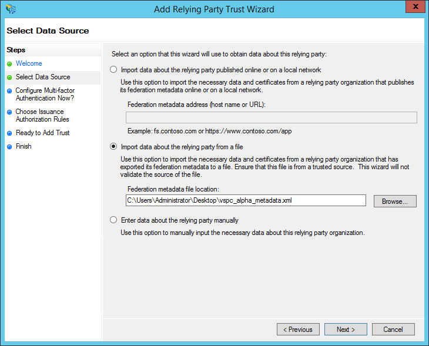
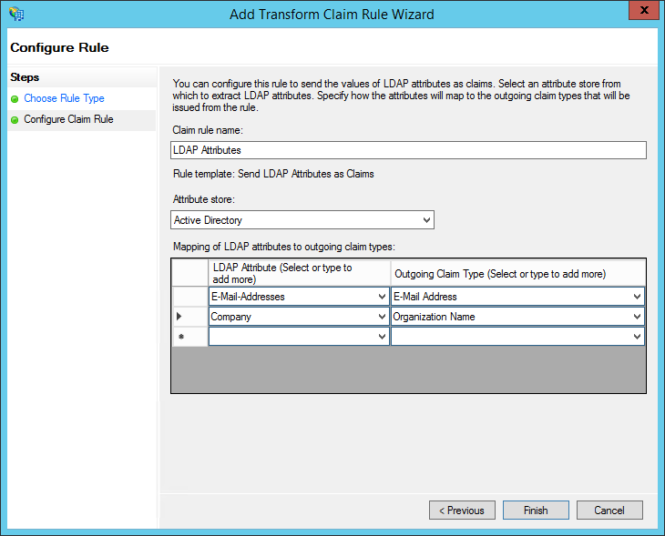
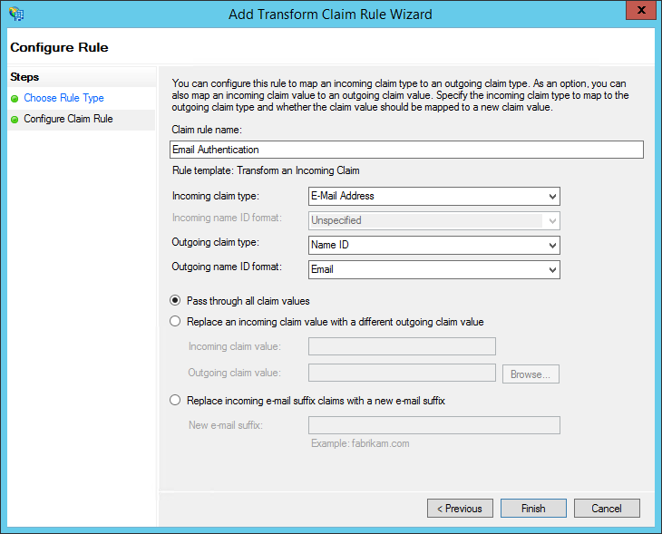

# Configuring SSO for AD FS

To configure SSO authentication on the AD FS server side:

1. Add an AD FS IdP as described in the [Managing Identity Providers](sso_idp.md#add_idp) section.
2. On the AD FS server, run AD FS Management.
3. Right click on the Relying Party Trusts folder and select Add Relying Party Trust.

The Add Relying Party Trust Wizard will open.

1. At the Welcome step of the wizard, click Start.
2. At the Select Data Source step of the wizard, select the Import data about the relying party from a file option.

In the Federation metadata file location field, provide the path to the Veeam Service Provider Console metadata file downloaded at step 1.

1. At the Specify Display Name step of the wizard, specify a name of the connection to Veeam Service Provider Console.
2. Follow the other steps of the wizard without changing any values and click Close.

The Edit Claim Rules window will open.

1. Click Add Rule.

The Add Transform Claim Rule Wizard will open.

1. At the Choose Rule Type step of the wizard, from the Claim rule type drop-down list, select Send LDAP Attributes as Claims.
2. At the Configure Claim Rule step of the wizard, specify the rule settings:

1. In the Claim rule name field, specify a rule name.
2. From the Attribute store drop-down list, select Active Directory.
3. In the Mapping of LDAP attributes to outgoing claim types table, from the drop-down lists in the left column, select E-Mail-Addresses and Company. In the right column, specify names of related claims that will be used to configure mapping rules in Veeam Service Provider Console.
4. Click Finish.

1. Click Add Rule.

The Add Transform Claim Rule Wizard will open.

1. At the Choose Rule Type step of the wizard, from the Claim rule type drop-down list, select Transform an Incoming Claim.
2. At the Configure Claim Rule step of the wizard, do the following:

1. From the Incoming claim type drop-down list, select E-mail Address.
2. From the Outgoing claim type drop-down list, select Name ID.
3. From the Outgoing name ID format drop-down list, select Email.
4. Click Finish.

1. Click Apply and then click OK.

