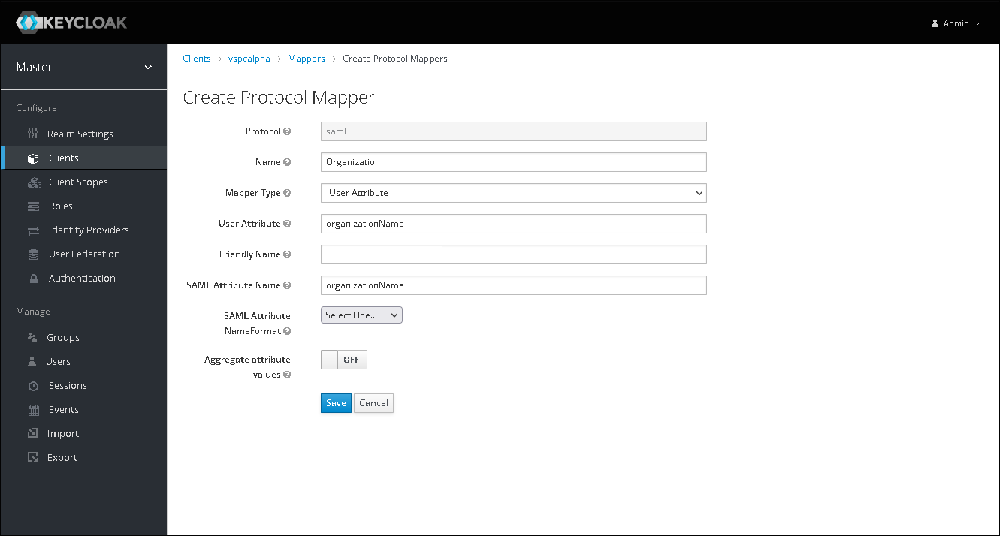
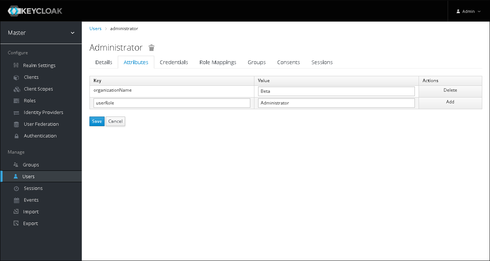

# Configuring SSO for Keycloak

To configure SSO authentication on the Keycloak server side:

1. Add a Keycloak IdP as described in the [Managing Identity Providers](sso_idp.md#add_idp) section.
2. Access Keycloak Administration Console.
3. In the menu on the left, click Clients.
4. At the top of the client list, click Create.

The Add Client page will open.

1. Click Select file and select the file that you downloaded at step 1.
2. In the Client ID field, specify the new connection name that will be displayed as the name of the client in the list.
3. Click Save.

The client profile will open.

1. On the Settings tab of the client profile, from the Name ID Format drop-down list, select email.
2. On the Mappers tab of the client profile, click Create.

The Create Protocol Mapper page will open.

1. Configure a user attribute mapper:

1. In the Name field, specify a mapper name that will be displayed in the mapper list.
2. From the Mapper Type drop-down list, select User Attribute.
3. In the User Attribute field, specify the name of the attribute that will be assigned to a user configuration in Keycloak.
4. In the SAML Attribute Name field, specify the attribute name that will be used to map the attribute to a Veeam Service Provider Console mapping rule claim.

User organization name mapper is required for Veeam Service Provider Console SSO authentication.You can add more mappers if needed.

1. Click Save.
2. Create users, if necessary.
3. For each user profile, navigate to the Attributes tab and specify the user attributes:

* In the Key field, specify the name of an attribute that you provided in the User Attribute field at step 10.
* In the Value field, specify the attribute value for the user.

