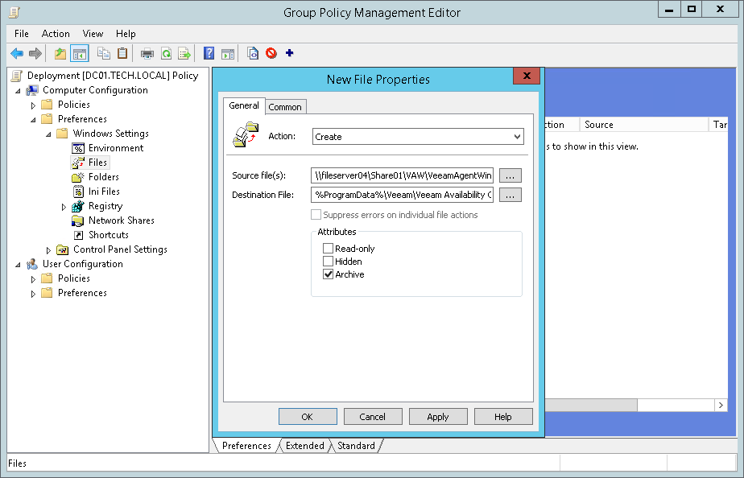

# How to Upload Veeam Agent for Microsoft Windows Setup File to Remote Computers with GPO

This topic describes how you can upload the Veeam backup agent setup file to remote computers using GPO. The procedure can be required if you do not want or cannot download the Veeam backup agent setup file from the Veeam Installation Server (over the Internet) during installation. For details, see [Installing Veeam Backup Agents Manually](install_agents_manually.md#initiate).

To create a Group Policy that will copy the Veeam backup agent setup file to remote computers:

1. Download a setup file for the supported version of Veeam backup agent, and place its setup file on a network share.

The network share must be accessible from all computers on which you want to install Veeam backup agents.

Make sure you set at least Read permissions on the file.

1. Log on to a domain controller.
2. Open the Group Policy Management Console.
3. Right-click the OU that includes computers that must be protected with Veeam Agent for Microsoft Windows, and choose to create a new Group Policy Object.
4. Right-click the Group Policy Object and choose Edit.
5. In the left pane of the Group Policy Management Editor, expand Computer Configuration > Preferences > Windows Settings.
6. Right-click Files and select New > File.
7. In the New File Properties window, specify the following settings:

1. In the Action list, choose Create.
2. In the Source file(s) field, specify the path to the Veeam backup agent setup file located on a network share.
3. In the Destination File field, specify a path to the Veeam backup agent setup file on a remote computer.

You must specify the following path to the file, including the file name: C:\ProgramData\Veeam\Veeam Availability Console\AgentPackage\VeeamAgentWindows.exe.

1. Click OK.
2. Close the Group Policy Management Editor.

