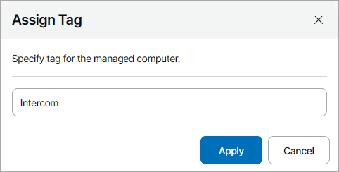
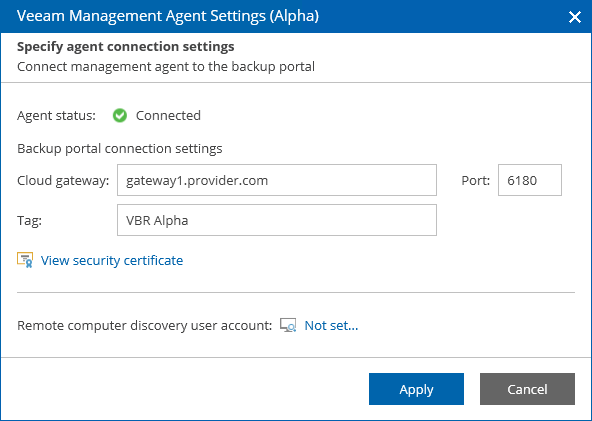

# Assigning Custom Tags to Veeam Backup Agents

In Veeam Service Provider Console, you can assign custom tags for discovered computers and managed Veeam backup agents. Assigning custom tags can help you differentiate computers that have same or similar names.

Required Privileges

To perform this task, a user must have one of the following roles assigned: Company Owner, Company Administrator, Company Tenant, Location Administrator.

Assigning Custom Tags in Veeam Service Provider Console

To assign custom tags to managed computers:

1. Log in to Veeam Service Provider Console.

For details, see [Accessing Veeam Service Provider Console](access_vac.md).

1. Navigate to one of the following tabs:

* Managed Computers > Discovered Computers or Managed Computers > Backup Agents
* Backup Jobs > Computers > Managed by Console
* Protected Data > Computers > Managed by Console

1. Select a Veeam backup agent or a computer in the list.
2. Click a link in the Tag column.

If the column is hidden, click the ellipsis on the right of the list header and select Tag in the list of properties that must be displayed.

1. In the Assign Tag window, specify a tag that must be assigned to a computer and click Apply.

Alternatively, you can assign custom tags to Veeam Service Provider Console management agents deployed on discovered computers.

Assigning Custom Tags to Windows Management Agents

To assign custom tags to management agents deployed on Windows computers:

1. Log on to the machine hosting the management agent as an Administrator.
2. In the icon tray, right-click the management agent icon and choose Agent Settings.

If the icon is hidden, display hidden icons, find Veeam.MBP.Agent.Configurator in the list of notification area icons, and choose to show the icon and notifications for it.

1. In the Veeam Management Agent Settings window, in the Tag field, specify tag that must be assigned to the management agent.

1. Click Apply.

Management agent will connect to Veeam Service Provider Console server, download the security certificate and perform its verification.

In case of errors during certificate verification you will be prompted the Security Certificate Preview window:

* To view error details, at the top of the window, click the Learn more link.
* To ignore the error and continue agent configuration, click Ignore.

1. In the Management Agent window, click Reconnect to apply connection settings.
2. Wait for the agent to connect to Veeam Service Provider Console.

When the agent connects to Veeam Service Provider Console, the status in the Management Agent Settings window will be displayed as Connected. The agent icon in the icon tray will turn blue.

Assigning Custom Tags to Linux and Mac Management Agents

To assign custom tags to management agents deployed on Linux and Mac computers:

1. Log on to the machine where the management agent is deployed.
2. Use the following command:

|  |
| --- |
| sudo veeamconsoleconfig --tag\_name <tag> |

where <tag> — tag that will be assigned to the management agent.

Management agent will connect to Veeam Service Provider Console server and verify the security certificate.

1. If you did not specify a certificate thumbprint, you will be asked to verify the security certificate.
2. After you verify the certificate, management agent will restart and apply connection settings automatically.
3. Wait for the agent to connect to Veeam Service Provider Console.

