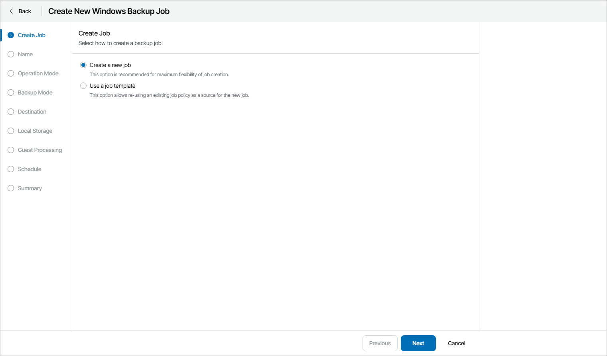

# Configuring Backup Job Settings for Individual Computers

Instead of assigning backup policies, you can configure Veeam backup agent job settings for individual managed computers.

Before You Begin

Before you configure a backup job, check prerequisites:

* For [Veeam Agent for Microsoft Windows](template_configuration_prerequisites.md)
* For [Veeam Agent for Linux](template_configuration_prerequisites_lin.md)
* For [Veeam Agent for Mac](template_configuration_prerequisites_mac.md)

Required Privileges

To perform this task, a user must have one of the following roles assigned: Company Owner, Company Administrator, Company Tenant, Location Administrator.

Configuring Backup Job Settings

To configure Veeam backup agent job settings:

1. Log in to Veeam Service Provider Console.

For details, see [Accessing Veeam Service Provider Console](access_vac.md).

1. In the menu on the left, click Backup Jobs.
2. Open the Computers tab and navigate to Managed by Console.
3. Do one of the following:

* Choose the necessary computers in the list and click Create Job at the top of the list.

* Choose the necessary computer in the list and click a link in the Backup Policy, Successful Jobs or Running Jobs column. In the Agent Jobs window, click Create Job.
* Right-click the necessary computer in the list and choose Create Job.

1. At the Create Job step of the New Backup Job wizard, select one of the following options:

* Create a new job

Select this option to create a job configuration from scratch. Configure Veeam backup agent job settings as described in [Configuring Backup Policies](configure_backup_policies.md).

* Use a job template

Select this option to use an existing policy as a template for job configuration. At the Backup Policies step of the wizard, select a backup policy on which the backup job will be based. Veeam Service Provider Console will assign the policy to the selected managed computers.

|  |
| --- |
| Note: |
| * When you create backup job configuration from scratch, some configuration steps may differ from steps available for backup policies. For example, at the Cloud Repository step, you can choose a specific cloud repository as a backup target. In backup policy settings, this possibility is not available.  * If you chose a cloud repository as a destination, make sure you specify credentials of the Veeam Cloud Connect tenant or subtenant account. The list of available cloud backup repositories may differ depending on specified credentials. |

