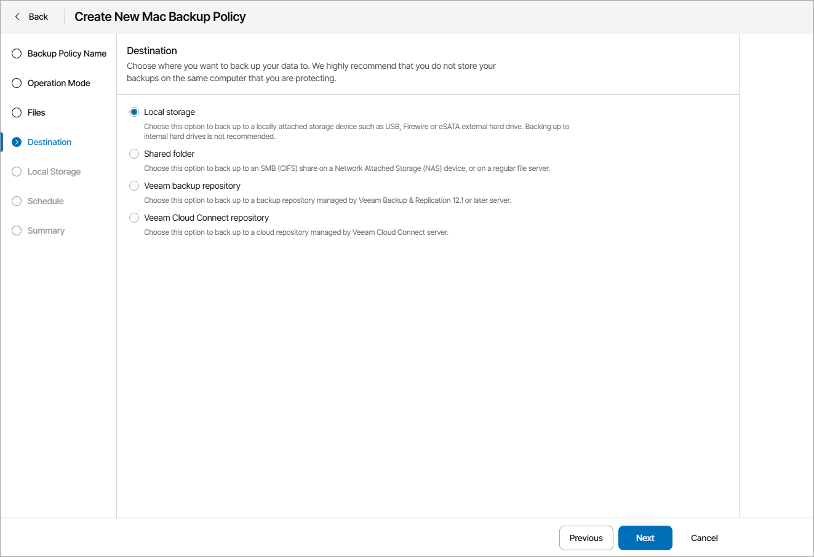

# Step 5. Choose Backup Destination

At the Destination step of the wizard, select a target location for the created backup:

* Local storage — select this option if you want to save the backup on a removable storage device attached to the endpoint, or on a local drive of the endpoint. With this option selected, you will pass to the [Local Storage](specify_storage_settings_mac.md) step of the wizard.
* Shared folder — select this option if you want to save the backup in a network shared folder. With this option selected, you will pass to the [Shared Folder](specify_folder_settings_mac.md) step of the wizard.
* Veeam backup repository — select this option if you want to save the backup on a backup repository managed by a Veeam Backup & Replication server. With this option selected, you will pass to the [Backup Server](specify_backup_server_settings_mac.md) step of the wizard.

* Veeam Cloud Connect repository — select this option if you want to save the backup on a cloud repository exposed by the Veeam Cloud Connect service provider or an object storage repository. With this option selected, you will pass to the [Cloud Repository](specify_cloud_backup_settings_mac.md) step of the wizard.

|  |
| --- |
| Important! |
| * It is strongly recommended that you store backups in the external location like USB storage device, shared network folder or in the cloud. You can also keep your backup files on a separate non-system local drive. * If you choose to store the backup on a Veeam Backup & Replication repository, you must pre-configure user access permissions on this backup repository. For details, see section [Setting Up User Permissions on Backup Repositories](https://helpcenter.veeam.com/docs/agentformac/userguide/integrate_permissions.html) of the Veeam Agent for Mac User Guide. |

