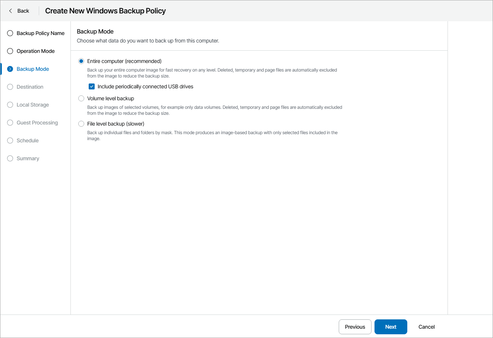

# Step 4. Choose Backup Mode

At the Backup Mode step of the wizard, select the mode in which you want to create a backup:

* Entire computer — select this option if you want to create a backup of the entire computer image. When you restore data from such backup, you will be able to recover the entire computer image as well as data on specific computer volumes: files, folders, application data and so on. With this option selected, you will pass to the [Destination](choose_backup_destination.md) step of the wizard.

If you want to include in the backup one or more external USB drives, select the Include periodically connected USB drives check box. With this option selected, Veeam backup agent will include in the backup all supported external drives that are connected to the managed computer at the time when the backup job starts. Veeam backup agent supports backup of external drives that support Microsoft VSS: HDD, SSD, and so on. USB flash drives (USB sticks) are not supported. For details, see section [Backup of External Drives](https://helpcenter.veeam.com/docs/agentforwindows/userguide/backup_usb.html) of the Veeam Agent for Microsoft Windows User Guide.

* Volume level backup — select this option if you want to create a backup of specific computer volumes, for example, all volumes except the system one. When you restore data from such backup, you will be able to recover data on these volumes only: files, folders, application data and so on. With this option selected, you will pass to the [Volumes](choose_volumes.md) step of the wizard.
* File level backup — select this option if you want to create a backup of individual directories on your computer. With this option selected, you will pass to the [Files](choose_files.md) step of the wizard.

|  |
| --- |
| Tip: |
| File-level backup is typically slower than volume-level backup. Depending on the performance capabilities of your computer and backup environment, the difference between file-level and volume-level backup job performance may increase significantly. If you plan to back up all directories with files on a specific volume or back up large amount of data, it is recommended that you configure volume-level backup instead of file-level backup. |

