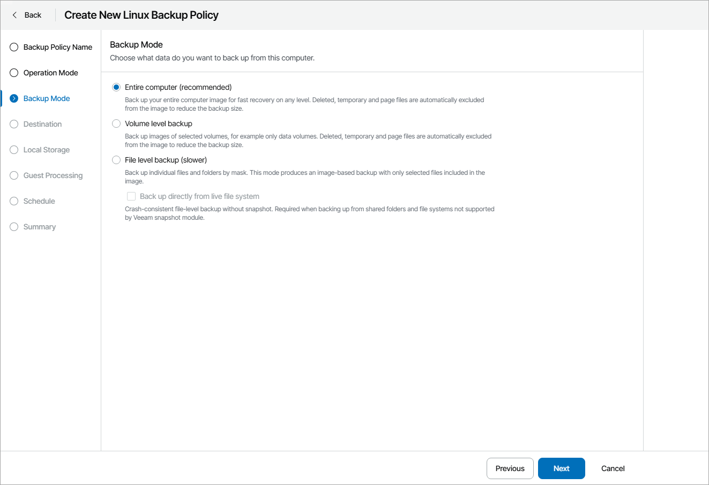

# Step 4. Choose Backup Mode

At the Backup Mode step of the wizard, select the mode in which you want to create a backup:

* Entire computer — select this option if you want to create a backup of the entire computer image. When you restore data from such backup, you will be able to recover the entire computer image as well as data on specific computer volumes: files, folders, application data and so on. With this option selected, you will pass to the [Destination](choose_backup_destination_lin.md) step of the wizard.
* Volume level backup — select this option if you want to create a backup of specific computer volumes, for example, all volumes except the system one. When you restore data from such backup, you will be able to recover data on these volumes only: files, folders, application data and so on. With this option selected, you will pass to the [Volumes](choose_volumes_lin.md) step of the wizard.
* File level backup — select this option if you want to create a backup of individual directories and files on your computer. With this option selected, you will pass to the [Files](choose_files_lin.md) step of the wizard.

If you want to perform backup in the snapshot-less mode, select the Backup directly from live file system check box. With this option selected, Veeam Agent for Linux will not create a snapshot of a backed-up volume during backup. This allows Veeam backup agent to back up data residing in file systems that are not supported for snapshot-based backup with Veeam Agent for Linux. For details, see section [Snapshot-Less File-Level Backup](https://helpcenter.veeam.com/docs/agentforlinux/userguide/file_backup_snapshotless.html) of the Veeam Agent for Linux User Guide.

|  |
| --- |
| Tip: |
| File-level backup is typically slower than volume-level backup. Depending on the performance capabilities of your computer and backup environment, the difference between file-level and volume-level backup job performance may increase significantly. If you plan to back up all directories with files on a specific volume or back up large amount of data, it is recommended that you configure volume-level backup instead of file-level backup. |

