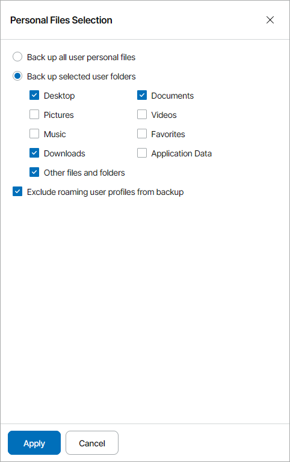
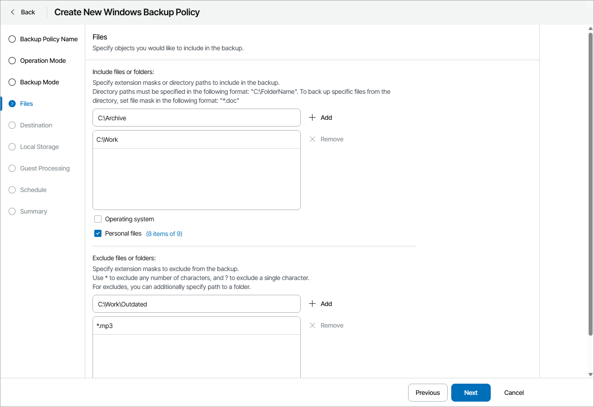

# Step 6. Choose Folders to Back Up

The Files step of the wizard is available if at the [Backup Mode](choose_backup_mode.md) step you have chosen to create a file-level backup.

In the file-level backup mode, you can create two types of backups:

* File-level backup that includes individual folders on the computer.
* Hybrid backup that contains individual folders and specific volumes of the computer.

To specify which files and folders must be included in the backup scope:

1. In the Include files or folders section text field, type a folder path or a file name or mask and click Add.

You can specify a drive letter at this step. In this case, Veeam backup agent will add the whole volume to the backup.

To include in the backup specific files or file types, you can specify file names and masks for file types that you want to back up. For example, MyMovie.avi,\*filename\*, \*.docx, \*.mp3. Veeam backup agent will create a backup only for selected files. Other files will not be backed up.

Repeat this step for all files and folders that you want to add to the backup.

1. Select the Operating system check box to include in the backup data pertaining to the OS installed on a protected computer.

With this option enabled, Veeam Agent for Microsoft Windows will include in the backup scope the Microsoft Windows system partition and boot partition of your computer. For GPT disks, Veeam backup agent will additionally back up the recovery partition. For details, see the [System State Data Backup](https://helpcenter.veeam.com/docs/agentforwindows/userguide/system_state_backup.html) section of the the Veeam Agent for Microsoft Windows User Guide.

1. Select the Personal files check box to include in the backup the user profile folders, including all user settings and data.

Click a link next to the check box to select which user folders must be included in the backup:

* To include all personal files, select the Back up all user personal files option.
* To include only specific folders, select the Back up selected user folders option and select folders you want to include in the backup.
* To exclude from the backup roaming user profile data, select the Exclude roaming user profiles from backup check box.

1. To exclude specific files or file types, in the Exclude files or folders section text field, type a folder path or a file name or mask and click Add.

You can specify a drive letter at this step. In this case, Veeam backup agent will exclude the whole volume from the backup. Note that it is not recommended to exclude volumes in file-level backup.

To exclude from the backup specific files or file types, you can specify file names and masks for file types that you do not want to back up, for example, OldPhotos.rar, \*.tmp, \*.back. Veeam backup agent will back up all files except files of the specified type.

Note that if you have selected the Operating System check box, Veeam backup agent will not exclude files and folders on the operating system partition from the backup.

Repeat this step for all files and folders that you want to exclude from the backup.

1. Select the Exclude Microsoft OneDrive folder check box, to exclude this folder from the backup.

Note that if you include an entire volume in the backup, Veeam backup agent will not exclude Microsoft OneDrive folder from the backup.

|  |
| --- |
| Note: |
| Veeam backup agent automatically adds to the list of exclusions the following Microsoft Windows objects for all computer users: temporary files folder, Recycle Bin, Microsoft Windows pagefile, hibernate file and VSS snapshot files from the System Volume Information folder. |

