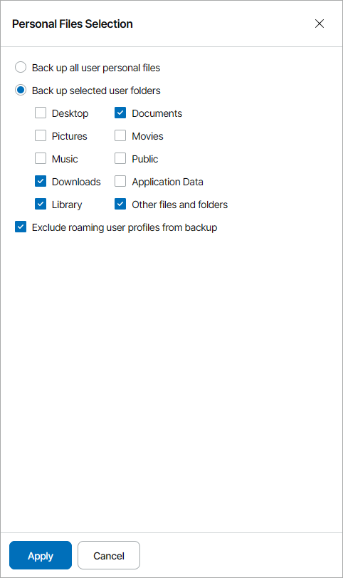
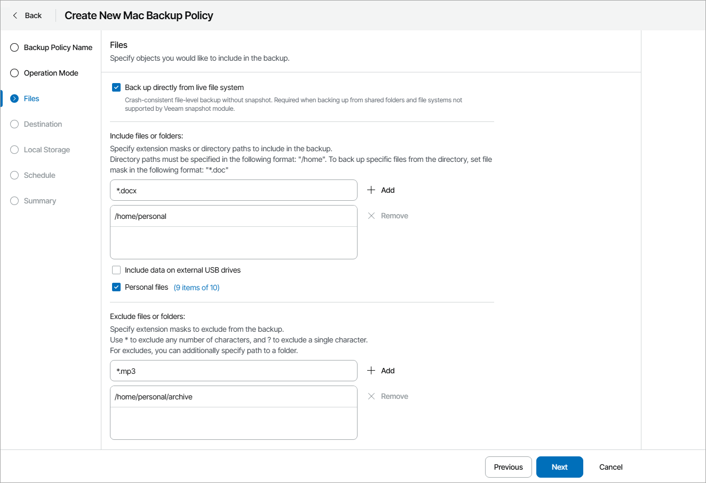

# Step 4. Choose Folders to Back Up

To specify which files and folders must be included in the backup scope:

1. If you want to perform backup in the snapshot-less mode, select the Back up directly from live file system check box. With this option selected, Veeam Agent for Mac will not create a snapshot of a backed up volume during backup. This allows Veeam backup agent to back up data residing in file systems that are not supported for snapshot-based backup with Veeam Agent for Mac.
2. In the Include files or folders section text field, type a folder path or a file name or mask and click Add.

To include in the backup specific files or file types, you can specify file names and masks for file types that you want to back up. For example, MyMovie.avi,\*filename\*, \*.docx, \*.mp3. Veeam backup agent will create a backup only for selected files. Other files will not be backed up.

Repeat this step for all files and folders that you want to add to the backup.

1. Select the Include data on external USB drives check box to include in the backup data from the external USB drives.
2. Select the Personal files check box to include in the backup the user profile folders, including all user settings and data.

Click a link next to the check box to select which user folders must be included in the backup:

* To include all personal files, select the Back up all user personal files option.
* To include only specific folders, select the Back up selected user folders option and select folders you want to include in the backup.

|  |
| --- |
| Note: |
| The option to select the Library folder is available for Veeam Agent for Mac version 2.2 or later. For earlier versions, select Other files and folders to back up the Library folder. |

* To exclude from the backup roaming user profile data, select the Exclude roaming user profiles from backup check box.

1. To exclude specific files or file types, in the Exclude files or folders section text field, type a folder path or a file name or mask and click Add.

You can specify file names and masks for file types that you do not want to back up, for example, OldPhotos.rar, \*.tmp, \*.back. Veeam backup agent will back up all files except files of the specified type.

Repeat this step for all files and folders that you want to exclude from the backup.

