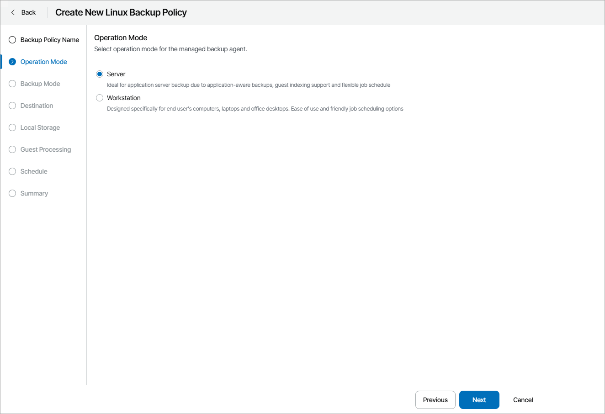

# Step 3. Choose Backup Agent Operation Mode

At the Operation Mode step of the wizard, select the operation mode:

* Server — choose this mode for computers running a server OS version.

This mode supports application-aware processing, files indexing and flexible backup job schedule, and is designed to protect application servers.

* Workstation — choose this mode for end users' computers running a workstation OS version.

This mode provides user-friendly job schedule, and is designed to protect end user computers.

