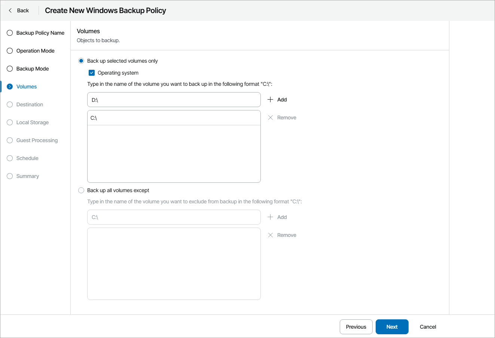

# Step 5. Choose Volumes to Back Up

The Volumes step of the wizard is available if at the [Backup Mode](choose_backup_mode.md) step you have chosen to create a volume-level backup.

* Select the Back up selected volumes only option to specify volumes that you want to include in the backup scope:

1. Select the Operating system check box, if you want to back up data pertaining to the OS installed on a protected computer.

With this option enabled, Veeam Agent for Microsoft Windows will include in the backup scope the Microsoft Windows system partition and boot partition of your computer. For GPT disks, Veeam backup agent will additionally back up the recovery partition. For details, see the [System State Data Backup](https://helpcenter.veeam.com/docs/agentforwindows/userguide/system_state_backup.html) section of the the Veeam Agent for Microsoft Windows User Guide.

1. In the text field, type a drive letter and click Add.

The drive letter must be specified in the following format: C:\

1. Repeat step b for all volumes that you want to add to the backup scope.

* Select the Back up all volumes except option to specify volumes that you want to exclude from the backup scope:

1. In the text field, type a drive letter and click Add.

The drive letter must be specified in the following format: C:\

1. Repeat step a for all volumes that you want to add to the backup scope.

|  |
| --- |
| Note: |
| * When you include a system volume in the backup, Veeam backup agent automatically includes the System Reserved/UEFI or other system partitions in the backup too. * Veeam backup agent automatically adds to the list of exclusions the following Microsoft Windows objects for all computer users: temporary files folder, Recycle Bin, Microsoft Windows pagefile, hibernate file and VSS snapshot files from the System Volume Information folder. |

