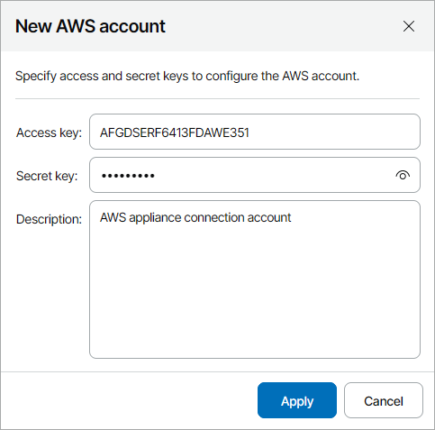

# Adding Amazon Web Services Accounts

In plugin, you can add Amazon Web Services connection accounts using one of the following ways:

* For Veeam Backup for AWS version 8 or later — create accounts [in Veeam Backup for AWS web portal](#aws).
* For Veeam Backup for AWS older than version 8 — create accounts [in Veeam Service Provider Console plugin](#vspc).

Prerequisites

Before you start adding Amazon Web Services accounts, consider requirements specified in the [Plug-In Permissions](https://helpcenter.veeam.com/docs/vbaws/guide/req_permissions.html) section of the Veeam Backup for AWS User Guide.

Creating Amazon Web Services Account

You can create Amazon Web Services connection accounts in Veeam Backup for AWS web portal:

1. Log in to Veeam Service Provider Console.

For details, see [Accessing Veeam Service Provider Console](access_vac.md).

1. At the top right corner of the Veeam Service Provider Console window, click Configuration.
2. In the configuration menu on the left, click Catalog.
3. Click the Veeam Backup for Public Clouds plugin tile.
4. In the menu on the left, click Accounts and navigate to Public Cloud.
5. At the top of the list, click New > Amazon Web Services.
6. If you have multiple connected appliances, select the necessary appliance and click Create.

You will be redirected to Veeam Backup for AWS web portal.

1. Create an account in Veeam Backup for AWS.

For details, see section [Adding IAM Roles](https://helpcenter.veeam.com/docs/vbaws/guide/iam_roles_add.html) of the Veeam Backup for AWS User Guide.

Creating Amazon Web Services Account in Veeam Service Provider Console

You can create Amazon Web Services connection accounts in Veeam Service Provider Console plugin:

1. Log in to Veeam Service Provider Console.

For details, see [Accessing Veeam Service Provider Console](access_vac.md).

1. At the top right corner of the Veeam Service Provider Console window, click Configuration.
2. In the configuration menu on the left, click Catalog.
3. Click the Veeam Backup for Public Clouds plugin tile.
4. In the menu on the left, click Accounts and navigate to Public Cloud.
5. At the top of the list, click New > Amazon Web Services.
6. In the New AWS Account window, specify account settings:

* In the Appliance field, select Veeam Backup for AWS appliance for which you want to create the account.
* In the Access key and Secret key fields, specify the key ID and secret key for the account.
* In the Description field, specify account description.

1. Click Apply.

