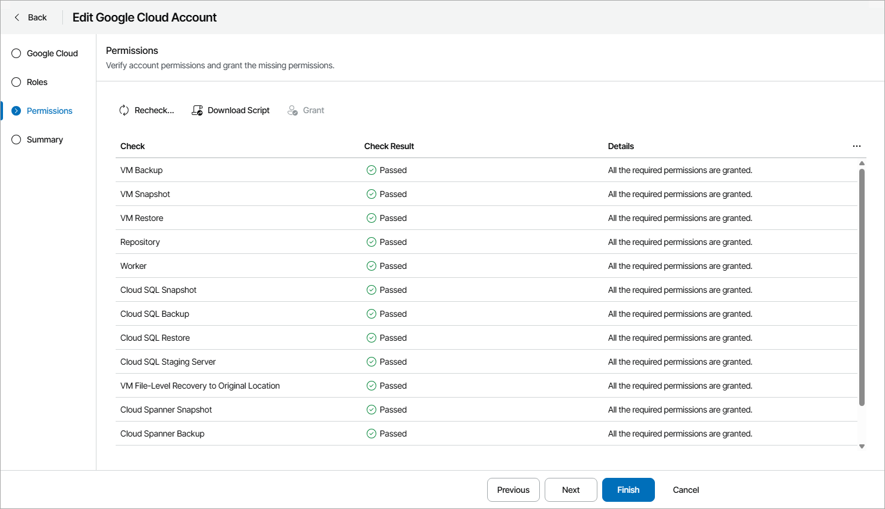

# Modifying Accounts

To modify Veeam Backup for Public Clouds account settings:

1. Log in to Veeam Service Provider Console.

For details, see [Accessing Veeam Service Provider Console](access_vac.md).

1. At the top right corner of the Veeam Service Provider Console window, click Configuration.
2. In the configuration menu on the left, click Catalog.
3. Click the Veeam Backup for Public Clouds plugin tile.
4. In the menu on the left, click Accounts.
5. Open the necessary tab:

* Public Cloud — select this tab to view Amazon Web Services, Microsoft Azure and Google Cloud accounts.
* Databases — select this tab to view database administrator accounts.

1. Select the necessary account in the list.

To narrow down the list of accounts, you can apply the following filters:

* Account Name — search the list of accounts by server name.
* [For databases accounts] Backup Appliance — search the list of accounts by appliance name.
* Platform — limit the list of accounts by platform (All, Amazon Web Services, Microsoft Azure, Google Cloud).

* [For databases accounts] Database Type — limit the list of accounts by database type (All, AWS RDS, Azure SQL, MySQL (SQL Built-In), PostgreSQL).

1. At the top of the list, click Edit.

Alternatively, you can right-click the necessary account and choose Edit.

If you modify accounts for Veeam Backup for AWS version 8 or later and Veeam Backup for Microsoft Azure version 7 or later, complete the account edition wizard in Veeam Backup for Public Clouds web portal. Veeam Backup for Public Clouds web portal will open automatically.

For details on account settings, see the following sections of Veeam Backup for Public Clouds User Guides:

* [Editing IAM Role Settings](https://helpcenter.veeam.com/docs/vbaws/guide/iam_roles_edit.html) of the Veeam Backup for AWS User Guide
* [Editing Service Accounts](https://helpcenter.veeam.com/docs/vbazure/guide/service_account_edit.html) of the Veeam Backup for Microsoft Azure User Guide

1. If you modify accounts for Veeam Backup for Google Cloud and older versions of Veeam Backup for AWS and Veeam Backup for Microsoft Azure, edit account settings in Veeam Service Provider Console plugin and save the applied changes.

For details on account settings, see [Adding Accounts](clouds_add_accounts.md).

For details on changing Google Cloud account roles and permissions, see [Modifying Google Cloud Account Permissions](#google).

Modifying Google Cloud Account Permissions

While editing Google Cloud accounts, you can modify account roles and permissions. If you assigned new roles and permissions to the account, at the Permissions step of the wizard do one of the following:

* To grant all missing permissions to the account, click Grant.

You will be asked to authenticate to your Google Cloud account to confirm granting permissions.

* To run a script for granting permissions, click Download Script.

The TXT file with script will be saved to the default download location on your computer. To grant permissions to the account, run the script in Google Cloud Shell.

To make sure that the missing permissions have been granted successfully, click Recheck.

Note that if you removed previously assigned permissions, you have also remove these permissions from Google Cloud console manually. For details, see section [Editing Projects and Folders](https://helpcenter.veeam.com/docs/vbgc/guide/editing_projects.html) of the Veeam Backup for Google Cloud User Guide.

Alternatively, you can assign the necessary permissions in Veeam Service Provider Console plugin. For details, see [Managing Account Permissions](clouds_account_permissions.md#google).

