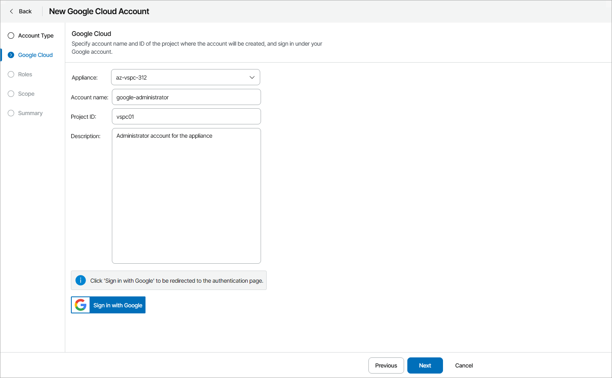
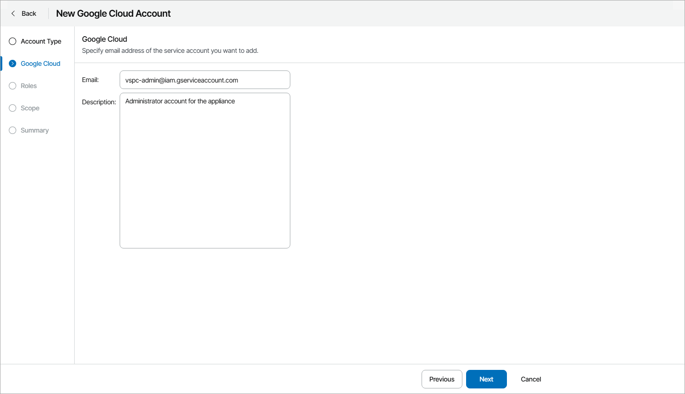
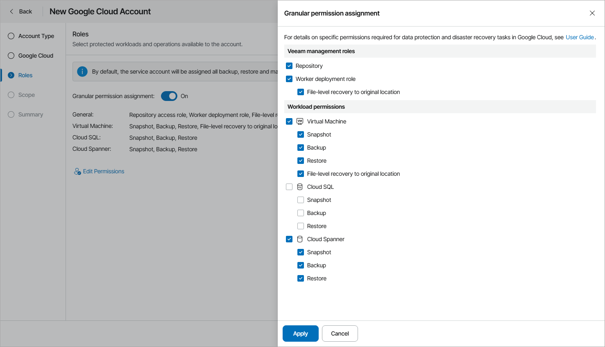
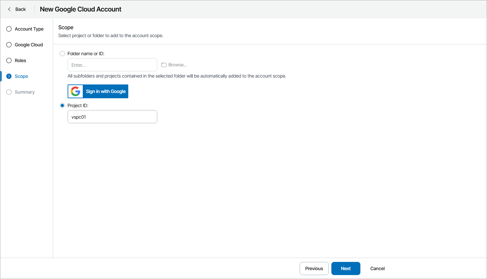

# Adding Google Cloud Accounts

In plugin, you can add Google Cloud connection accounts.

Prerequisites

Before you start adding Google Cloud accounts:

* Consider requirements specified in the [Plug-In Permissions](https://helpcenter.veeam.com/docs/vbgc/guide/plugin_permissions.html) section of the Veeam Backup for Google Cloud User Guide.
* Make sure your service provider has registered Google Cloud application.

Creating Google Cloud Account

To create a new Google Cloud account:

1. Log in to Veeam Service Provider Console.

For details, see [Accessing Veeam Service Provider Console](access_vac.md).

1. At the top right corner of the Veeam Service Provider Console window, click Configuration.
2. In the configuration menu on the left, click Catalog.
3. Click the Veeam Backup for Public Clouds plugin tile.
4. In the menu on the left, click Accounts and navigate to Public Cloud.
5. At the top of the list, click New > Google Cloud.

Veeam Service Provider Console will open the New Google Cloud Account wizard.

1. At the Account Type step of the wizard, specify whether you want to create a new service account or use an existing account:

* To create a new service account, at the Google Cloud step of the wizard, specify account settings:

1. In the Appliance field, select Veeam Backup for Google Cloud appliance on which you want to register the account.
2. In the Account Name field, specify account name.
3. In the Project ID field, specify the ID of a project in which the new service account will be created.
4. In the Description field, specify account description.
5. Click Sign in with Google.

A web browser window will open.

Make sure to sign in with credentials of the user account with permission to create service accounts. For details, see [Google Cloud documentation](https://cloud.google.com/iam/docs/creating-managing-service-accounts#permissions).

1. Return to the wizard and click Next.

* To connect an existing service account, at the Google Cloud step of the wizard, specify your Google Cloud account:

* In the Appliance field, select Veeam Backup for Google Cloud appliance on which you want to register the account.
* In the Email field, specify email address of the service account.
* In the Description field, specify account description.

1. By default, the service account is assigned all roles and permissions for all types of protected workloads. If necessary, at the Roles step of the wizard you can define operations that the account will be able to perform for the managed workloads:

1. If you want to configure granular roles and permissions for the account, set the Granular permission assignment toggle to On and click Edit Permissions.
2. In the Veeam management roles section, select role types for the account:

* Repository access role — permissions of this account role will be used to create new repositories in target Google Cloud buckets and to access the repositories during data protection and disaster recovery operations.
* Worker deployment role — permissions of this account role will be used to launch worker instances in the worker project.
* File-level recovery to original location — permissions of this account role will be used to launch worker instances during file-level restore operations.

1. In the Workload permissions section, select workloads that will be protected using permissions of the account role, and operations that can be performed with these workloads.

1. At the Scope step of the wizard, specify project or folder that manages the protected workloads:

* To choose a folder, select the Folder name or ID option and specify name or ID of a folder.

To select a folder from the list:

1. Click Sign in with Google.
2. Sign in to a Google account with the Organization Viewer and Folder Viewer roles assigned.
3. Click Browse.
4. In the Folders window, select the necessary folder and click Apply.

* To choose a project, select the Project ID option and specify ID of a project.

1. At the Summary step of the wizard, review the account settings and click Finish.

