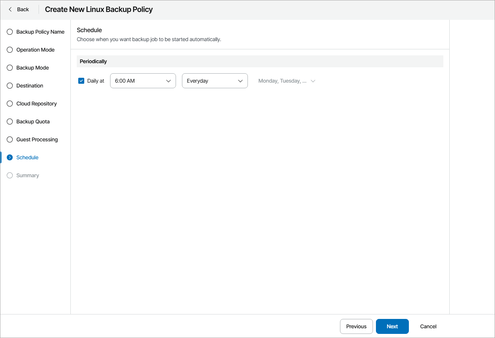
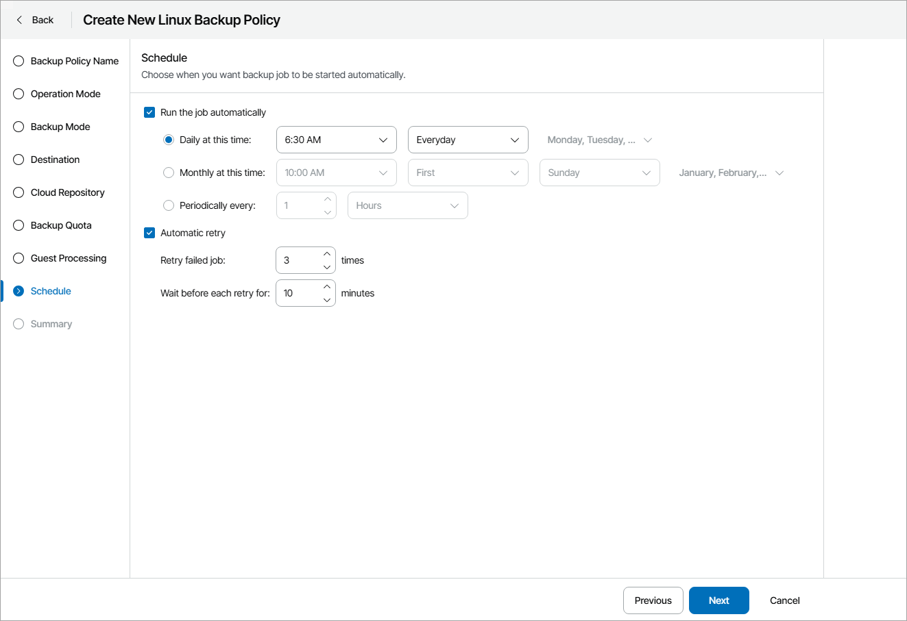

# Step 16. Configure Backup Schedule

At the Schedule step of the wizard, specify the schedule according to which backup must run. Backup job scheduling options depend on the application mode in which Veeam backup agent operates:

* [Workstation Backup Schedule](#workstation)
* [Server Backup Schedule](#server)

Workstation Backup Schedule

At the Schedule step of the wizard, specify the schedule according to which backup must be performed.

1. Select the Daily at check box and use the fields on the right to specify time and days when the backup job must start:

* Everyday — select this option to start the job at the specified time daily.
* On weekdays — select this option to start the job at the specified time on weekdays.
* On these days — select this option to start the job at the specified time on selected days.

If this check box is not selected, you will have to start the backup job manually to create backup.

1. If you have selected the On these days option, click the drop-down menu and clear check boxes for the days when the job must not start.

Server Backup Schedule

At the Schedule step of the wizard, select to run the backup job manually or schedule the job to run on a regular basis.

To specify the job schedule:

1. Select the Run the job automatically check box.

If this check box is not selected, you will have to start the backup job manually to create backup.

1. Define scheduling settings for the job:

* To run the job at specific time daily, on defined week days or with specific periodicity, select Daily at this time. Use the fields on the right to configure the necessary schedule.
* To run the job once a month on specific days, select Monthly at this time. Use the fields on the right to configure the necessary schedule.
* To run the job repeatedly throughout a day with a specific time interval, select Periodically every. In the field on the right, select the necessary time unit: Hours or Minutes.

A repeatedly run job always starts counting defined intervals from 12:00 AM. For example, if you configure to run a job with a 4-hour interval, the job will start at 12:00 AM, 4:00 AM, 8:00 AM, 12:00 PM, 4:00 PM and so on.

1. In the Automatic retry section, define whether Veeam backup agent must attempt to run the backup job again if the job fails for some reason. Type the number of attempts to run the job and define time intervals between them.

