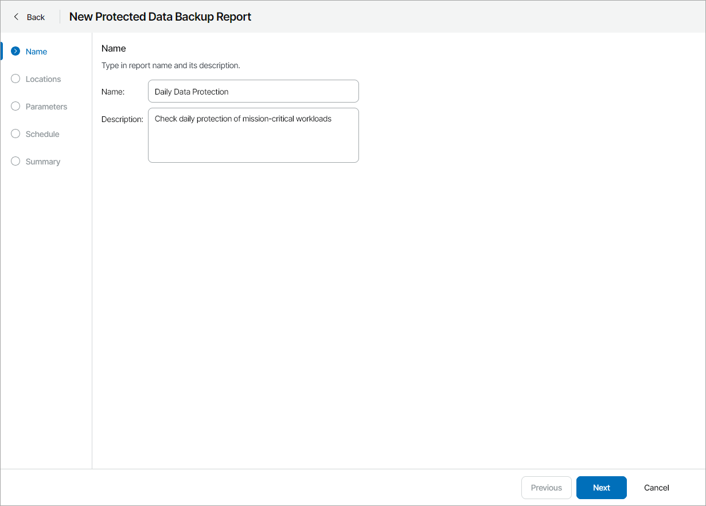
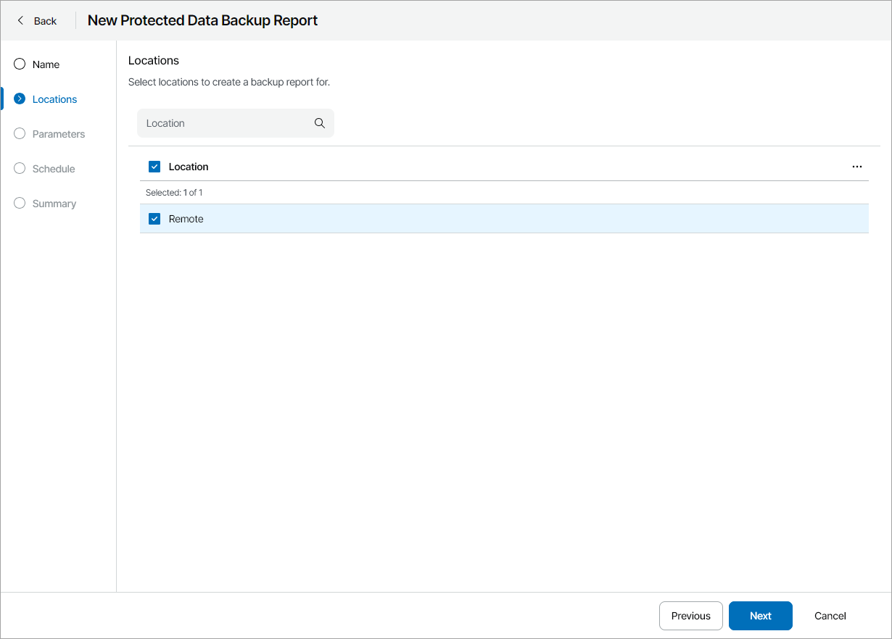
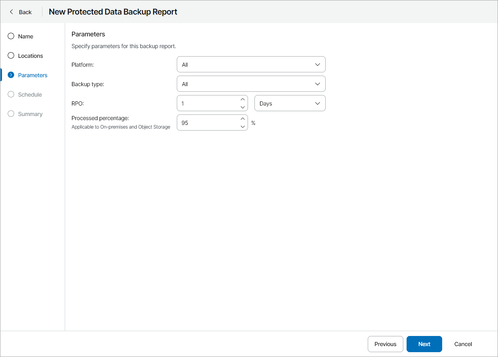
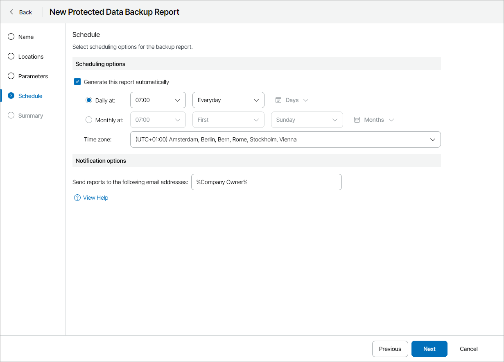
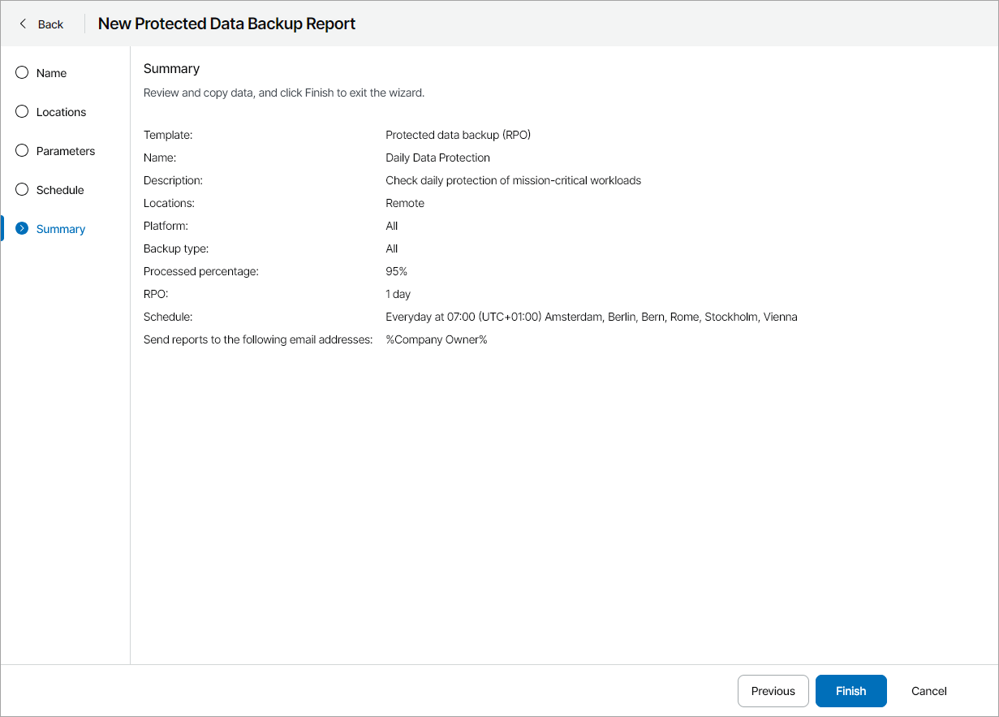

# Creating Protected Data Backup Report

To create a Protected Data Backup report configuration:

1. At the Name step of the wizard, specify the report name and description.

The report name and description will be displayed in reports generated based on this report configuration.

1. At the Locations step of the wizard, select one or more company locations. Use the search field at the top to find the necessary location.

By choosing a location you can limit the scope of the report: only file shares that belong to the chosen locations will appear in the report.

1. At the Parameters step of the wizard, specify parameters for analyzing protected file shares:

* In the Platform list, choose what type of file shares must be analyzed in the report (All, On-premises, Public Cloud, Object Storage).
* In the Backup type list, choose what type of backup retention must be analyzed in the report (All, Primary Backup, Archive, Snapshot).
* In the RPO section, specify a period for which protected cloud file shares must have backup or archive restore points.

RPO defines a period between backup sessions, or, in other words, a period for which you can afford to lose data. For example, if protected file shares must have daily backups, specify 1 day or 24 hours as the RPO value.

For on-premises fie shares, a file share is counted as protected if the last job session processing this file share finished successfully or with warning. If the last job session finished with error, file shares processed by this job session will be counted as unprotected.

* In the Processed percentage field, specify which percentage of backed up files and folders must be processed successfully.

1. At the Schedule step of the wizard, specify a schedule according to which the report must be generated:

1. In the Scheduling options section, select the Generate this report automatically check box to enable scheduling and define report scheduling:

1. To generate the report at specific time daily, on defined week days or with specific periodicity, select the Daily at option. Use the fields on the right to configure the necessary schedule.
2. To generate the report once a month on specific days, select the Monthly at option. Use the fields on the right to configure the necessary schedule.
3. From the Time zone drop-down list, select the time zone in which the daily or monthly schedule must be run.

1. In the Notification options section, provide the email address to which the report must be sent.

You can specify multiple email addresses separated with commas (,) or semicolons. To send a notification to multiple users with a specific role, you can use email variables. For a list of available email variables, click View Help.

To receive the report, the user must configure an email address in the user profile. For details, see .

1. At the Summary step of the wizard, review the report configuration and click Finish.

