# Configuring Import-Based Discovery Rules

Import-based discovery rules allow you to discover computers using a list of computer IP addresses or DNS names imported from a CSV file.

Prerequisites

Before you configure an import-based discovery rule:

* Deploy a master agent on a machine in the company infrastructure.

For details, see [Deploying Management Agents Manually](deploy_management_agents.md).

* Make sure you have the root account or any user account with super user privileges on all computers that you want to discover.

* Prepare a properly formed CSV file with the list of computer IP addresses or DNS names to scan.

For details, see [Preparing CSV File for Import](#csv).

* Make sure that SSH port is opened on all computers that you want to discover.

* If you plan to assign a backup policy as part of the discovery procedure, create a new backup policy or check and if necessary customize one of the predefined policies.

For details, see [Configuring Backup Policies](configure_backup_policies.md).

Preparing CSV File for Import

To perform import-based discovery, you must create a CSV file with a list of computer IP addresses or DNS names to scan during discovery.

Delimit IP addresses and DNS names in the list with commas:

|  |
| --- |
| 172.17.53.10,srv10,172.17.53.12,linsrv,172.17.53.22 |

Alternatively, form a file where each new IP address or DNS name is on a new line:

|  |
| --- |
| 172.17.53.10 |

Configuring Import-Based Discovery Rule

To configure an import-based discovery rule:

1. Log in to Veeam Service Provider Console.

For details, see [Accessing Veeam Service Provider Console](access_vac.md).

1. In the menu on the left, click Rules.
2. On the Rules tab, click New and select Linux.

Veeam Service Provider Console will launch the New Linux Discovery Rule wizard.

1. At the Rule Name step of the wizard, specify a discovery rule name.

[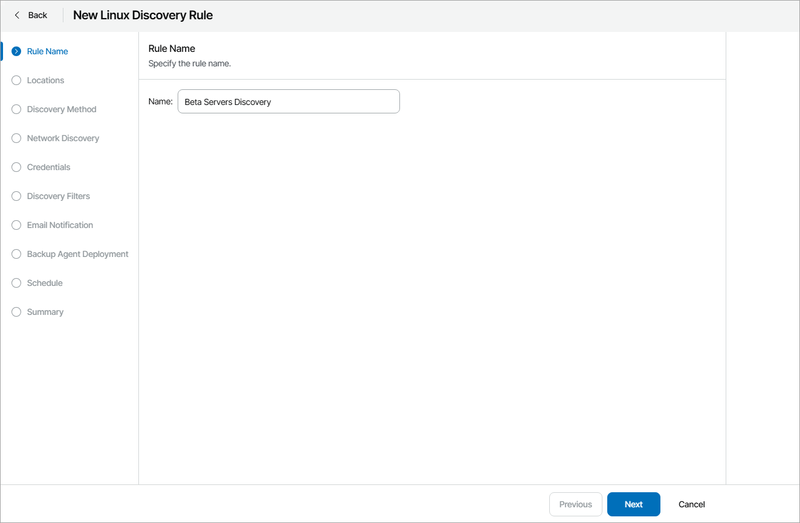](images/discovery_rule_name_linux.webp "Specify Discovery Rule Name")

1. At the Locations step of the wizard, click a link in the Master Agent column, and select a management agent that will be used as the master agent for discovery in each company location.

By default, discovery is performed in all company locations where you deployed a master agent. If you choose to perform discovery in multiple locations, after you complete the wizard steps, Veeam Service Provider Console will create a separate discovery rule for each location. If you do not want to perform discovery in some company locations, clear check boxes next to these locations.

For details on working with company locations, see [Managing Locations](manage_locations.md).

[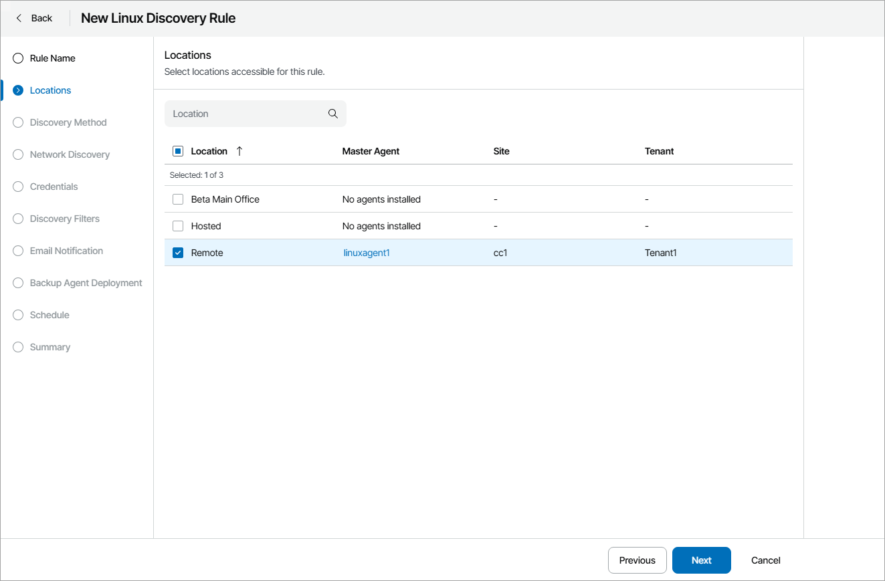](images/discovery_rule_agent_sp_lin.webp "Choose Master Agent")

1. At the Discovery Method step of the wizard, select Computers from CSV file.

[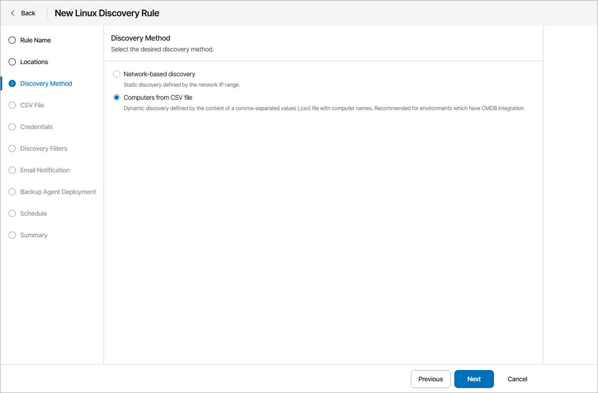](images/discovery_rule_method_csv_lin.webp "Choose Discovery Method")

1. At the CSV File step of the wizard, click Browse and specify a path to a CSV file that contains a list of IP addresses or DNS names of computers that must be scanned.

[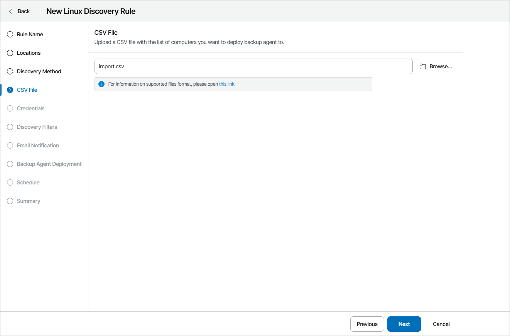](images/discovery_rule_csv_file_lin.webp "Specify Path to CSV File")

1. At the Credentials step of the wizard, specify credentials of an account that the master agent will use to connect to computers within the discovery scope.

Click New and select the type of credentials:

* Linux Credentials. Select this option to connect to Linux machines with a user name and password.

1. In the Username field, enter a user name for the account that you plan to add.
2. In the Password field, enter a password for the account that you want to add. To view the entered password, click and hold the eye icon on the right of the field.
3. In the SSH port field, specify the SSH port over which you want to connect to a Linux machine. By default, port 22 is used.
4. In the Description field, enter a description for the created credentials record. As there can be a number of similar account names, for example, Administrator, it is recommended that you provide a meaningful unique description for the credentials record so that you can distinguish it in the list.
5. If you specify data for a non-root account that does not have root permissions on a Linux machine, you can use the Non-root account section to grant sudo rights to this account.

To provide a non-root user with root account privileges, select the Elevate account privileges automatically check box.

To add the user account to sudoers file, select the Add account to the sudoers file automatically check box. In the Root password field, enter the password for the root account.

If you do not enable this option, you will have to manually add the user account to the sudoers file.

When registering a Linux machine, you have an option to failover to using the su command for distros where the sudo command is not available.

To enable the failover, select the Use "su" if "sudo" fails check box and in the Root password field, enter the password for the root account.

[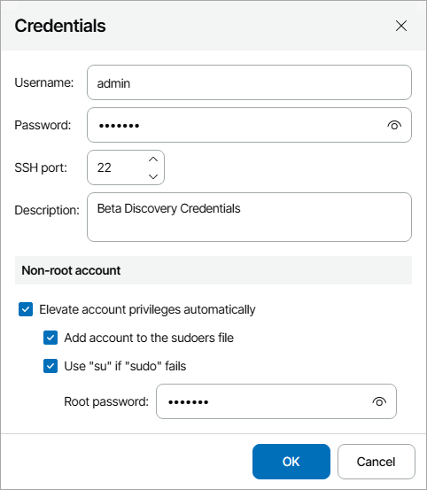](images/discovery_rule_credentials_linux.webp "Specify Linux Credentials")

* Private Key. Select this option to connect to Linux machines using the Identity/Pubkey authentication method.

|  |
| --- |
| Note: |
| To use this method, you must first generate a pair of keys using a key generation utility, for example, ssh-keygen. Place the public key on Linux machines that you want to discover. To do this, add the public key to the authorized\_keys file in the .ssh/ directory in the home directory on a Linux machine. Place the private key in a location accessible from your computer. |

1. In the Username field, specify a user name for the created credentials record.
2. In the Password field, specify the password for the user account. The password is required in all cases except when you use root or a user with enabled NOPASSWD:ALL setting in /etc/sudoers.
3. In the Private key field, enter a path to the private key or click Browse to select a private key.
4. In the Passphrase field, specify a passphrase for the private key on the backup server. To view the entered passphrase, click and hold the eye icon on the right of the field.
5. In the SSH port field, specify a number of the SSH port that you plan to use to connect to a Linux machine. By default, port 22 is used.
6. In the Description field, enter a description for the created credentials record. As there can be a number of similar account names, for example, Administrator, it is recommended that you supply a meaningful unique description for the credentials record so that you can distinguish it in the list.
7. If you specify data for a non-root account that does not have root permissions on a Linux machine, you can use the Non-root account section to grant sudo rights to this account.

To provide a non-root user with root account privileges, select the Elevate specified account to root check box.

To add the user account to sudoers file, select the Add account to the sudoers file automatically check box. In the Root password field, enter the password for the root account.

If you do not enable this option, you will have to manually add the user account to the sudoers file.

When registering a Linux machine, you have an option to failover to using the su command for distros where the sudo command is not available.

To enable the failover, select the Use "su" if "sudo" fails check box and in the Root password field, enter the password for the root account.

[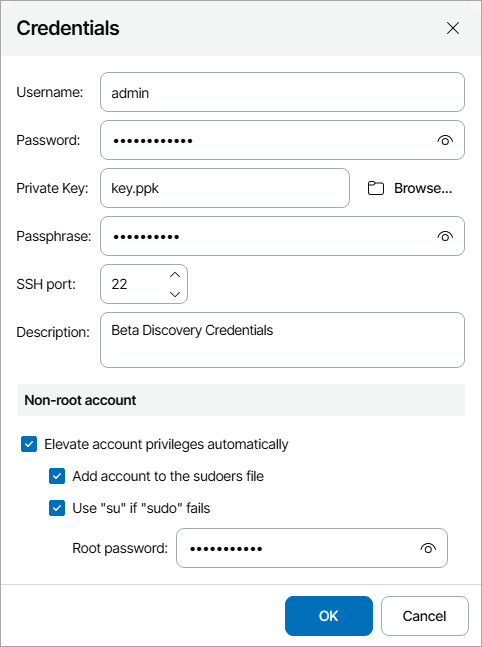](images/discovery_rule_credentials_linux_key.webp "Specify Linux Private Key")

To define which credential records must be used first during discovery, use the Up and Down buttons at the top of the credentials list.

1. At the Discovery Filters step of the wizard, choose what filters you want to enable for discovery.

* To filter computers by OS type, select By OS type in the list and click Edit. In the Operating System window, select the type of OS that must run on discovered computers (CentOS, Debian, Oracle Linux, Fedora, Ubuntu, OpenSUSE, SUSE Linux Enterprise Server, Red Hat Enterprise Linux). Click OK.
* To filter computers by application, select By application in the list and click Edit. In the Application window, select applications that must run on discovered computers (Apache HTTP server, Oracle database, MySQL database, PostgreSQL, MongoDB, Other Applications). Click OK.
* To filter computers by platform, select By platform in the list and click Edit. In the Platform window, select platforms on which discovered computers must run (Virtual infrastructure, Physical computers, Microsoft Azure, Amazon Web Services, Google Cloud, Other). Click OK.
* If you want to perform discovery among accessible computers only, select the Do not show inaccessible computers check box.

|  |
| --- |
| Note: |
| Different types of filter conditions are joined using Boolean AND operator. For example, if you enable filters Oracle Linux, Oracle database and Virtual infrastructure, the list of discovered computers will include only VMs that run Oracle Linux and Oracle database. |

[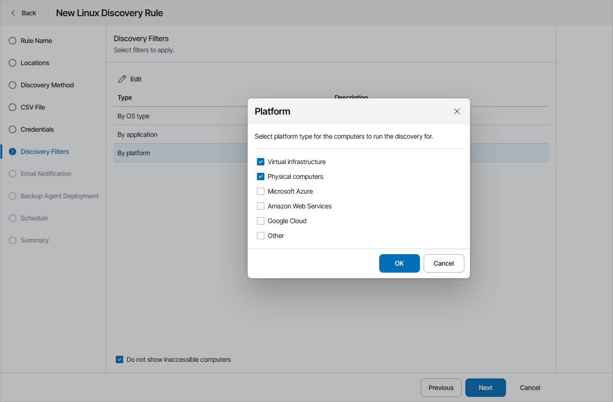](images/discovery_rule_filters_csv_lin.webp "Choose Discovery Filters")

1. At the Email Notification step of the wizard, you can enable notifications about discovery results by email.

1. Select the Send notifications check box and specify a schedule according to which email notifications must be sent.
2. In the To field, specify an email address at which the email notification must be sent.
3. In the Subject field, specify the subject of the notification.
4. Select the Send notification email after the first run check box if a notification about discovery results must be sent after the first run of the discovery rule, regardless of the specified schedule.

[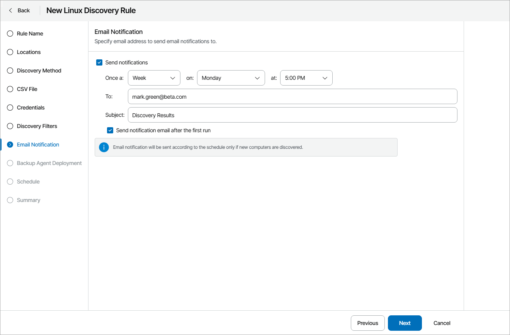](images/discovery_rule_csv_notification_lin.webp "Configure Discovery Notifications")

1. At the Backup Agent Deployment step of the wizard, specify whether you want to install Veeam backup agents on discovered computers:

1. If you do not want to install Veeam backup agents as part of the discovery process, leave the Discover remote computer without installing backup agent option selected.
2. If after discovery Veeam backup agents must be installed automatically, select the Discover remote computer, install backup agent and assign the selected backup policy option.

From the Backup policy to apply list, choose a backup policy that must be assigned immediately after installation. To view the selected policy details, click the Show link. If you do not want to assign any backup policy after installation, choose No policy from the list.

If you do not have the necessary backup policy configured yet, you can click the Create New link to create a new policy, without exiting the New Rule wizard. For details on backup policies, see [Configuring Backup Policies](configure_backup_policies.md).

1. By default, the read-only access mode is enabled for all Veeam backup agents installed as part of discovery. To disable the read-only access mode for Veeam backup agents on discovered computers, set the Read-only UI access for the backup agent toggle to Off.

For details on the read-only access mode for Veeam backup agents, see [Enabling Read-Only Access Mode](enable_read_only_mode.md).

[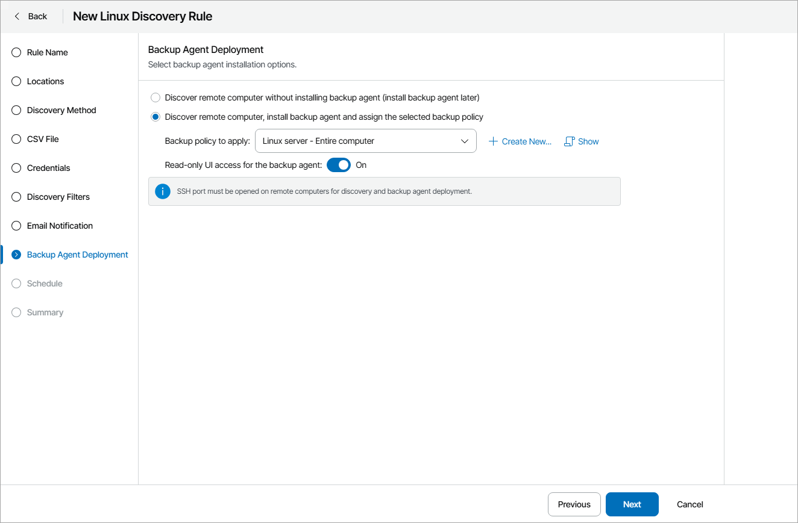](images/discovery_rule_val_csv.webp "Configure Backup Agent Deployment")

1. At the Schedule step of the wizard, specify schedule according to which discovery must be performed:

1. Select the Run this rule automatically check box, if you want to enable scheduling for the discovery rule.
2. Define scheduling settings:

* To run discovery at specific time daily, on defined week days or with specific periodicity, select the Daily at option. Use the fields on the right to configure the necessary schedule.
* To run discovery once a month on specific days, select the Monthly at option. Use the fields on the right to configure the necessary schedule.
* To run discovery repeatedly throughout a day with a specific time interval, select the Periodically every option. In the field on the right, select the necessary time unit: Days, Hours or Minutes.

* To run discovery continuously, select the Periodically every option and choose Continuously from the list on the right. A new discovery session will start as soon as the previous discovery session finishes.

1. From the Time zone drop-down list, select the time zone in which daily and monthly schedule must be run.

[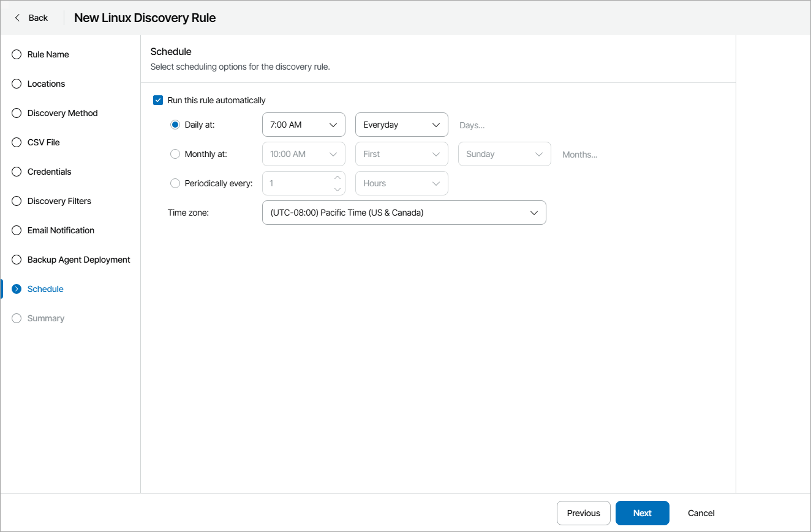](images/discovery_rule_schedule_csv_lin.webp "Configure Discovery Schedule")

1. At the Summary step of the wizard, review discovery rule settings and click Finish.

To start discovery after you save the rule, in the pop-up window, click Yes.

[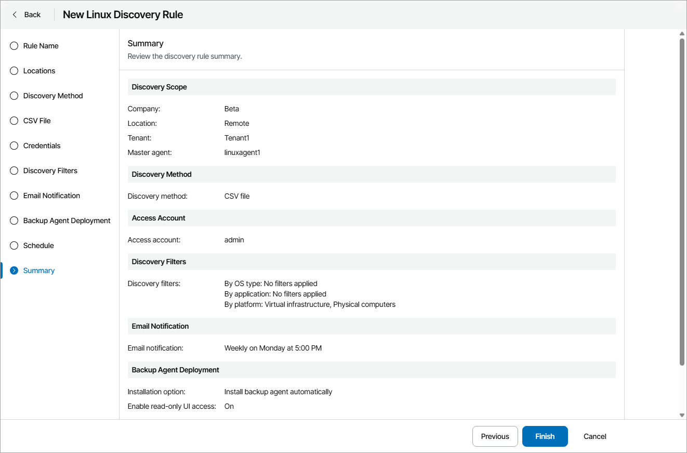](images/discovery_rule_review_csv_lin.webp "Review Discovery Settings")

