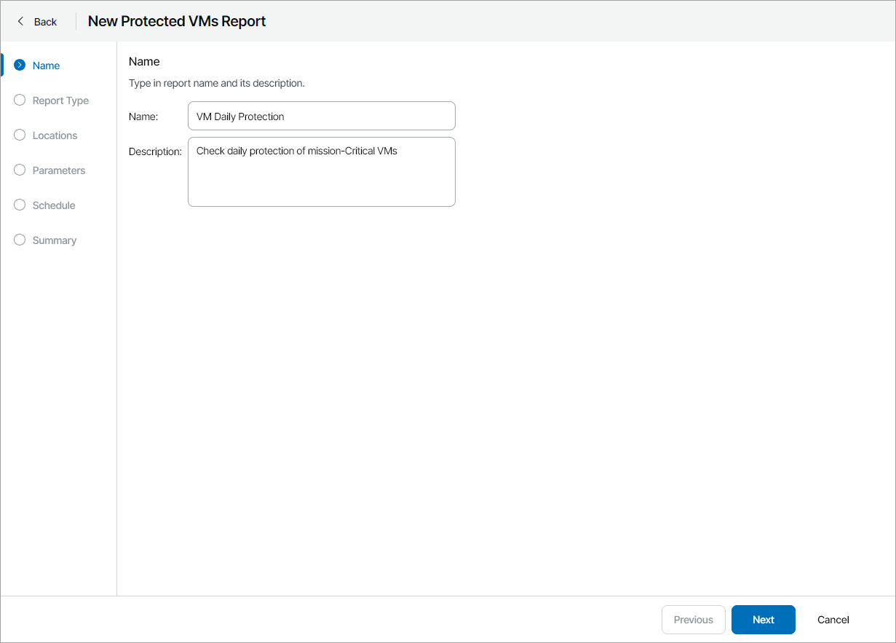
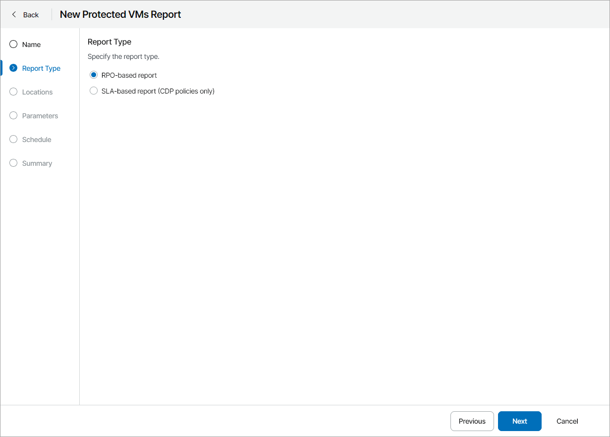
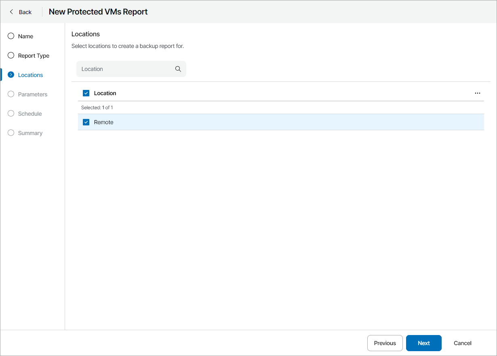
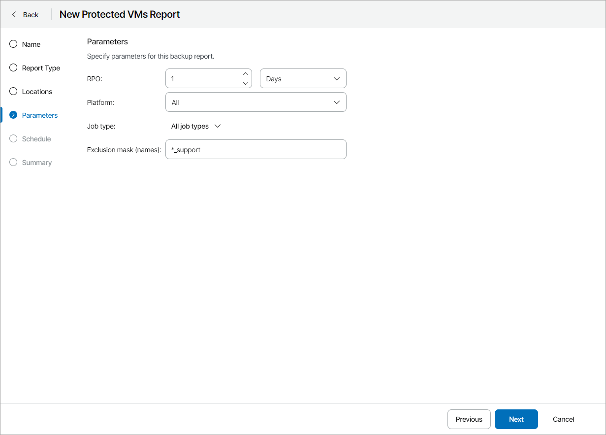
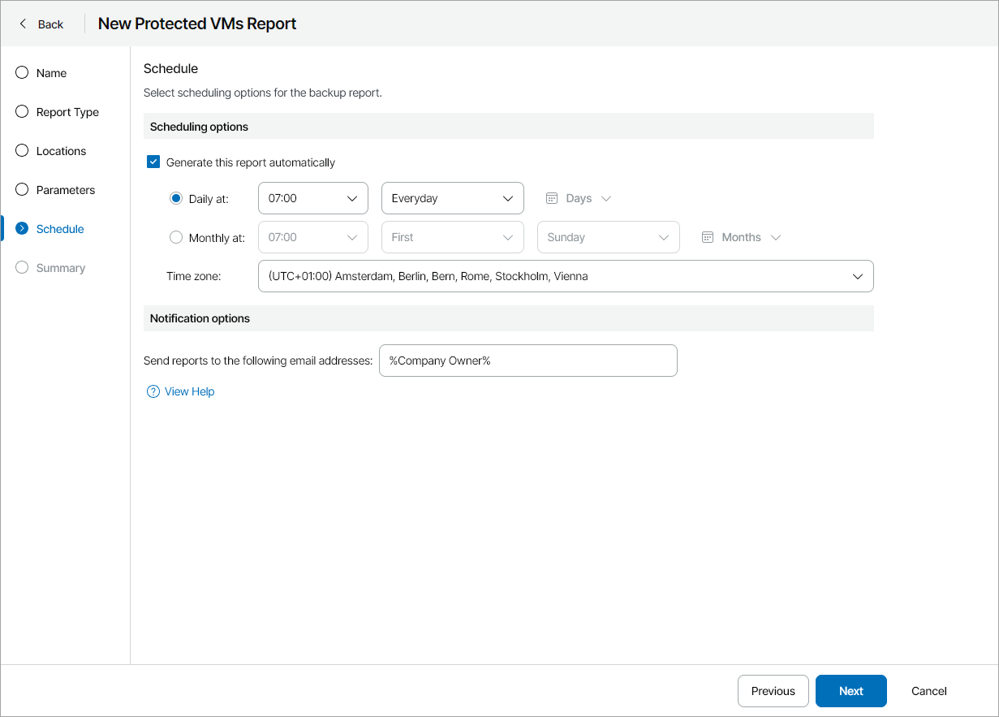
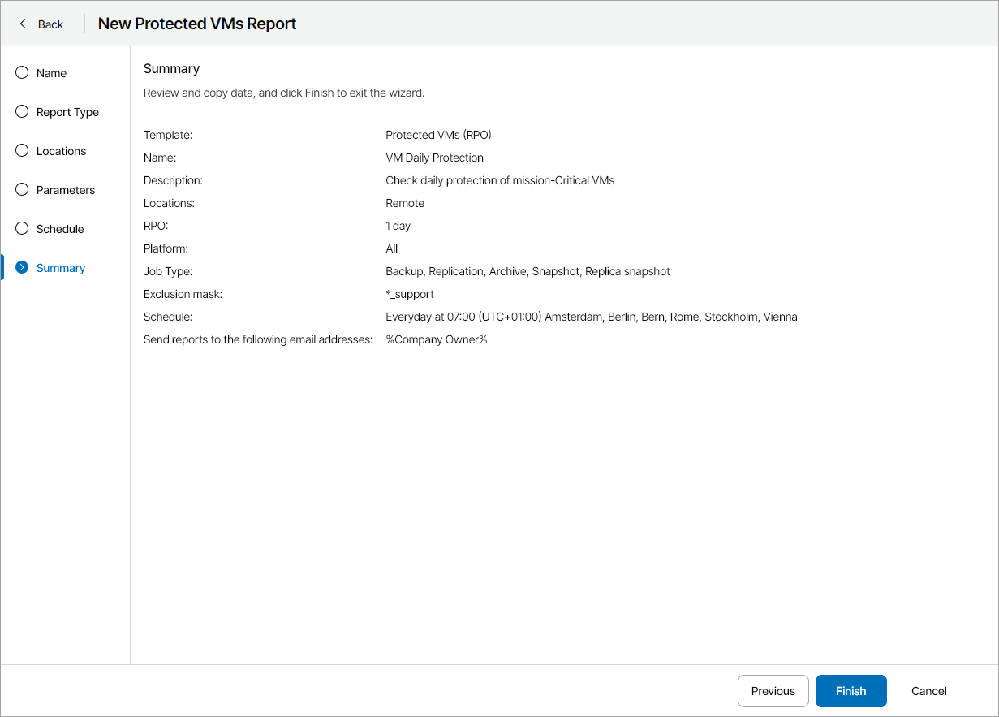

# Creating Protected VMs Report

To create a Protected VMs report configuration:

1. At the Name step of the wizard, specify the report name and description.

The report name and description will be displayed in reports generated based on this report configuration.

1. At the Report Type step of the wizard, select report type:

* To create a report for VMs protected by restore points, select RPO-based report.
* To create a report for VMs protected by CDP policies, select SLA-based report (CDP policies only).

1. At the Locations step of the wizard, select one or more company locations. Use the search field at the top to find the necessary location.

By choosing a location you can limit the scope of the report: only VMs that belong to the chosen locations will appear in the report.

1. At the Parameters step of the wizard, specify parameters for analyzing protected VMs:

* For RPO-based report:

1. In the RPO section, specify a period for which protected VMs must have backup or replica restore points.

RPO defines a period between backup sessions, or, in other words, a period for which you can afford to lose data. For example, if protected VMs must have daily backups, specify 1 day or 24 hours as the RPO value.

1. In the Platform section, specify a platform type for VMs that must be analyzed in the report (All, Virtual Infrastructure, Public Cloud).

If you have selected the Virtual Infrastructure type, you can select which platforms must be analyzed in the report (vSphere, Hyper-V, AHV, oVirt KVM, Proxmox VE, SC HyperCore).

1. In the Job type list, select what type of Veeam Backup & Replication jobs must be analyzed in the report (All, Backup, Replication, Archive, Snapshot, Replica snapshot).
2. In the Exclusion mask (names) field, specify a mask for excluding VMs from the report scope.

The mask will be evaluated against the VM names. You can use the ‘\*’ (asterisk) and ‘?’ (question mark) wildcards in the mask. The ‘\*’ (asterisk) character stands for zero or more characters. The ‘?’ (question mark) stands for a single character. For example, if you want to exclude from the report VM replicas with default names created with Veeam Backup & Replication, you can specify a mask with the ‘\*\_replica’ name query.

You can specify more than one mask in the field. Separate multiple masks with commas.

* For SLA-based report:

1. In the Time period section, specify time period to analyze in the report.
2. In the SLA field, specify the target SLA value (in percent).
3. In the VM exclusions rule field, specify a mask for excluding VMs from the report scope.

The mask will be evaluated against the VM names. You can use the ‘\*’ (asterisk) and ‘?’ (question mark) wildcards in the mask. The ‘\*’ (asterisk) character stands for zero or more characters. The ‘?’ (question mark) stands for a single character. For example, if you want to exclude from the report VM replicas with default names created with Veeam Backup & Replication, you can specify a mask with the ‘\*\_replica’ name query.

You can specify more than one mask in the field. Separate multiple masks with commas.

1. At the Schedule step of the wizard, specify a schedule according to which the report must be generated:

1. In the Scheduling options section, select the Generate this report automatically check box to enable scheduling and define report scheduling:

1. To generate the report at specific time daily, on defined week days or with specific periodicity, select the Daily at option. Use the fields on the right to configure the necessary schedule.
2. To generate the report once a month on specific days, select the Monthly at option. Use the fields on the right to configure the necessary schedule.
3. From the Time zone drop-down list, select the time zone in which the daily or monthly schedule must be run.

1. In the Notification options section, provide the email address to which the report must be sent.

You can specify multiple email addresses separated with commas (,) or semicolons. To send a notification to multiple users with a specific role, you can use email variables. For a list of available email variables, click View Help.

To receive the report, the user must configure an email address in the user profile. For details, see .

1. At the Summary step of the wizard, review the report configuration and click Finish.

